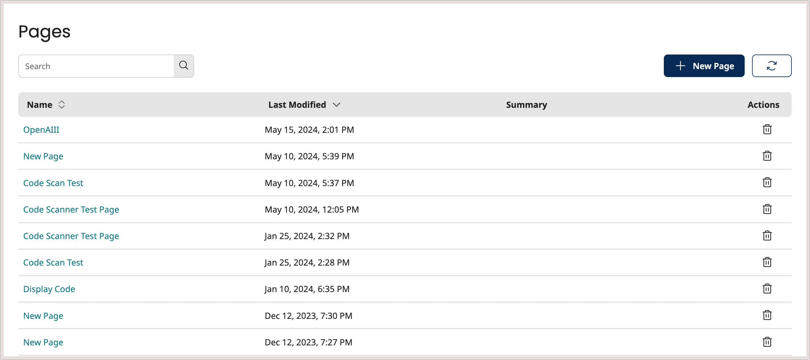

# Pages page

<head>
  <meta name="guidename" content="Flow"/>
  <meta name="context" content="GUID-3834be68-0ef5-4c4a-ac59-3d75e6ddcd35"/>
</head>

Manage your existing pages, and create new pages on the **Pages** page.

## Opening the page

-   Select **Pages** from the left-hand menu.

## Page overview

The **Pages** page displays all the pages currently set up within the tenant.

-   Pages are displayed in a table, sorted using the **Last Modified** column by default, showing the most recently modified pages first.

-   Click the page **Name** to open the page in a new tab.

-   Click the **Name** or **Last Modified** headings to change the table sorting order.

-   Click the **Delete** icon  in the **Actions** column to delete a page.

## Creating a new page

As well as managing existing pages on this page, you can also create a new page:

1.  Click the **New Page** button. See [Creating a page](/docs/Atomsphere/Flow/topics/t-flo-Pages_Creating_Page_Layout_8547b517-a2e6-4d0e-8ae3-736597064154.md).

## Searching/filtering pages

The **Search** field allows you to search for and filter which pages are shown in the table.

This is useful if you have a large number of pages, or wish to quickly search for a specific page.

1.  Enter the text into the **Search** field that you wish to filter the table by. Partial search terms can be used, for example, entering "Doc" will filter the table so that all/only pages containing 'Doc' in their name are shown.
2.  Click the **Search** icon to perform the search.