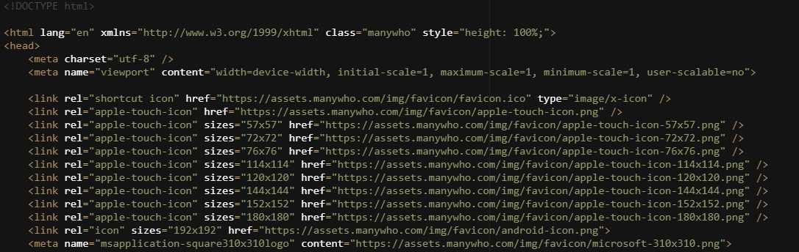
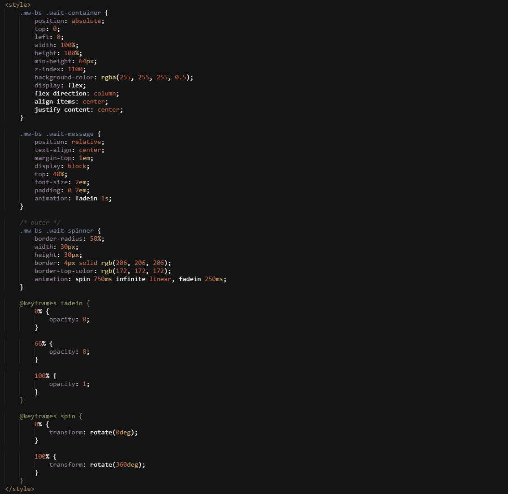
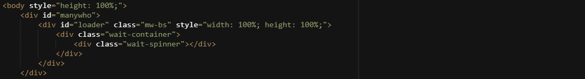
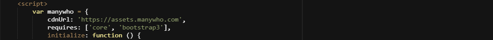
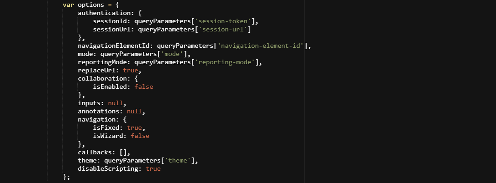

# Default legacy player

<head>
  <meta name="guidename" content="Flow"/>
  <meta name="context" content="GUID-1ec7b998-bb39-4296-9857-949eb1dd5680"/>
</head>

You can continue to use the default legacy player to run your flows.

:::warning

We recommend you to use the default player over the legacy player for an effective and seamless experience. The new player is fast-paced and a lighter version of the legacy player.

:::

## Overview

The default legacy player is based on the 'paper' Bootstrap 3 theme. See [Player themes](c-flo-Players_Themes_c08a4544-961f-478d-b949-a833634034b0.md).

-   The default legacy player offers a responsive, mobile-friendly experience when viewing a flow in a browser or on a mobile device, and can be used as a base from which to develop your own custom players.

-   Changes cannot be made to the default legacy player; if you wish to extend the functionality and styling of the default legacy player, you will need to create a custom player. See [Creating a custom player](t-flo-Players_Create_New_8c9d70c8-3d56-42ac-b988-927e60e5c4db.md).

The main player HTML sections are as follows:

## Favicon links

The `<link>` references contained in the `<head>` section load a favicon for the web application across browser/device environments. Change these links in a custom player to display a different favicon for yourweb application, for example your company logo or branded favicon.

## Title

The `<Title>` tag sets the browser page title to 'Boomi Flow'. Change this in a custom player to display a different browser page title for your flow.

## Flow loading spinner

The inline CSS within the `<Style>` tag configures the default spinner that is shown when a flow is loading/waiting.

The inline CSS layer within the `<Body>` tag displays the default spinner shown when a flow is loading/waiting.

**Note:** Change this code in a custom player to set a different flow spinner, for example to use your company branding or logo. See [Customizing the loading spinner](t-flo-Players_spinner_7343ec9c-c2d7-497e-bf8d-b1b4c36b2878.md).

## Flow User Interface framework bundles

The Flow User Interface framework is split into discrete bundles of functionality that are loaded independently; together they form the complete User Interface framework. Each bundle is a collection of related resources \(JavaScript, CSS, images etc\). The default legacy player defines which bundles are loaded using the `requires` property.

Bundles are loaded via the `requires` property on the root `manywho` object in the player, with the following supported bundles also loaded by the default legacy player:

-   **Core**: The `Core` bundle includes core services that handle the ‘backend’ modelling.

-   **Bootstrap3**: The `Bootstrap3` bundle includes the [Bootstrap 3](http://bootstrapdocs.com/v3.0.3/docs/getting-started/) implementation of supported components.

**Note:** The `Offline` bundle can also be loaded into a custom offline player here if offline flows functionality is required. See [Configuring an offline flow](c-flo-Offline_Creating_Offline_Flow_97f8fffa-7576-4682-8999-69b6f55f59ac.md).

## Settings

The default legacy player supports various settings that can be specified when the player initializes.

You can customize any of the settings by passing them into `manywho.settings.initialize({})` in a custom player. See [Default legacy player settings](r-flo-Players_settings_87ccbabe-0f52-4395-954c-86e9340770d6.md).

## Options

The default legacy player supports various options that allow you to modify the behaviour of the player.

You can customize these options as required in a custom player. See [Default legacy player options](r-flo-Players_Default_Options_8bfa7e4b-12e1-4b69-81de-40c9b40f5765.md).

