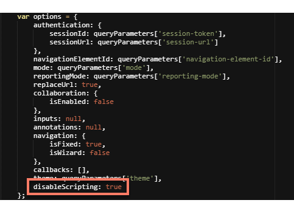

# Applying input sanitization in a player

<head>
  <meta name="guidename" content="Flow"/>
  <meta name="context" content="GUID-6c363b3c-9556-4075-8763-7e98308a80b9"/>
</head>


The `disableScripting` player option allows you to define the input sanitization behaviour for any flows run using a player.

Components such as the presentation component can allow flow users to enter HTML or JavaScript scripting into a flow; it is important to define whether your Organization wishes to allow unsanitized input within your flows, or whether any user input in a flow should be sanitized to comply with your internal security requirements.

For example, you may prefer to allow users to enter unsanitized input into a flow, in order to render HTML/JavaScript for improving the UX dynamics of any flows that you build.

-   The default player has the `disableScripting` option included, set to 'true' by default. This applies input sanitization and provides immediate security protection against scripting in any flow that uses the default player.

-   If the `disableScripting` option is not included in a player, the scripting behaviour will default to 'false', to allow scripting in custom players by default; input sanitization is not applied.

-   If you are using a custom player and wish to apply sanitization to user input in your flows, you will need to add the `disableScripting` option into your custom player and set this to 'true'. Any input in a flow run using the player will then be sanitized.




## Disabling input sanitization in the default player

The default player is set to apply scripting sanitization to user input by default. To disable input sanitization and allow users to enter HTML/JavaScript scripting within flows that use the default player:

1.  Edit the default player on the **Players** page.
2.  Search for and find the `disableScripting` option, located in the player options section.
3.  Change the setting to 'false'.
4.  Save the player.

Any flows run using this player will no longer apply input sanitization, allowing flow users to enter HTML/JavaScript scripting within a flow.

## Disabling input sanitization in a custom player

To disable input sanitization and allow users to enter HTML/JavaScript scripting within flows that use a custom player:

1.  Edit the custom player on the **Players** page.
2.  If it does not already exist, add the `disableScripting` option into the player options section.
3.  Set the setting to 'false'.
4.  Save the player.

Any flows run using this player will no longer apply sanitization to user input, allowing flow users to enter HTML/JavaScript scripting within a flow.

## Enabling input sanitization in a custom player

To enable input sanitization and prevent users from entering HTML/JavaScript scripting within flows that use a custom player:

1.  Edit the custom player on the **Players** page.
2.  If it does not already exist, add the `disableScripting` option into the player options section.
3.  Set the setting to 'true'.
4.  Save the player.

Any flows run using this player will apply input sanitization, so that any HTML/JavaScript scripting entered within a flow is removed.

## Advanced sanitization configuration

An additional `disableScriptingConfiguration` option can also be added into a player to further define the exact sanitization configuration, by enabling or disabling individual tags/attributes.

See the [DOMPurify GitHub repository](https://github.com/cure53/DOMPurify) for information on how to override default sanitization configuration values.

Example - excluding `<style>` content from sanitization

For example, to ensure that the styles and colors in your presentation components are applied as normal, you might wish to exclude `<style>` tag content from the sanitization process.

To exclude `<style>` tags from the sanitization process, the following code can be added into a player:

```
disableScripting: true,
disableScriptingConfiguration: {ALLOWED_TAGS: ['style']}
```

This will sanitize any flow using the player by removing HTML and JavaScript, but will allow HTML styles to be rendered.

Example - excluding `<iframe>` content from sanitization

To exclude `<iframe>` tags from the sanitization process, the following code can be added into a player:

```
disableScripting: true,
disableScriptingConfiguration: {ALLOWED_TAGS: ['iframe']}
```

This will sanitize any flow using the player by removing HTML and JavaScript, but will allow HTML iframes to be rendered.