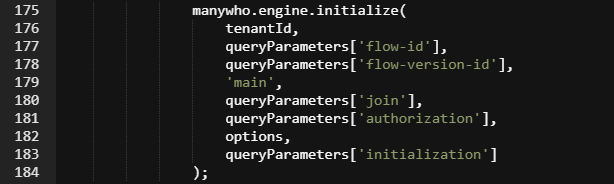

# Hosting external players

<head>
  <meta name="guidename" content="Flow"/>
  <meta name="context" content="GUID-99809e63-ba19-4c80-a399-ba3d7bd38ff3"/>
</head>


You can host your own external player if you do not wish to use the Boomi Flow hosted player.

To host an external player:

1.  Create and publish the flow that you would like to deliver using your hosted player.
2.  Identify and copy the tenant-id and flow-id of the published flow.
    -   For example, the flow-id can be found in the flow url as the '&flow-id=' parameter.

    -   For example, the tenant-id can be found in the **Account** menu. See [Accounts](c-flo-Tenant_menu_de6da113-3aab-4c23-aff0-5e42908b3536.md).

3.  Create and host a .HTML file on your external server - this will be the new player.
4.  Edit the file and copy-paste the entire HTML code from within the Boomi Flow default player. See [Default player](flo-defaultplayer_05efb5f4-0c3c-4c1c-98c3-d470af81fcad).
5.  Edit the engine initialization Url parameters at the bottom of the pasted HTML; initialization of the flow requires a few parameters that by default are usually fetched from the url query string. This will ensure that your player communicates with the correct flow.

    

    -   To start the latest activated version of a flow, enter the tenant-id and flow-id parameters.

    -   To start a specific version of a flow, enter the tenant-id, flow-id and flow-version-id parameters.

    -   To join a flow, enter the tenant-id and join parameters.

    For example, if your flow tenant-id was '07f799a4-af7c-449b-ba7c-f1f526f70b' and your flow-id was 'c6b211f0-b342-4f67-b7b1-b8b62868bb', your player code would be:

    ```
    manywho.engine.initialize(
    **'07f799a4-af7c-449b-ba7c-f1f526f70b',
     'c6b211f0-b342-4f67-b7b1-b8b62868bb'**,
     null,
     'main',
     queryParameters['join'],
     queryParameters['authorization'],
     options,
     queryParameters['initialization']);
    ```

6.  Edit the engine platform uri setting in the pasted HTML and specify the platform uri as 'https://flow.manywho.com'. For example:

    ```
    manywho.settings.initialize({
        platform: {
            uri: '**https://flow.manywho.com**',
                  },
    ```

7.  Save the file.
8.  View your hosted player file in a browser; the flow will run and be displayed as if it were using the default Boomi Flow hosted player.
9.  Customize the player as required. See [Customizing players](flo-defaultplayer_customizing.md).