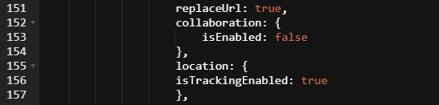

# Using geolocation in a player 

<head>
  <meta name="guidename" content="Flow"/>
  <meta name="context" content="GUID-f69770b6-9414-46bd-a6da-68d078855a4b"/>
</head>


Geolocation can be used in your flows, allowing access to user device geolocation data functionality.

## Overview 

Boomi Flow allows you to work with geolocation data using a number of system values. See [Location values](r-flo-Values_System_User_Values_d9728e25-86de-4d77-8246-a04031fe6b63.md#section_bxl_j1w_jjb).

The following user geolocation data can be accessed:

-   Current Latitude
-   Current Longitude
-   Location Accuracy
-   Current Altitude
-   Altitude Accuracy
-   Current Heading
-   Current Speed
-   Location Timestamp

Geolocation must be enabled as a setting in a player in order for it to be included in your flows.

Access to the geolocation values and functionality is device-dependent; for example, if a mobile phone running the flow does not have a GPS or an altimeter built in, some of the geolocation values will not be available.

## Enabling geolocation in a player 

1. Edit a custom player that requires geolocation functionality. See [Editing a player](t-flo-Players_Editing_1a1c96a1-6f8e-40ab-aec7-75778f374c1d.md).
2.  Enter the following setting into the '`var options`' settings in the player HTML:

    ```
    location: {isTrackingEnabled:true},
    ```

    

3.  Save the player.
   
4.  Now that geolocation is enabled in the player, you can use geolocation values in your flows as normal. For example, you could enter the $User/Current Latitude and $User/Current Longitude values into a step map element. For a list of available geolocation values, see [Location values](r-flo-Values_System_User_Values_d9728e25-86de-4d77-8246-a04031fe6b63.md#section_bxl_j1w_jjb).