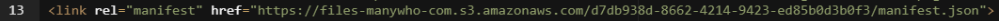

# Progressive Web Application players

<head>
  <meta name="guidename" content="Flow"/>
  <meta name="context" content="GUID-857506db-3a34-4d83-a4ab-09096c0c08b2"/>
</head>


Players can be configured to deliver a flow as a progressive web application \(PWA\).

## About this tutorial

In this tutorial, we are going to learn how to configure a player to deliver a flow as a PWA.

## What you will learn

This tutorial is designed for intermediate users, and aims to introduce the basic concepts involved in delivering a flow PWA, such as customizing players and using manifest files.

|**Duration**: 30 mins \| **Skill level**: Intermediate |

## Before you begin

A flow can be configured to work as a PWA by linking to a manifest JSON file from a custom player, allowing browsers \(such as Google Chrome on Android\) to deliver a PWA experience to your flow end users. For example, a visitor sign-in flow PWA could be configured on a tablet to be used by visitors to your office location\(s\).

For more information on manifest files and properties, see the [Google Developer guide to web app manifest files](https://developers.google.com/web/fundamentals/web-app-manifest).

-   A manifest JSON file is required for this feature. This can be hosted in your asset library. See [Assets](c-flo-Assets_7d21c82d-c700-437d-bdaa-ae4b0716726b.md).

-   A custom player is required to deliver the flow and link to the manifest file. See [Creating a custom player](t-flo-Players_Create_New_8c9d70c8-3d56-42ac-b988-927e60e5c4db.md).

-   Service Workers are not currently supported for use with flows as PWA.

-   Ensure that your custom player is optimized for use on the target device that you wish to install your flow PWA on. For example, fonts, button sizes and styles should be designed for use with a mobile/tablet touch interface.


## Step 1 - Create and upload a manifest file

1.  Create a JSON manifest file.
2.  Edit the file to configure the PWA as required. An example JSON file is shown below:

    **short\_name**: Enter a name for the pwa that will be used on the device home screen.

    **name**: Enter a name for the pwa that will be used for the [app install prompt](https://developers.google.com/web/fundamentals/app-install-banners/).

    **icons**: Define the icons that will be used on the device home screen.

    **start\_url**: Enter the published flow url for the flow that you wish to deliver as a PWA. Do not use the 'join\_url' flow url as the PWA should start a new state for the flow each time. For example, a valid url would be: 'https://flow.boomi.com/945f56a3-9a65-447e-b3ed-acaf1ac21005/play/pwaplayer?flow-id=7ac90e7b-ce95-49e3-82d5-821c466ed20x'.

    **display**: Set to 'standalone' to open your flow web app as if it were a standalone native app; i.e. it will open in its own window and hide browser UI such as the address bar.

    ```language-json
    {
        "short_name": "Boomi Flow PWA",
        "name": "Boomi Flow PWA",
        "icons": [
          {
            "src": "https://yoururl.com/assets/masthead/images/favicon.png",
            "type": "image/png",
            "sizes": "96x96"
          },
          {
            "src": "https://yoururl.com/assets/masthead/images/favicon.png",
            "type": "image/png",
            "sizes": "48x48"
          },
          {
            "src": "https://yoururl.com/assets/masthead/images/favicon.png",
            "type": "image/png",
            "sizes": "72x72"
          },
          {
            "src": "https://yoururl.com/assets/masthead/images/favicon.png",
            "type": "image/png",
            "sizes": "36x36"
          }
        ],
        "start_url": "https://flow.boomi.com/945f56a3-9a65-447e-b3ed-acaf1ac21005/play/pwaplayer?flow-id=7ac90e7b-ce95-49e3-82d5-821c466ed20x",
        "display": "standalone"
      }
    ```

3.  Save the file and upload it to your asset library. See [Uploading a new asset](t-flo-Assets_Uploading_a28577c2-84b1-44c9-8b63-37ace8968163.md).
4.  Right-click on the file on the [Assets page](c-flo-Assets_Page_f1d604a7-b133-4d4d-8dd1-4f29a62be2be.md) and copy the link. You will need this for the custom player.

## Step 2 - Create a custom player and link to the manifest file

1.  Create a custom player that you will use to deliver the PWA flow. See [Creating a custom player](t-flo-Players_Create_New_8c9d70c8-3d56-42ac-b988-927e60e5c4db.md).
2.  Edit the player and insert a link to the manifest file with the **rel** property set to 'manifest'. See [Adding CSS and Javascript to custom players](c-flo-Players_Stylesheets_ebaf21f6-277a-4a8e-8f12-e6d48c2a99be.md).

    ```language-json
    <link rel="manifest" href="{yoururl}/manifest.json">
    ```

    

3.  Save the player and ensure that you publish the flow using this player when generating your flow url.

## Step 3 - Configuring the PWA on a device

The flow can now be set to display as a PWA on devices; as it will not be downloaded from an app store like a native mobile application, you may need to configure it to display as a PWA on your device.

For example, on an IOS device:

1.  Open the flow url in the device Safari browser.
2.  Select **Options \| Add to Home Screen**. An icon will be added to the device home screen.
3.  Tap this icon to launch the flow as a PWA.