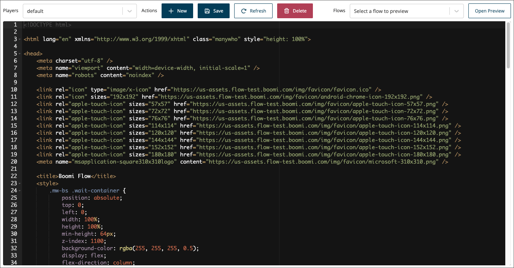

# Players page

<head>
  <meta name="guidename" content="Flow"/>
  <meta name="context" content="GUID-ba77dfc3-cf1c-42b3-90dd-957b04d1e4e1"/>
</head>

Manage and configure flow players on the **Players** page.

## Opening the page

-   Select **Players** from the left-hand menu.

## Page overview

The **Players** page allows you to access and edit your existing players, as well as create new custom players. You can also preview a player when applied to any of your flows, allowing you to quickly check your player changes.

-   The **Player selection** drop-down menu allows you to select any of your existing players.

-   Once you have selected a player in the drop-down, you can edit it and save your changes by clicking the **Save** button, delete the player by clicking the **Delete** button, or create a new custom player by clicking the **New** button. See [Creating a custom player](t-flo-Players_Create_New_8c9d70c8-3d56-42ac-b988-927e60e5c4db.md).

-   Once you have selected a player in the drop-down, the code for the player is displayed in the main window, allowing you to directly edit the player. See [Editing a player](t-flo-Players_Editing_1a1c96a1-6f8e-40ab-aec7-75778f374c1d.md).

-   Once you have selected a player in the drop-down, you can also quickly preview how your flows will look with the player applied. See [Previewing a player](t-flo-Players_Previewing_df24e41d-01af-43f5-8031-fc86362c39e2.md).