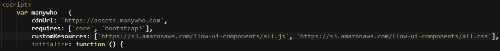

# Adding CSS and Javascript to custom players

<head>
  <meta name="guidename" content="Flow"/>
  <meta name="context" content="GUID-ebaf21f6-277a-4a8e-8f12-e6d48c2a99be"/>
</head>


You can add custom CSS styling and Javascript into a player.

## Using CSS/Javascript to customize a player

You can add CSS and Javascript to a player by either linking to external CSS/Javascript files, or by adding CSS/Javascript directly inline into the player.

Once you have created custom CSS style classes, you can then directly apply these to components and containers in the page builder, so that they are then applied when the flow is run in a browser.

## Linking to external CSS and Javascript files

The most efficient way of organizing your CSS and Javascript is to separate these into files that you can link to and load in the player. This approach keeps the code/styling separate from the player code, allowing easier maintenance and re-use across multiple players.

You can link files in a player by adding a `customResources` property into the player code:

1.  Create a new custom player. See [Creating a custom player](t-flo-Players_Create_New_8c9d70c8-3d56-42ac-b988-927e60e5c4db.md).
2.  Edit the player on the **Players** page.
3.  Search for and find the 'manywho' object.
4.  Add a new 'CustomResources' property to the object, and insert your file link url\(s\). The URL must support [cross-origin resource sharing \(CORS\)](https://en.wikipedia.org/wiki/Cross-origin_resource_sharing). For example:

    

    ```
    customResources: ['https://s3.amazonaws.com/flow-ui-components/all.js', 'https://s3.amazonaws.com/flow-ui-components/all.css'],
    ```

5.  Save the player.

## Adding CSS/Javascript inline in a player

Javascript and CSS can also be added directly inline in the player if required using the normal `<style>` and `<script>` HTML tags. Unlike linking to an external file however, this means that any changes required to the CSS/Javascript will require updating the player each time.

If you are adding CSS inline in a player, best practice is to insert your new `<style>` tag just inside the `<body>` tag at the end of the player; this ensures your custom styles are lower in the 'cascade' than the default CSS styles being inserted from the core platform.