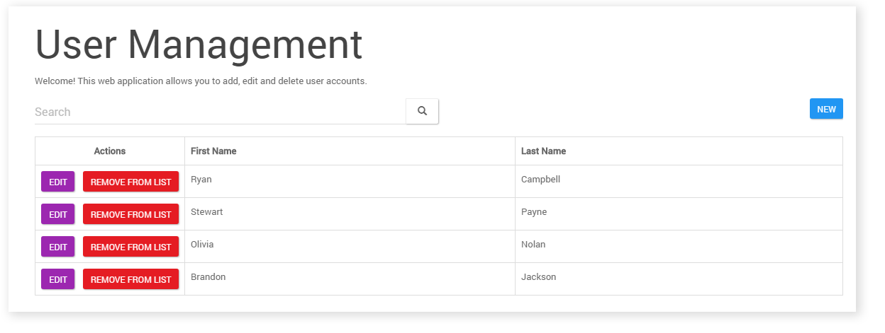
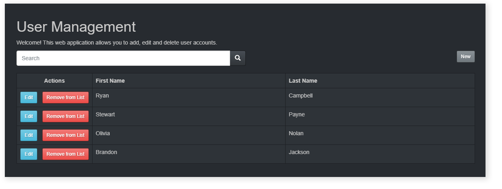
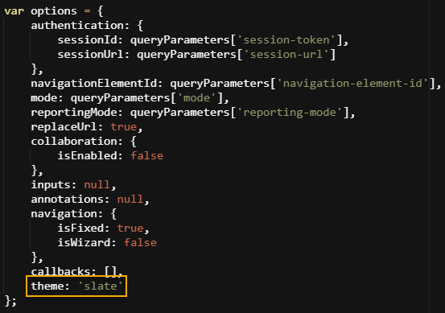

# Player themes

<head>
  <meta name="guidename" content="Flow"/>
  <meta name="context" content="GUID-c08a4544-961f-478d-b949-a833634034b0"/>
</head>

The default legacy player uses themes to quickly customize the appearance of a web application without having to rebuild the application or apply custom CSS.

## Overview

Themes provide a way to easily “skin” the default legacy player and custom players based on it. The design elements contained within any flow that uses the player, such as colours, fonts, background colour, button styles and so on, can all be customized. Apply a different theme to change the way a player renders a flow to the end-user.

If no theme is applied, a web application is rendered using the default player and 'paper' theme. For a list and preview of currently supported themes, see [Supported player themes](r-flo-Players_Themes_Supported_2b04d544-9ac4-4132-9f08-f258cc72a069.md).

You can also create and develop your own themes for use in Boomi Flow. See [Custom player themes](c-flo-Players_Themes_Custom_8c249fc3-56eb-460f-8cc4-a0fa8af27be7.md).

## Applying a theme

In the following example, a simple flow has the default theme applied:

If a new theme is applied in the player \(for example, 'slate'\), the flow is displayed using the new theme elements:

## Applying a theme using a custom player

1.  Create a new custom player based on the default player. See [Creating a custom player](t-flo-Players_Create_New_8c9d70c8-3d56-42ac-b988-927e60e5c4db.md).
2.  Edit the player and search for the 'var options' section. See [Editing a player](t-flo-Players_Editing_1a1c96a1-6f8e-40ab-aec7-75778f374c1d.md).
3.  In this section, change the 'theme: queryParameters\['theme'\]' option by removing the queryparameters\[\] string and simply reference the theme you wish to apply. For example, change this to 'theme: 'slate'' to apply the 'slate' theme to any flows using the player.

    

4.  Save the player. You can preview what a flow will look like in the player with the new theme applied, see [Previewing a player](t-flo-Players_Previewing_df24e41d-01af-43f5-8031-fc86362c39e2.md). Any flows using this player will now be displayed using the 'slate' theme.

**Note:** Do not use upper case when entering the name of the theme. For example, ‘Yeti’ should be entered as ‘yeti’.

## Applying a theme using a query parameter

A theme can also be applied to a flow web application by simply adding a query parameter to the end of the flow url.

1.  Run or publish a flow.
2.  In the browser address bar, add a '&theme=theme' query parameter to the end of the url to apply a theme for the flow, replacing 'theme' with the name of the theme. For example, '&theme=slate' will apply the 'slate' theme to the flow.