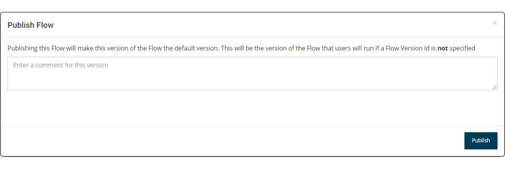
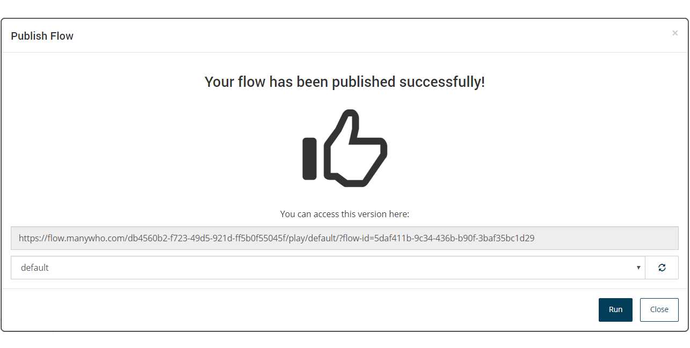
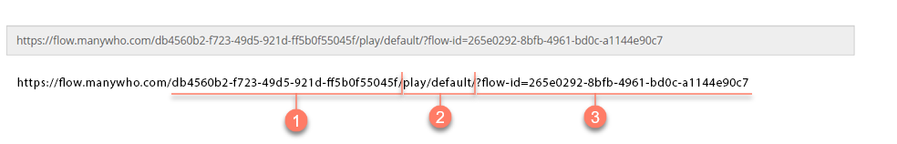

# Publishing a flow

<head>
  <meta name="guidename" content="Flow"/>
  <meta name="context" content="GUID-ace67655-6267-49a1-a1dd-2eb29ac6c585"/>
</head>

Publishing a flow allows you to build and execute a flow in the same way that a flow can be run, except that the published flow 'snapshot' is then set as the default version of the flow.

:::note

Care should be taken when publishing a flow; when a flow is published it will overwrite and become the new default version of the flow, which will impact any users currently running and using the flow. Typically, a flow would only be published after it has been run and tested. See [Running a flow](c-flo-Running_flows_5b0b848d-2528-4a14-b186-e393812b4664.md).

:::
## Overview 

When you publish a flow, a snapshot is taken of the current version of the flow, with this version becoming the default version of the flow.

-   The default URL for the flow is generated for this version of the flow, allowing you to access the flow in a browser as a web application, and share the flow with other users.

-   This default flow URL will always present the latest published version of your flow; this will be the version of the flow that users will run if a Flow Version Id is not specified.

## Publishing a flow 
To publish a flow.

1.  Select **Publish** from the right-hand menu on the flow canvas.
2.  The **Publish Flow** form is displayed.

    

    -   Enter a comment if required to provide information about this published version of the flow.

    -   Tenant Administrators can also select which runtime environment to publish to by selecting the from the **Runtime Environment** drop-down menu. Standard users do not have this drop-down menu available.

3.  Click **Publish** to publish the flow.
4.  The **Publish Flow** form is displayed.

    

    -   **Flow Run URL**: The flow run URL is displayed. This URL identifies the default version of the flow, and will remain constant throughout the lifetime of the flow. Any user who accesses the flow with this URL will always be presented with the latest published version of the flow.

    -   **Player**: Select the player you wish to use with the flow. The player section of the URL will update with the corresponding player that you select here. See [Players](c-flow-Players_931f82a8-0725-4dc3-b965-f606330dc5a6.md).

5.  Click **Run** to launch and run the published flow web application in a browser.

## The Flow Run URL 

The URL generated when you publish a flow is the **Flow Run URL**.

This URL includes the following information:

-   The **Tenant ID** for the tenant that the flow is stored in. See [Tenants](c-flo-Tenants_770f70ef-b441-4f1b-b565-2f87430e28f2.md). 

-   The **Player** that is being used to run the flow in a browser. Changing the player when you run a flow will change this value to the corresponding player in the URL. See [Players](c-flow-Players_931f82a8-0725-4dc3-b965-f606330dc5a6.md). 

-   The **Flow ID** that is the unique identifier for the flow. This remains constant throughout the life cycle of a flow. 

When the published flow is launched in a browser, the **Join URI** is generated for the URL. See [ System state values](r-flo-Values_System_State_Values_0e184acc-ec85-4922-b06b-07a5d6966fa0.md) for more information on joining and resuming flows using the **Join URI**.