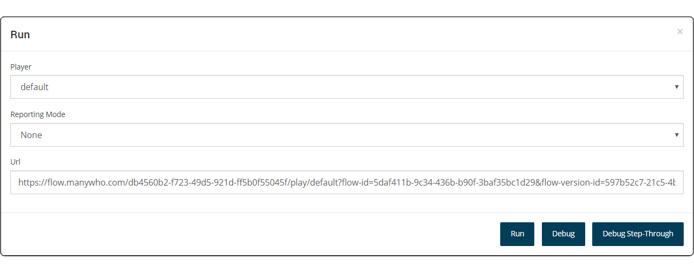
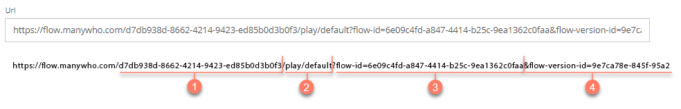

# Running a flow

<head>
  <meta name="guidename" content="Flow"/>
  <meta name="context" content="GUID-5b0b848d-2528-4a14-b186-e393812b4664"/>
</head>

Running a flow allows you to build and execute a flow. The flow is then presented in a browser as a web application.

## Overview 

Running a flow allows you to generate and view a flow, but without making it the default version of a flow. This is different to publishing a flow. See [Publishing a flow](c-flo-Publishing_Flows_ace67655-6267-49a1-a1dd-2eb29ac6c585.md).

When you run a flow, a snapshot is taken of the current version of the flow. A URL is generated for this version of the flow, allowing you to access the flow in a browser as a web application. This URL can then be used to share the flow with other users.

## Running a flow 
Run a flow directly from the flow canvas.

1.  To run a flow:
    -   Select **Run** from the right-hand menu on the flow canvas.

    -   Press **CTRL** + **R** on the flow canvas.

2.  The **Run** form is displayed. Define options for the run operation as required:

    

    -   **Player**: Select the player you wish to use with the flow. See [ Players](c-flow-Players_931f82a8-0725-4dc3-b965-f606330dc5a6.md).

    -   **Reporting Mode**: Allows you to optionally specify whether to capture reporting data for the flow to be used with Flow reporting. If you are not using this feature, select 'None' \(default\).

    -   **URL**: The Flow Run URL that will be generated is displayed.
3.  Click **Run** to run the flow. A snapshot is created and the flow web application is opened in a browser.
4.  You can also run the flow in debug mode by clicking either **Debug** or **Debug Step-Through**. See [Debugging a flow](c-flo-Debugging_a82ae672-dd07-469f-b2a4-baa8180cb522.md).

## The Flow Run URL 

The URL generated when you run a flow is the **Flow Run URL**.

This URL includes the following information:

-   The **Tenant ID** for the tenant that the flow is stored in. See [ Tenants](c-flo-Tenants_770f70ef-b441-4f1b-b565-2f87430e28f2.md). 

-   The **Player** that is being used to run the flow in a browser. Changing the player when you run a flow will change this value to the corresponding player in the URL. See [ Players](c-flow-Players_931f82a8-0725-4dc3-b965-f606330dc5a6.md). 

-   The **Flow ID** that is the unique identifier for the flow. This remains constant throughout the life cycle of a flow. 

-   The **Flow Version ID** that is the unique identifier for this version of the flow. Every time the flow is changed, a new version ID is generated. 