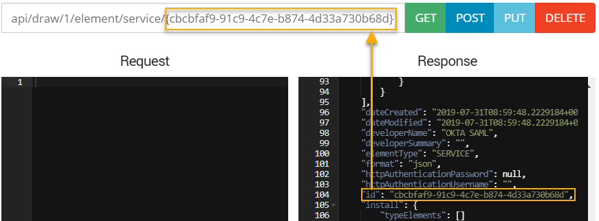
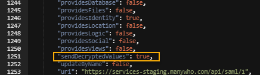

# Installing the SAML (Deprecated) connector

<head>
  <meta name="guidename" content="Flow"/>
  <meta name="context" content="GUID-0c7580d2-e07f-45d2-b81c-91778ec4c19f"/>
</head>

:::warning

This connector is now in Deprecated status. It is no longer available for new users and is not actively maintained. We will provide a minimum six-month notice before its retirement. We recommend upgrading to the newer supported version of this connector.

:::

To use the SAML (Deprecated) connector, you will first need to install the into your flow tenant.

## Step 1: Installing the SAML (Deprecated) connector

1.  Select **** from the main left-hand menu.
2.  Click **New Connector**.
3.  Select "SAML \(Deprecated\)" from the **Connector Type** menu.
4.  Enter a name for the in the **Name** field, "SAML connector" for example. The URL is shown in the **Url** field.
5.  Click **Retrieve Connector Configuration Data**.
6.  Specify the required configuration values. See [configuration values](c-flo-SAML_Values_88e02c39-d341-40d6-b9d0-d1d4db7e690c.md) for details on the required values.
7.  Click **Install**.
8.  Click **Save Connector**.
9.  The is now installed.

## Step 2: Certificate Decryption

The certificate is encrypted in the system, and needs to be decrypted before it is sent to the SAML .

1.  Open the flow you wish to configure the certificate for.
2.  On the **Home** tab select **API** from the main menu.
3.  Enter api/draw/1/element/service?filter= into the API **Address** field.
4.  Click **GET**.
5.  The **Response** pane now contains the id for the SAML (Deprecated) connector. Copy this value.
6.  Enter api/draw/1/element/service/\{service id\} into the API **Address** field, replacing service id with the SAML connector id value copied previously.

    

7.  Click **GET**.
8.  Copy all the content in the **Response** pane and paste it into the **Request** pane.
9.  Set **"sendDecryptedValues"** to true in the **Request** pane content.

    

10. Remove the service id from the API **Address** field so that it reads api/draw/1/element/service.
11. Click **POST**.

## Step 3: Define the IdP assertion package

In your IdP you will need to configure the assertion package to add the required claim attributes needed to identify the user by the flow; this allows the flow to understand the user information that is being sent by your IdP.

The following claim attributes will need to be added:

|Claim Attribute|Description|System user value|
|:--------------|:----------|:----------------|
|name|The first name of the user.The following claim attribute naming conventions are accepted: name, firstname, first\_name, first name, givenname, given\_name, http://schemas.xmlsoap.org/ws/2005/05/identity/claims/name |Use in a flow through the $User/First Name system user value.|
|surname|The surname of the user.The following claim attribute naming conventions are accepted: surname, sur\_name, last name, last\_name,lastname, http://schemas.xmlsoap.org/ws/2005/05/identity/claims/surname|Use in a flow through the $User/Last Name system user value.|
|emailaddress|The e-mail address of the user.The following claim attribute naming conventions are accepted: email, emailaddress,email\_address, mail,http://schemas.xmlsoap.org/ws/2005/05/identity/claims/emailaddress|Use in a flow through the $User/Email system user value.|
|groups|Group\(s\) that the user is a member of. This attribute is optional, depending on your configuration.The following claim attribute naming conventions are accepted: groups, http://schemas.microsoft.com/ws/2008/06/identity/claims/groups|Groups are concatenated into the $User/Primary Group Name system user value in comma-separated format. For example, 'GroupA,GroupB,GroupC'. Where the SAML response contains both groups and primarygroupname attributes, the primarygroupname attribute takes priority and is set in the $User/Primary Group Name system user value.|
|primarygroupname|The primary group name that the user is a member of. This attribute is optional, depending on your configuration. The following claim attribute naming conventions are accepted: primarygroupname, primary\_group\_name, primary group name, http://schemas.manywho.com/2020/identity/claims/primarygroupname|Use in a flow through the $User/Primary Group Name system user value.|
|primarygroupid|The primary group ID that the user is a member of. This attribute is optional, depending on your configuration. The following claim attribute naming conventions are accepted: primarygroupid, primary\_group\_id, primary group id, http://schemas.manywho.com/2020/identity/claims/primarygroupi|Use in a flow through the $User/Primary Group ID system user value.| To learn more about using system user values in your flows, see [System user values](r-flo-Values_System_User_Values_d9728e25-86de-4d77-8246-a04031fe6b63.md).

:::note

When using Active Directory Federation Services \(ADFS\) with SAML, the reply from ADFS may need to include the Name ID claims attribute for the configuration to work correctly.

:::

## Example SAML IdP response Attribute Statement

In this example, once a user has successfully logged in with their IdP, the SAML Response sent from the IdP to should contain an Attribute Statement that identifes the user, as follows:

```
<saml:AttributeStatement>
    <saml:Attribute Name="http://schemas.xmlsoap.org/ws/2005/05/identity/claims/name" NameFormat="urn:oasis:names:tc:SAML:2.0:attrname-format:basic">
        <saml:AttributeValue xsi:type="xs:string">First Name</saml:AttributeValue>
    </saml:Attribute>
    <saml:Attribute Name="http://schemas.xmlsoap.org/ws/2005/05/identity/claims/surname" NameFormat="urn:oasis:names:tc:SAML:2.0:attrname-format:basic">
        <saml:AttributeValue xsi:type="xs:string">Surname</saml:AttributeValue>
    </saml:Attribute>
    <saml:Attribute Name="http://schemas.xmlsoap.org/ws/2005/05/identity/claims/emailaddress" NameFormat="urn:oasis:names:tc:SAML:2.0:attrname-format:basic">
        <saml:AttributeValue xsi:type="xs:string">test@example.com</saml:AttributeValue>
    </saml:Attribute>
    <saml:Attribute Name="http://schemas.microsoft.com/ws/2008/06/identity/claims/groups" NameFormat="urn:oasis:names:tc:SAML:2.0:attrname-format:basic">
        <saml:AttributeValue xsi:type="xs:string">group1</saml:AttributeValue>
        <saml:AttributeValue xsi:type="xs:string">group2</saml:AttributeValue>
    </saml:Attribute>
    <saml:Attribute Name="http://schemas.manywho.com/2020/identity/claims/primarygroupname" NameFormat="urn:oasis:names:tc:SAML:2.0:attrname-format:basic">
        <saml:AttributeValue xsi:type="xs:string">Primary Group Name</saml:AttributeValue>
    </saml:Attribute>
    <saml:Attribute Name="http://schemas.manywho.com/2020/identity/claims/primarygroupid" NameFormat="urn:oasis:names:tc:SAML:2.0:attrname-format:basic">
        <saml:AttributeValue xsi:type="xs:string">Primary Group Id</saml:AttributeValue>
    </saml:Attribute>
</saml:AttributeStatement>
```

:::note

In the above example, the optional group information for the user has also been included, using the `groups`, `primarygroupname`, and `primarygroupid` Attributes.

:::