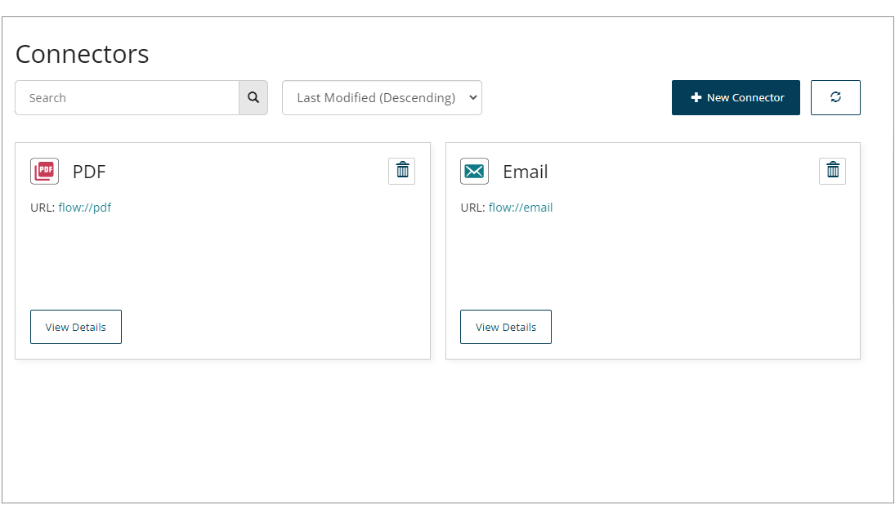

# Connectors page

<head>
  <meta name="guidename" content="Flow"/>
  <meta name="context" content="GUID-282a671d-996b-4561-a97d-6cc5993929da"/>
</head>

The **Connectors page** allows you to manage your existing connectors, and install new connectors into your tenant.

## Opening the page 

-   Select **Connectors** from the left-hand menu.

## Page overview 

The **Connectors page** shows all the connectors currently set up within the tenant.

-   Each connector is displayed as an individual tile on the page.

-   Each tile shows the name of the connector, and the Connector URL.

-   Click **New Connector** to install a new into the tenant.

-  Click **View Details** on a connector tile to view and edit a connector.

-   Click the **Delete Connector** tile icon  to delete a connector from the tenant.

## Searching/filtering connectors 

The **Search** field allows you to search for and filter which are displayed on the page.

This is useful if you have a large number of , or wish to quickly search for a specific .

1.  Enter the text into the **Search** field that you wish to filter the page by. Partial search terms can be used, for example, entering "Doc" filters the list so that all that contain "Doc" in their name are shown.
2.  Click the **Search** icon to perform the search.

## Sorting connectors 

The **Sort** menu allows you to sort the connectors that are shown on the page.

You can sort connectors on the page by:

-   Last Modified \(Descending\)

-   Last Modified \(Ascending\)

-   Name \(Descending\)

-   Name \(Ascending\)

## Refreshing the page

Click the **Refresh** icon Refresh to refresh the page.