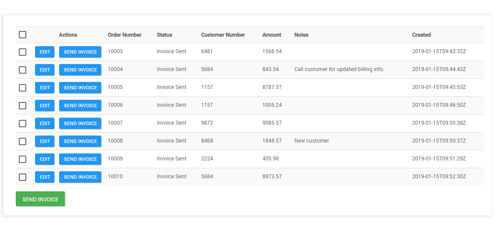

#  SQL (Deprecated) connector

<head>
  <meta name="guidename" content="Flow"/>
  <meta name="context" content="GUID-4c5f84e4-38c9-4b2a-a90f-bff3078000e7"/>
</head>

:::warning

This connector is now in Deprecated status. It is no longer available for new users and is not actively maintained. We will provide a minimum six-month notice before its retirement. We recommend upgrading to the newer supported version of this connector.

:::

The SQL (Deprecated) connector allows you to read and write data from an SQL database.

## Overview 

The SQL (Deprecated) connector provides a way of loading, saving and deleting data in your flows using an SQL database. For example, you may wish to integrate an existing database into your flow to display and work with database table data.

The SQL (Deprecated) connector currently supports the following SQL database types:

-   MySQL

-   PostgreSQL

-   SQL Server


During the connector installation your database metadata will be read and each table and view will be mapped to a flow Type. You can then use a **Load** map element in your flow to read and display rows from the database tables, and the **Save** and **Delete** map elements to modify rows in the tables.

For example, you can load rows from a database table into a page in your flow to display, and then allow a user to edit the rows and save their results back to the database, as shown in the example below.




-  In the example image above, the SQL connector is being used with a **Load** map element to read data from an SQL database into a page in a flow. Individual rows in the table can then be edited and saved back to the database using a **Save** map element.

## Connector URL

The SQL connector endpoint URL is:

-   https://services.manywho.com/api/sql/2

## Features 

The SQL (Deprecated) connector forms part of the following features within flow:

-   **Database:** This connector feature allows you to connect to a remote data source and perform save, load and delete operations.

## Known limitations 

-   The SQL (Deprecated) connector requires a table to have a Primary Key and AutoIncrement defined. Only standard tables with primary keys are supported by the connector. If a database is used where the primary key is not supported, in views the connector will use all the columns in the table as a primary key.

-   There is a limit of 1000 returned rows for each database query; if a query load is requested with a size bigger then the max supported size will be used. The maximum number of elements that can be executed in a row without a break (i.e. a step or page) is 1000.

-   There is a 100 second maximum duration for connector invoker calls. After this duration, the connector invoker call is cancelled.

-   Only PostgreSQL has support for changing the names of the flow Types via the column descriptions.

-   The MONEY type is not supported when using the SQL (Deprecated) connector with an SQL Server database type.

-   Although a large variety of data types are supported, if the data type is not supported then the column will be ignored; if the column is not null in the table you will not be able to insert or save in the flow. See  [supported SQL data types](r-flo-Services_SQL_Supported_Databases_599e7267-106c-43d3-855f-63cb843fe805.md).

-   When applying filters to date/time value columns in custom components, the value supplied must use the ISO-8601 extended offset date-time format in order for the connector to correctly parse the value. For example

    ```
    2011-12-03T10:15:30+01:00
    ```

    To learn more about this date/time format, see the [ISO\_OFFSET\_DATE\_TIME](https://docs.oracle.com/javase/8/docs/api/java/time/format/DateTimeFormatter.html#ISO_OFFSET_DATE_TIME) API specification. See [ Formatting date and time values](c-flo-Date_Time_in_Flow_967f3878-c123-4466-9f9f-dffb94c4f3b1.md) to learn more about formatting date/time values in.