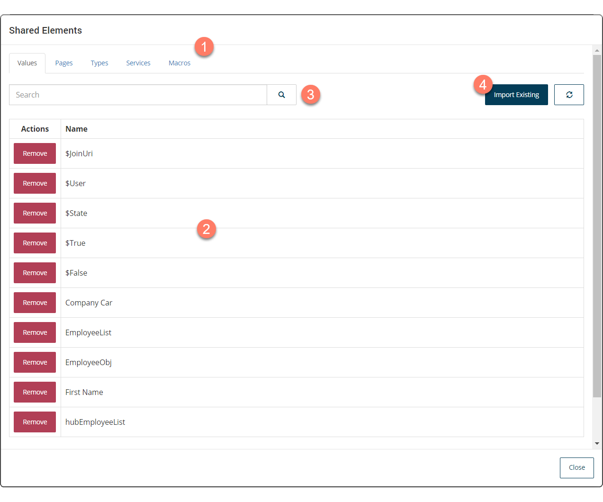

# Dependencies 

<head>
  <meta name="guidename" content="Flow"/>
  <meta name="context" content="GUID-85425302-deb7-4f96-aedd-be797a3224e5"/>
</head>

Dependencies are 'global' tenant elements that can be shared and re-used across multiple flows within a tenant.

## Overview 

The following types of element can be shared across multiple flows within a tenant:

-   [Macros](c-flo-Macros_b108573d-8668-4d4f-aab3-79fb49adcc3f.md)

-   [Pages](c-flo-ME_Page_539c415f-59d7-47d5-90ef-cb3a108b3010.md)

-   [Types](c-flo-Types_d429840a-ffa4-47c5-8131-5411965e422c.md)

-   [Connectors](c-flo-Service_Integrations_cac4d712-9607-4f24-8e70-aae48ceb27b9.md)

-   [Values](c-flo-Values_f83f964c-1348-475d-80b1-480daef433f7.md)

For example, once you have successfully added and configured a in your tenant, this can then be imported into multiple flows as a dependencies, without having to re-create the inside each flow.

Similarly, you can set up and import common types or values that you wish to use within different flows in your tenant.

## Opening the Shared Elements form 

-   Select **Shared Elements** from the right-hand menu on the flow canvas.

## Shared elements form 

The **Shared Elements** form allows you to manage dependencies in a flow, including importing elements into a flow and removing elements from a flow.

-   The different types of element that can be imported into the flow are accessed by selecting from the tabs at the top of the form. 

-   The main area of the form displays a table of all the current dependencies of that type that have been imported into the flow. 

-   The **Search** field allows you to search for and filter which values are displayed in the list. 

    This is useful if you have a large number of dependencies, or wish to quickly search for a specific element.

    1.  Enter the text into the **Search** field that you wish to filter the table by. Partial search terms can be used, for example, entering "Doc" will filter the list so that all elements containing 'Doc' in their name will be shown.
    2.  Select the **Search** icon to perform the search.
-   Click **Import Existing** to import elements into the flow. 

## Importing dependencies into a flow 

1.  Select the type of element you wish to add to the flow using the tabs at the top of the form.
2.  Click **Import Existing** to open the **Add To Flow** form.
3.  A list of all the elements of that type are displayed. Locate the element you wish to add \(using the search if required\) and click **Import** in the **Actions** column on the element row.
4.  The element will be imported into the flow and become available for use. Repeat the process as required to add more elements into the flow.

## Removing dependencies from a flow 

1.  Select the type of element you wish to remove from the flow using the tabs at the top of the form.
2.  A list of all the elements of that type are displayed. Locate the element you wish to remove \(using the search if required\) and click **Remove** in the **Actions** column on the element row.
3.  The element will be removed from the flow. Note that you should only remove elements that are not being actively used within other flows in the tenant as this may cause problems with functionality in flows that are dependent on the element you are removing.