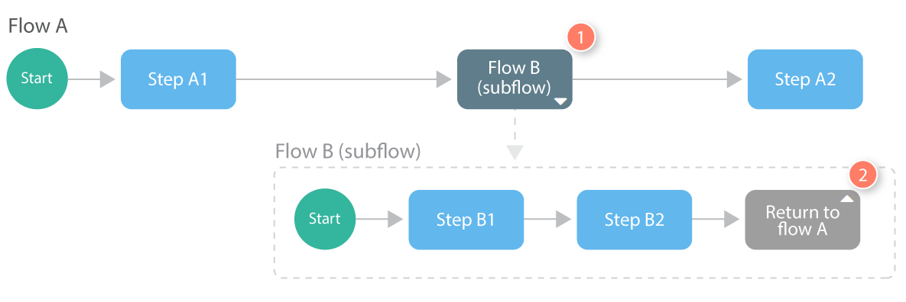
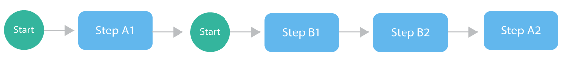

# Subflows technical overview 

<head>
  <meta name="guidename" content="Flow"/>
  <meta name="context" content="GUID-d549a097-2903-411d-b514-a7ee38731a69"/>
</head>

When a flow that calls a subflow is run, the content of the referenced subflow is inserted wherever the **Subflow** map element is located in the flow.

## A visual overview of subflows 

In this example, flow A is set up to call flow B as a subflow.

-   Flow A contains two step map elements \(Step A1 and Step A2\).

-   A **Subflow** map element is inserted after Step A1,  indicating that flow A should 'pause' at this point and flow B should start running as a subflow instead.

-   Flow B will start and continue running until the **Return** map element is encountered,  at which point flow A will be re-joined, 'unpause' and re-commence running, proceeding to Step A2.

At runtime, flow A will be executed for end users as follows:

**Note:** A new flow state is not created for subflows, as the flow state created during initialization of the main flow is used, regardless of how many levels of nested flows and subflows are running.

## Publishing and subflows 

-   When a parent flow is built by clicking **Run** or **Publish** on the flow canvas, a new snapshot of each subflow is also generated and will then be used by the parent flow.

-   If a flow being called as a subflow is changed and published, the new version will not immediately be called by the parent flow, **until** the parent flow is run or published.

-   For example, if flow A above was run or published, would automatically generate a snapshot of flow B to be used. If flow B was changed and then re-published, flow A would still not use this updated version of flow B. Only when flow A itself is run or published again would the latest version of flow B then be called.

## Nesting subflows 

-   Flows can contain multiple **Subflow** map elements.

-   Flows called as subflows can also themselves contain **Subflow** map elements, allowing multiple levels of nested flows and subflows.

## Authorization 

Authorization is honoured within subflows, allowing flows that are called as a subflow to have different authorization settings \(such as identity connector, access mode, authorization group and so on\).

-   Before a subflow is run, the relevant authorization settings are checked and processed.

-   Depending on the flow configuration, this may result in an additional authentication operation \(such as a log-in screen, OAuth2 or SAML protocol\) or denial of access for a user \(in case an identity connector used by both flows is the same but the user is not a member of the required authorization group\).

## Navigation 

If a flow being used as a subflow has Navigation configured, the Navigation will not be used when the flow is run. Only the Navigation defined for the parent running flow is used.

## Exporting and importing flows containing subflows 

When a flow containing **Subflow** map elements is exported, all subflows are also exported as part of the export package.

For example:

-   Flow A uses flow B as a subflow, and flow B in turn uses flow C as a subflow.

-   When flow A is exported, flows B and flow C are also exported and included in the export package.

-   When flow A is imported into a tenant, flows B and C are also imported.