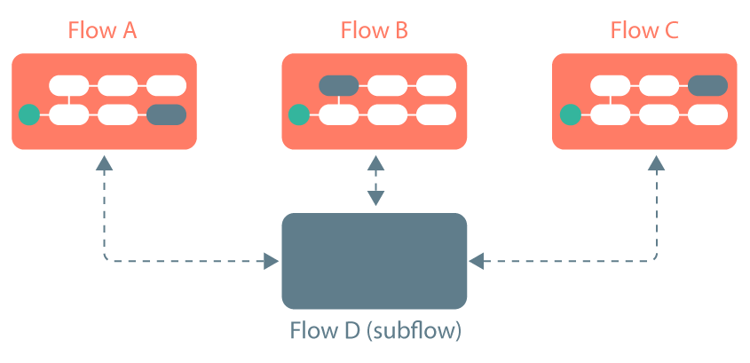

# Subflows 

<head>
  <meta name="guidename" content="Flow"/>
  <meta name="context" content="GUID-ca879fac-5941-44d3-87df-69b97ac5c034"/>
</head>

Flows can be called by other flows as 'subflows', allowing you to reuse flows across multiple workflows.

## Overview 

Subflows allows you to reuse flows and their functionality within another flow.

For example, if you have multiple flows \(flows A, B and C\) that all require the same piece of functionality provided by another flow \(flow D\), you can configure flow D as a subflow to be referenced within each of the other flows. This means that if the functionality needs to be changed, it only needs changing once, in flow D.

-   Subflows functionality consists of a parent flow and a subflow.

-   The parent flow requires a **Subflow** map element  that calls the subflow.

-   The subflow requires a **Return** map element  to define when it should rejoin the parent flow. Subflows without a **Return** map element will not re-join the parent flow.

-   Values can be passed between parent flows and subflows. See [Passing values using subflows](c-flo-Subflows_passing-values_8a94d936-7c7c-4e50-8706-6652dcf1e0c9.md).

To get started using subflows, see [Adding and using subflows](t-flo-Subflows_Creating_a_subflow_02491fd8-480f-49dd-9806-352781af429a.md).