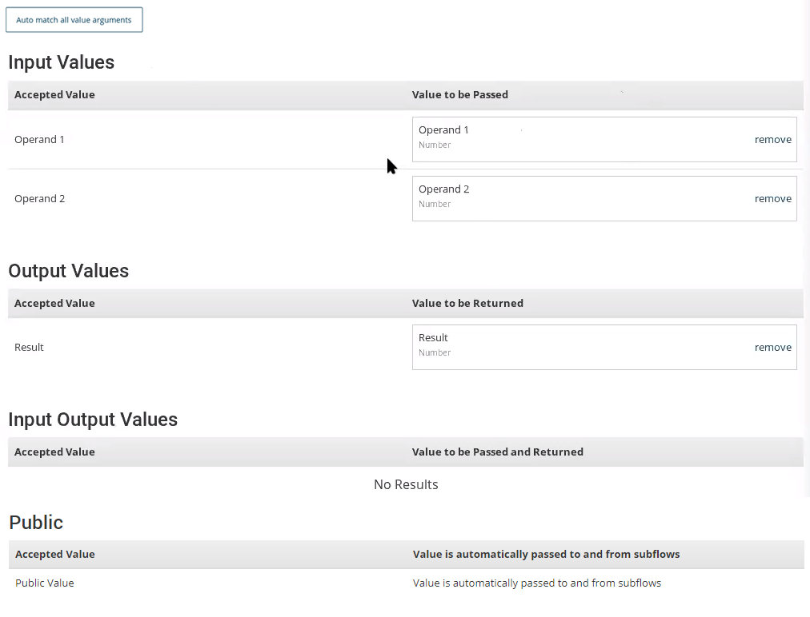
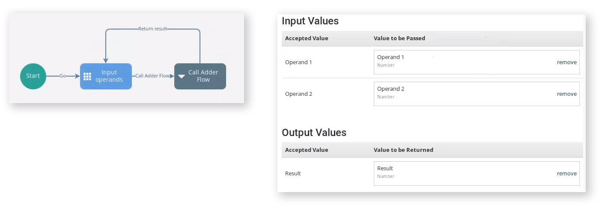
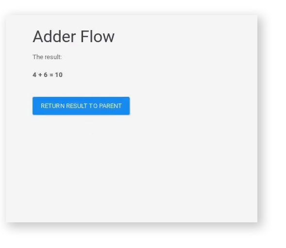
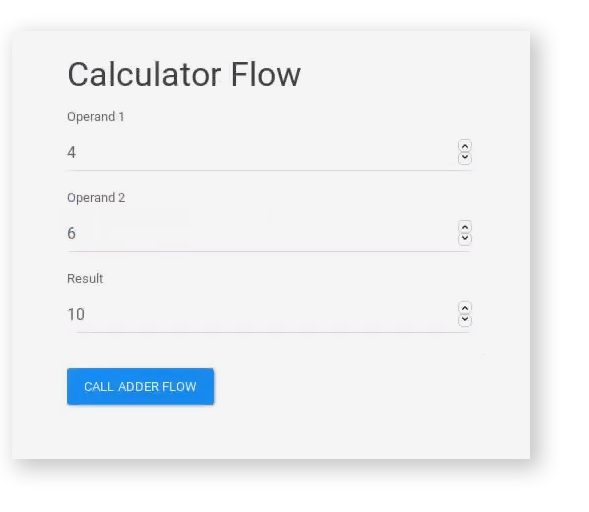

# Passing values using subflows

<head>
  <meta name="guidename" content="Flow"/>
  <meta name="context" content="GUID-8a94d936-7c7c-4e50-8706-6652dcf1e0c9"/>
</head>

You can pass values between parent flows and subflows.

## Overview

Values can be passed from one flow to another using subflows.

-   This behaviour is configured on the **Subflow** map element.

-   If you are referencing a subflow using the "Value" **Subflow Type**, public values, and matching values used in both the parent & child flow are automatically passed. Specific Input/Output values cannot be selected.

-   **Auto match all value arguments**: If you are passing values between the parent flow and the subflow, click this button to automatically add all the values that are present in both flows.

-   **Input Values**: Select any values that you wish to pass into the subflow from the parent flow.

-   **Output Values**: Select any values that you wish to return into the parent flow from the subflow.

-   **Input & Output Values**: Select any values that you wish to both pass and return between the parent flow and the subflow.

-   **Public**: Any values that have been defined as being of Public access type when the value was created are automatically passed between the parent flow and the subflow. This value list cannot be edited, and is provided for information purposes only.

## General rules for passing values between flows

-   Simple and complex values can be passed between parent flows and subflows, including objects and type properties. See [Understanding Values, Types, Objects, and Lists](c-flo-Values_Understanding_0a938b9f-c1be-45d9-b53f-aa9d0addad86.md).

-   Values must be of a matching and relevant content kind. For example, you cannot pass a numeric value from one flow into a string value in another flow. See [Value content kinds](c-flo-Values_Content_Types_782220dc-722d-4d55-8576-e0274117e190.md).

-   To allow values to be passed between flows when a navigation link is used, the **Persist values on navigation** [Navigation](c-flo-Navigation_871ceb19-15cf-4fe6-bc34-7e07acbf5878.md) setting must be enabled. If it is not enabled, no values are passed between flows when a navigation link is used.

## Passing Public values between flows

Public access values are always passed between flows:

-   When progressing from a parent flow to a subflow along an outcome to a [Subflow map element](c-flo-ME_Subflow_3ab11267-89f8-4b36-afe8-1be36e1c4cef.md).

-   When returning from a subflow to a parent flow along an outcome to a [Return map element](c-flo-ME_Return_d54ca14f-ff8b-43a6-af0b-db0174ad22df.md).

-   When a [Navigation](c-flo-Navigation_871ceb19-15cf-4fe6-bc34-7e07acbf5878.md) link is used to move from a subflow into a parent flow.

## Passing Input values between flows

Input values are passed between flows using the following rules:

-   Input values are always passed 'down' from a parent flow to a subflow when progressing along an outcome to a [Subflow map element](c-flo-ME_Subflow_3ab11267-89f8-4b36-afe8-1be36e1c4cef.md).

-   Input values are not passed 'up' from a subflow to the parent flow, either when progressing along an outcome to a [Return map element](c-flo-ME_Return_d54ca14f-ff8b-43a6-af0b-db0174ad22df.md), or if a [Navigation](c-flo-Navigation_871ceb19-15cf-4fe6-bc34-7e07acbf5878.md) link is used to move from the subflow back into the parent flow.

## Passing Output values between flows

Output values are passed between flows using the following rules:

-   Output values are never passed 'down' from a parent flow to a subflow when progressing along an outcome to a [Subflow map element](c-flo-ME_Subflow_3ab11267-89f8-4b36-afe8-1be36e1c4cef.md).

-   Output values are always passed from a subflow back 'up' to the parent flow when progressing along an outcome to a [Return map element](c-flo-ME_Return_d54ca14f-ff8b-43a6-af0b-db0174ad22df.md).

-   Output values are not passed 'up' from a subflow to the parent flow if a [Navigation](c-flo-Navigation_871ceb19-15cf-4fe6-bc34-7e07acbf5878.md) link is used to move from the subflow back into the parent flow, unless:

    -   The `returnValuesOnJump` setting is set to "true" in the metadata of the map element.

## Passing Input Output values between flows

Input & Output values are always passed between flows:

-   When progressing from a parent flow to a subflow along an outcome to a [Subflow map element](c-flo-ME_Subflow_3ab11267-89f8-4b36-afe8-1be36e1c4cef.md).

-   When returning from a subflow to a parent flow along an outcome to a [Return map element](c-flo-ME_Return_d54ca14f-ff8b-43a6-af0b-db0174ad22df.md).

-   When a [Navigation](c-flo-Navigation_871ceb19-15cf-4fe6-bc34-7e07acbf5878.md) link is used to move from a subflow into a parent flow, unless:

    -   The `returnValuesOnJump` setting is set to "false" in the metadata of the map element.

## Passing Private values between flows

Private values are never passed between a parent flow and a subflow.

## Summary of rules for passing values using subflows

The following table summarizes the scenarios in which values can be passed using subflows.

-   **Subflow\***: If values can be passed when progressing from a parent flow to a subflow along an outcome to a [Subflow map element](c-flo-ME_Subflow_3ab11267-89f8-4b36-afe8-1be36e1c4cef.md).

-   **Subflow return\*\***: If values can be passed when returning from a subflow to a parent flow along an outcome to a [Return map element](c-flo-ME_Return_d54ca14f-ff8b-43a6-af0b-db0174ad22df.md).

-   **Navigation jumping\*\*\***: If values can be passed from a subflow, when using a [Navigation](c-flo-Navigation_871ceb19-15cf-4fe6-bc34-7e07acbf5878.md) link to move from the subflow into the parent flow.

|Value access type|Subflow\*|Subflow return\*\*|Navigation jumping\*\*\*|
|:----------------|:--------|:-----------------|:-----------------------|
|Public| Yes| Yes| Yes|
|Private| No| No| No|
|Input| Yes| No| No|
|Output `"returnValuesOnJump": false`| No| Yes| No|
|Output `"returnValuesOnJump": true`| No| Yes| Yes|
|Input & Output `"returnValuesOnJump": false`| Yes| Yes| No|
|Input & Output `"returnValuesOnJump": true`| Yes| Yes| Yes|

For example, to pass all values between parent flows and subflows, ensure that the values are are set to the Public access type, and if you are using navigation links within your flow, ensure that the **Persist values on navigation** [Navigation](c-flo-Navigation_871ceb19-15cf-4fe6-bc34-7e07acbf5878.md) setting is selected.

However, if you do not want public values passed from the subflow when a navigation link is used, ensure that the **Persist values on navigation** setting is not enabled.

To return values to a parent flow when using a navigation element to navigate out of a subflow and back into the parent flow, you must either:

-   Set the returning values to the Public access type, or

-   Set the returning values to be either Output or Input & Output, and also set `returnValuesOnJump` to "true" in the metadata of the subflow map element\(s\).

## A worked example - a simple subflows calculator

The following example illustrates how values can be passed between flows to create a simple 2 page addition calculator.

-   Three numeric values are created: Operand 1, Operand 2 and Result.

-   A 'Calculator' master flow is set up to display a page that requires a user to enter two numeric values \(Operand 1 and Operand 2\). A third **Result** field will eventually display the result obtained by adding these two values together, using the Result value.

    

-   An 'Adder' subflow is set up to add these two values together and display the result to the user.

-   When the user clicks the **Call Adder Flow** button, the two Operand 1 and Operand 2 values that the user has entered are passed into the 'Adder' subflow.

    

-   The 'Adder' subflow adds the two values together and displays them using the Result value.

    

-   If the user clicks the **Return Result to Parent** button, the Result value is passed back into the 'Calculator' master flow and displayed in the **Result** field.

    