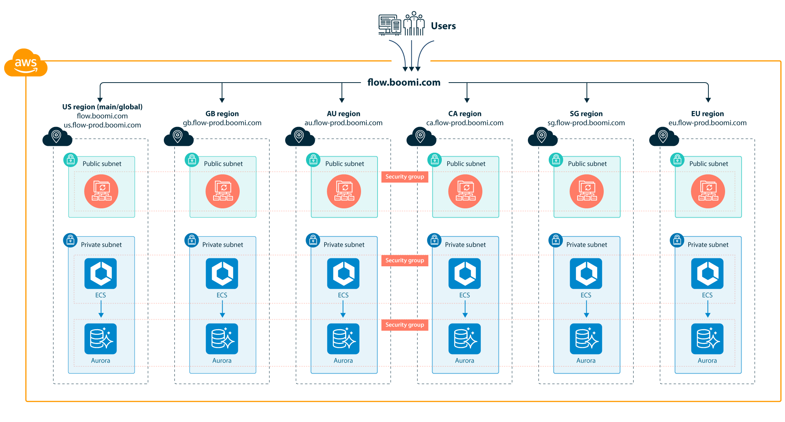
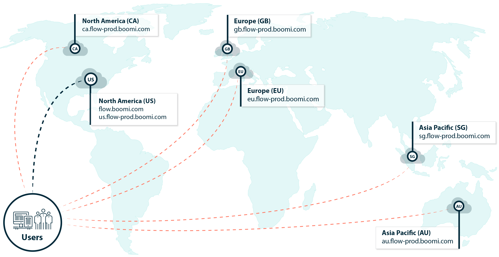

# Technical architecture overview 

<head>
  <meta name="guidename" content="Flow"/>
  <meta name="context" content="GUID-b7cbf7a7-bcd0-4d1c-b926-69854df699ec"/>
</head>

Flow forms part of the Boomi IPAAS (Integration platform as a service), delivered to customers via the Amazon Web Services (AWS) Flow platform. It is highly fault tolerant and scalable.

-   Users typically access Flow using the `flow.boomi.com` URL, routing to the main US regional AWS data centre.

-  User access for Flow can also be configured to route through one of the alternative regions (CA/EU/GB/AU/SG). Each region is accessed through a regional URL, such as `gb.flow-prod.boomi.com`, that directs users to the appropriate regional AWS data centre.

-  Each region is hosted within its own regional Amazon AWS Virtual Private Cloud (VPC) virtual network. Using a regional URL means that the Flow build time and runtime is contained within that region.

-   Traffic coming into a regional VPC is then distributed by an Elastic Load Balancer (ELB), which directs requests to the relevant flow instances.

-   These multiple flow instances use Amazon Elastic Container Services (ECS) and Amazon Aurora. This offers maximum platform availability, making use of the power of AWS availability zones and clustering technologies native to Amazon ECS and Amazon Aurora. These instances are not publicly accessible and can only be accessed from within the private network.

-  A high degree of scalability is built into the architecture, with services configured to scale automatically based on demand.

-   Customers can also choose to deploy Flow runtime applications to their own runtime environments, such as on-premise. See [Flow Multi-cloud](c-flo-MC_149c8266-5449-4c3c-afc4-a53f814bd7bb.md).

## Global infrastructure regions 

| Region | Regional URL(s) |
| --- | --- |
| **Main/global region** North America (US) Located in North Virginia, USA. | • https://flow.boomi.com/ • https://us.flow-prod.boomi.com/ |
| North America (CA) Located in Montreal, Canada. | • https://ca.flow-prod.boomi.com/ |
| Europe (EU) Located in Frankfurt, Germany. | • https://eu.flow-prod.boomi.com/ |
| Europe (GB) Located in London, England. | • https://gb.flow-prod.boomi.com/ |
| Asia Pacific (AU) Located in Sydney, Australia. | • https://au.flow-prod.boomi.com/ |
| Asia Pacific (SG) Located in Singapore, Singapore. | • https://sg.flow-prod.boomi.com/ |

## API-first Flexibility 

Flow is built on an API-first architecture, which provides a **loosely coupled and highly cohesive** code environment; this allows Flow to integrate new and as-yet undefined functionality in a modular way, providing seamless future integration into the Flow environment.

## Adaptive API Architecture 

Flow offers a completely open architectural stack based on REST APIs; this allows developers to tap into the platform at various levels using their language of choice: Java, C#, Ruby, NodeJS and so on. This enables the Flow platform to be extended and enhanced with additional capabilities as needed.

## Integration Connectors 

Flow offers a library of integration connectors to minimize the need for coding when integrating with third-party products and applications. See[ Connectors](c-flo-Service_Integrations_cac4d712-9607-4f24-8e70-aae48ceb27b9.md).

As new products and accompanying functionality emerge as a customer requirement, the necessary integration connectors can quickly be built and deployed without requiring changes to the underlying platform.

For example, if the underlying system changes for a customer (migrating from Microsoft Dynamics 365 CRM to Salesforce, for example), their flows will not need to be completely rewritten, as the services are not hard wired to the underlying application.