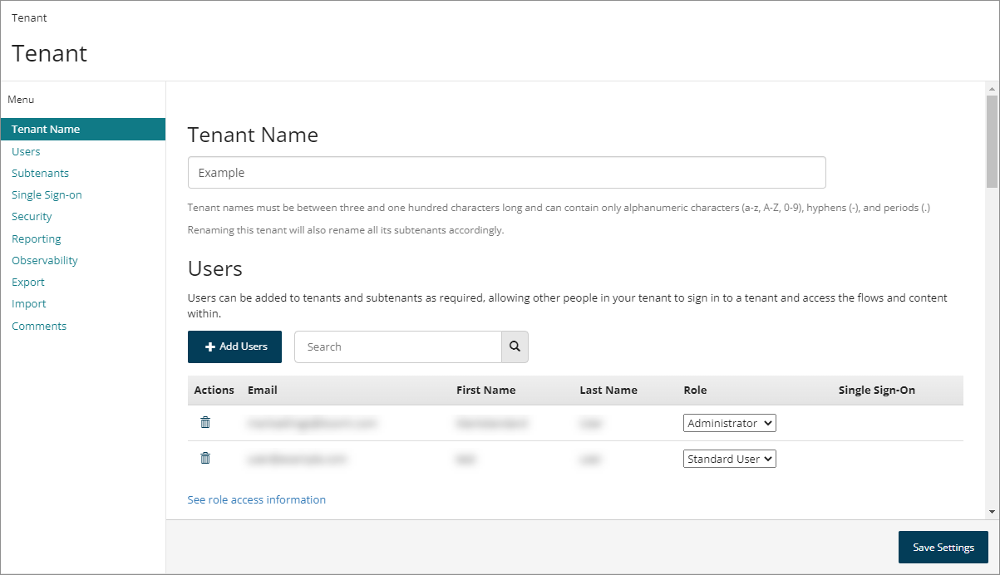

# Tenant page

<head>
  <meta name="guidename" content="Flow"/>
  <meta name="context" content="GUID-5cf56ab8-1bcc-48f1-b497-b80491a09a73"/>
</head>


The **Tenant** page allows you to manage and administer your tenant.

## Opening the page

-   Select **Tenant** from the top [Settings menu](c-flo-Settings_menu_12a0188d-00cb-4039-97bd-11f89e83f3ca.md).


## Page overview

The **Tenant** page displays all the users and subtenants currently set up within the tenant, as well as providing access to tenant settings.



## Tenant Name

-   The name of the tenant is displayed in the **Tenant Name** field.

-   Tenant naming restrictions are as follows:

    -   A tenant name must be between 3 and 100 characters in length. For example, a valid tenant name is at least 3 characters or more in length, but no longer than 100 characters.

    -   A tenant name can only contain alphanumeric characters \(a-z, A-Z, 0-9\), hyphens \(-\), and periods \(.\). You are informed when an invalid character is entered in a tenant name, and will be unable to save the renamed tenant until the highlighted invalid characters are removed from the tenant name.

-   To rename a tenant, enter a new name into the **Tenant Name** field and click **Save Settings**.

    -   Renaming a tenant also renames all subtenants that belong to the tenant, using the new naming structure. For example, renaming a tenant from “NewTenant” to “TenantA” will also rename the subtenant “Sub+NewTenant” to “Sub+TenantA”.


## Users

-   Click **Add Users** to add a new user to the tenant. See [Adding a user to a tenant](t-flo-Tenant_Users_Adding_8a049d20-4759-48bc-bd12-a69f446bd46c.md).

-   Users set up within the tenant are displayed in the **Users** list.

-   Click **Delete User** in the **Actions** field to delete a user from the tenant. See [Removing a tenant user](t-flo-Tenant_Users_Deleting_ad9aacd2-1b5a-4fa9-ad1a-8cb0fe102933.md).

-   Assign a user role in the **Role** field. This defines what areas of functionality a user is able to access within . See [User roles](flo-Roles_23fb386e-67d8-4d7c-a9ba-e0ba9b9e4c27.md).

-   The **Single Sign-on** field indicates if the user is a single sign-on \(SSO\) enabled user, i.e. that they sign in to the tenant using single sign-on with SAML. See [Single sign-on with SAML authentication](flo-SAML_SSO_00ee23ce-43ee-4024-9fd8-d13fc0f23b82.md).

    -   ‘*Yes*’ is displayed in the column if the user is a single sign-on \(SSO\) enabled user.

    -   The column remains blank if the user is not a single sign-on \(SSO\) enabled user.

-   The Users **Search** field allows you to search for and filter which users are displayed in the list.

-   The list only displays 10 users at a time. If there are more than this, you can use the **Page Navigation** icons to navigate the list of users.


## Subtenants

-   Click **New Subtenant** to add a new subtenant to the tenant. See [Creating a new subtenant](t-flo-Tenant_Creating_916cb02a-5a80-4992-91eb-3a05f0e14cb4.md).

-   Subtenants set up within the tenant are displayed in the **Subtenants** list.

-   The Subtenants **Search** field allows you to search for and filter which subtenants are displayed in the list.


## Single Sign-on

Select the **Enable SAML Single Sign-On** toggle to enable SAML single sign-on for the tenant. See [Single sign-on with SAML authentication](flo-SAML_SSO_00ee23ce-43ee-4024-9fd8-d13fc0f23b82.md).

-   If this feature is enabled, additional configuration fields are displayed. See [SAML single sign-on settings](flo_SAML_SSO_Options_ebd375a4-4475-400c-b9af-998e4226a2a8.md).


## Security

The **Security** section of the page allows you to restrict run, draw, admin, and package access to flows within a tenant by IP address, as well as enable SAML single sign-on for the tenant. See [Restricting tenant flow access by IP address](c-flo-Tenant_restrict_by_ip_address_96aa7e22-e56d-4ae1-aab5-ba6d92627eca.md).

-   **Restrict run access by IP address**: Users who run the flow web app have to be within a specified IP range otherwise they will be unable to run the flow.

-   **Restrict draw access by IP address**: Users who wish to access the canvas have to be within a specified IP range otherwise they will be unable to access the tool. Your current IP address will automatically be added to the range to prevent locking yourself out of the canvas.

-   **Restrict admin access by IP address**: Users who wish to access the Admin API have to be within a specified IP range otherwise they will be unable to access the Admin API.

-   **Restrict package access by IP address**: Users who wish to access the Package API have to be within a specified IP range otherwise they will be unable to access the Package API.


## Reporting

The **Reporting** section of the page allows you to use the [reporting infrastructure](https://github.com/manywho/reporting) to analyze, store, and query state data using your own PostgreSQL database or analytics user interface. reporting supports storing events, states and state values \(a state is a running instance of a flow\). State data provides information on all running states.

**Reporting endpoint URL**: Enter the reporting endpoint that you wish to use for your tenant state data, for example 'http://35.168.52.97/api/reporting/1/states'.

This endpoint is the HTTP endpoint that the platform will post state updates to, in near realtime, when running a flow. This is set on a per-tenant basis.

Basic or OAuth authentication can be applied to the reporting endpoint, in the tenant `"stateSettings"` object metadata as follows:

-   Unauthenticated: This is the default setting, with the `“authentication”` property set to `“none”`, and no authentication applied to the reporting endpoint.

-   Basic authentication: To apply basic authentication, set the `“authentication”` property to `“basic”`, and the `“username”` and `“password”` properties to the required values.

-   OAuth2 authentication: To apply OAuth authentication, set the `“authentication”` property to `“clientcredentials”`, the `"tokenEndpoint”` property to the required OAuth token endpoint, and the `“username”` and `“password”` properties to the required values.


For example:

```
"stateSettings": {
        "authentication": "clientcredentials",
        "endpoint": "[Your reporting endpoint]",
        "password": "client secret",
        "tokenEndpoint": "[Your OAuth token endpoint]",
        "username": "client id"
    },
```

:::note

The performance of this endpoint does not affect the experience in the running flow; state updates are posted asynchronously.

:::

**Enable Connector Logging**: By default, the requests, responses and failures between and are not logged and included in the reporting data. Select this option to enable this logging functionality.

You can also view the actual requests that makes to using the dashboard [Connector Log](c-flo-Dashboard_Service_Log_878d14da-33a6-4728-8e5e-6dfe3364edee.md) page, or the invoker apis /api/service/1/requests. The invoker APIs can be used to check the requests, responses and failures between Boomi Flow and any . These are grouped under /api/service/1/requests in the **API** tool and can be filtered by flow, flow version and state IDs.

## Observability

The **Observability** section of the page allows you to enable and configure observability for a tenant.

-   **OTLP endpoint:** Enter the OpenTelemetry Protocol \(OTLP\) endpoint to which data should be sent, i.e. your APM system or OpenTelemetry collector.

    -   Only RPC over HTTPS \(Remote Procedure Call over HTTPS\) endpoints are supported.

    -   Entering a value into this field enables the observability data export.

-   **OTLP headers**: Optionally enter a list of headers to send with the data, such as API key credentials for authentication to the APM system.

    -   Multiple headers are supported, but must be comma-separated. For example, “name1=value1,name2=value2”.


To learn more about observability, see [Observability](flo-Observability_e3ebeb63-f184-4c13-88a5-e20b9115ae10.md) and [Configuring observability in a tenant](flo-Observability_configuration_0b36d4b4-5f27-49d2-b9e2-487954d6df5b.md).

## Export

You can export tenant data from the current tenant as a packaged tenant data file \(*.tenant*\), which can then be imported into a different tenant.

-   This functionality allows you to create a 'copy' of a tenant, for backup purposes or for migrating tenant content to other regions.

-   To learn more about exporting tenant data, see [Exporting and importing tenant data](flo-tenant_export_import_8f733b18-2d03-4695-bcff-70d0280874b0.md).


## Import

Import a previously exported tenant data file into the current tenant.

You can either drag and drop the a *.tenant* file onto the **Import Tenant** field or click and browse to a *.tenant* file.

-   To learn more about importing tenant data, see [Exporting and importing tenant data](flo-tenant_export_import_8f733b18-2d03-4695-bcff-70d0280874b0.md).