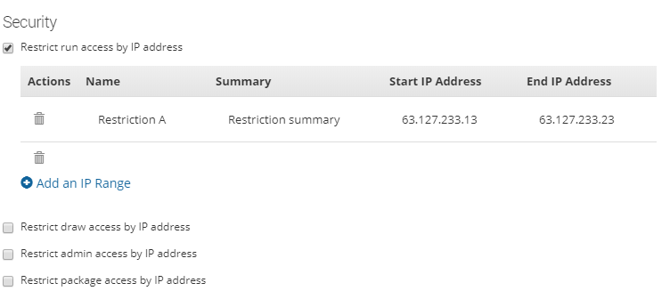

# Restricting tenant flow access by IP address

<head>
  <meta name="guidename" content="Flow"/>
  <meta name="context" content="GUID-96aa7e22-e56d-4ae1-aab5-ba6d92627eca"/>
</head>

You can set up IP address restrictions for run, draw, admin, and package access to the flows within a tenant from the **Tenant** page.

## Overview

The following types of restriction can be set up:

-   **Restrict run access by IP address**: Users who run the flow web app have to be within a specified IP range otherwise they will be unable to run the flow.

-   **Restrict draw access by IP address**: Users who wish to access the flow canvas have to be within a specified IP range otherwise they will be unable to access the canvas. Your current IP address will automatically be added to the range to prevent locking yourself out of the canvas.

-   **Restrict admin access by IP address**: Users who wish to access the Admin API have to be within a specified IP range otherwise they will be unable to access the Admin API.

-   **Restrict package access by IP address**: Users who wish to access the Package API have to be within a specified IP range otherwise they will be unable to access the Package API.

## Setting up restrictions by IP address

1.  Ensure that you are in the correct tenant.
2.  On the **Tenant** page, select the restriction option you wish to apply in the **Security** section.
3.  Click **Add an IP Range**.
4.  Enter a name for the IP restriction in the Name field.
5.  Enter a summary description for the IP restriction in the Summary field.
6.  Enter the starting IP address of the range you wish to restrict access to in the **Start IP Address** field.
7.  Enter the ending IP address of the range you wish to restrict access to in the **End IP Address** field.
8.  The IP range will now be defined using these start and end addresses. For example, entering 63.127.233.13 in the **Start IP Address** field and 63.127.233.23 in the **End IP Address** field would mean that users would have to be within the IP range of 63.127.233.13 - 63.127.233.23 in order to access the area of functionality you have defined the range for. Users not within this range will be informed that they do not have sufficient rights for the functionality you have restricted.

    

9.  Repeat this process to add multiple IP ranges for each restriction option as required.
10. Click **Save Settings** to save and apply the restrictions to the tenant.