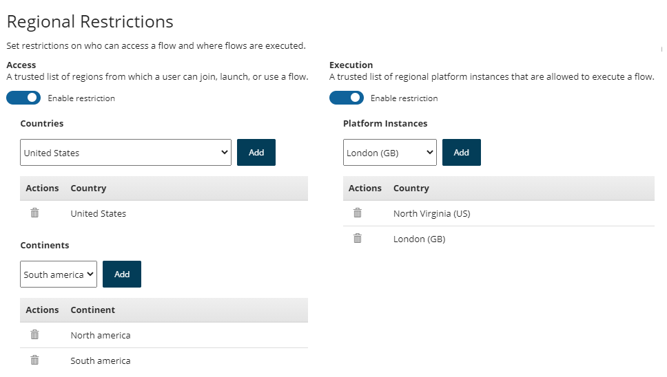

# Restricting tenant flow access by region

<head>
  <meta name="guidename" content="Flow"/>
  <meta name="context" content="GUID-47e2739b-772b-41bd-8166-6727224a5b70"/>
</head>

You can set up regional restrictions for access to the flows within a tenant from the **Tenant** page.

## Overview

You can set up regional restrictions for your flows by defining where flows in a tenant can be accessed from, i.e. the regions from where an end-user can make requests to the Run API.

Restrictions can be configured at both an **Access** and **Execution** level:

-   **Access**: Enable this option to define a trusted list of regions from which a user can join, launch, or use a flow.

-   **Execution**: Enable this option to define a trusted list of which regional platform instances are allowed to execute a flow.

**Note:** Regional routing behaviour can also be defined in a custom player, see [c-flo-Players\_Regional\_cc9b4fda-56eb-4bab-a5f0-9695fd709b80.md](c-flo-Players_Regional_cc9b4fda-56eb-4bab-a5f0-9695fd709b80.md). To learn more about platform regions, see [c-flo-Techref\_IP\_Whitelist\_4361e393-2aef-4c2c-9c96-5f5c7fe87e0d.md](c-flo-Techref_IP_Whitelist_4361e393-2aef-4c2c-9c96-5f5c7fe87e0d.md).

## Setting up regional restrictions

1.  Ensure that you are in the correct tenant.
2.  On the **Tenant** page, select **Enable Restriction** for the restrictions you wish to apply in the **Regional Restrictions** section, i.e. **Access** or **Execution**.
3.  For **Access** restrictions, **Countries** and **Continents** sections are then displayed, allowing you to select any combination of countries and/or continents which restrictions should be applied for. For **Execution** restrictions, a **Platform Instances** section is displayed, allowing you to select any combination of platform instances which restrictions should be applied for.

    

    -   Select a country/continent where you want your tenant flows to be accessible from, and click **Add** to add it to the **Countries**/**Continents** list. Multiple entries can be added. Delete an entry by clicking the **Delete** icon .

    -   Select a regional platform instance that you wish to allow flows to be executed from, and click **Add** to add it to the **Platform Instances** list. Multiple entries can be added as required. Delete an entry by clicking the **Delete** icon .

4.  Click **Save Settings** to save and apply the regional restrictions to the tenant. If a user tries to access a flow within the tenant from a region that you have not added to your trusted list, a message is displayed informing the user that 'The flow you are trying to run cannot be accessed from your current location'.