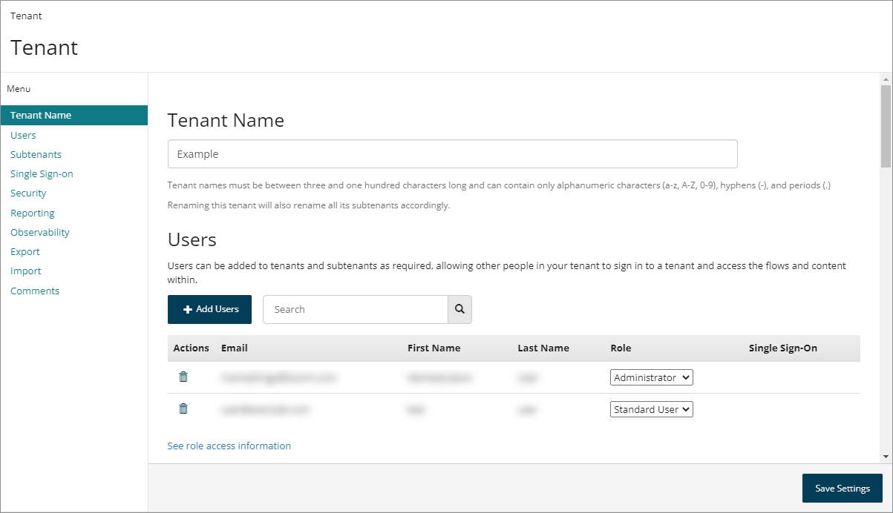

# Tenants

<head>
  <meta name="guidename" content="Flow"/>
  <meta name="context" content="GUID-770f70ef-b441-4f1b-b565-2f87430e28f2"/>
</head>

A tenant is where all your flows, values, integrations and content are stored.

Tenants and subtenants are managed and administered on the **Tenant** page, accessed via the [Settings menu](c-flo-Settings_menu_12a0188d-00cb-4039-97bd-11f89e83f3ca.md). See [Tenant page](c-flo-Tenant_Settings_Page_5cf56ab8-1bcc-48f1-b497-b80491a09a73.md).

When you create a account you are initially set up with a tenant.

-   Subtenants can also be set up under your main tenant account, and can be used to structure and organise your flows, for example by using different subtenants for different divisions of your company, or for separating out deployment environments into Development, Staging, and Production.

-   Subtenants do not have visibility into the content, flows, values, or integrations of the tenant \(and vice versa\).

-   Each tenant and subtenant is assigned a unique Tenant ID, for example 'db4560b2-f723-49d5-921d-ff5b0f55045g'. This is displayed under your user name on the **Account** menu. See [Account Menu](c-flo-Tenant_menu_de6da113-3aab-4c23-aff0-5e42908b3536.md).

-   Tenants can all connect to the same database \(through \). This means that you can have many different tenants acting on a central data repository.

-   You can switch between tenants and subtenants via the **Account** menu. See [Account Menu](c-flo-Tenant_menu_de6da113-3aab-4c23-aff0-5e42908b3536.md).

-   Tenants can be renamed using the **Name** field. Renaming a tenant will also rename all subtenants to match the new naming structure.

## Tenant users

Users can be added to tenants and subtenants as required, allowing other people in your organization to sign in to a tenant and access the flows and content within.

-   [Adding a user to a tenant](t-flo-Tenant_Users_Adding_8a049d20-4759-48bc-bd12-a69f446bd46c.md)

User roles are assigned to users to control and manage access to functionality within .

-   [User roles](flo-Roles_23fb386e-67d8-4d7c-a9ba-e0ba9b9e4c27.md)

## Single sign-on with SAML authentication

Single sign-on \(SSO\) using SAML authentication can be enabled for tenants so that users are logged into a tenant using SAML authentication to provide access as an authorized application. With single sign-on enabled, a user can log into an identity provider \(IdP\) and simply click a generated hyperlink to sign directly into a Boomi Flow tenant.

-   [Single sign-on with SAML authentication](flo-SAML_SSO_00ee23ce-43ee-4024-9fd8-d13fc0f23b82.md)

## Restricting flow access by IP address

You can restrict run, draw \(canvas\), admin, and package access to flows within a tenant by IP address.

-   [Restricting tenant flow access by IP address](c-flo-Tenant_restrict_by_ip_address_96aa7e22-e56d-4ae1-aab5-ba6d92627eca.md)

## Exporting and importing tenant data

You can export tenant data from a tenant as a tenant data file, which can then be imported into a different tenant. This functionality allows you to create a 'copy' of a tenant, for backup purposes or for migrating tenant content to other regions.

-   [Exporting and importing tenant data](flo-tenant_export_import_8f733b18-2d03-4695-bcff-70d0280874b0.md)

## Tenant organization best practice

When organizing your projects, tenants and subtenants allow you to separate out changes. For example:

-   **Templates**: If you have a set of template flows that you want to keep as a “master” version. You can then deploy these template flows into another tenant if it is not adequate for a particular use-case. You can easily package and deploy the template flows into as many other tenants as you like. This can also be helpful if you want to “clone” the flow for any reason.

-   **Deployment environments**: You may wish to logically separate out your flow deployment environments into 'Development', 'Staging', 'Production' for example. In this scenario, we recommend always making changes in the Development tenant as moving packaged flows “up the stack” will overwrite changes. If you have to make a change in Production/Staging, you’ll need to rigorously ensure you make that same change in Development or the next time you package and deploy, it will be lost \(or more accurately, it will be in a historic snapshot, but it will take a lot more effort to find it and merge it back\).

-   **Restricting user access**: You may wish to restrict access to certain flows to particular team members, groups or customers so that changes are not made inadvertently by another user. A tenant and its subtenants currently share the same identity access rights, so authoring users in the main tenant can easily provision themselves into a subtenant without requesting access. Separate tenants have separate permissions.

:::note

In more complex scenarios, it may be appropriate to package and deploy a flow into another tenant/subtenant – effectively cloning it so the flows don’t get unmanageable. It is important to note that when you package and deploy a flow into another tenant, all of the unique identifiers of all of the elements in the flow remain the same. So if you make a change in one flow, you can replicate that change in other tenants simply by copying and pasting the changed Element JSON.

:::

The following recommendations may be uesful when planning your tenant/subtenant structure:

-   Create a tenant for your generic flows and for each industry. This means a tenant exists for each industry that holds the generic flows that should be used by all “standard” customers. Under each tenant, there should be a subtenant for Development, Staging, and Production.

-   Create a tenant for each customer that then varies from the standard template.

-   If you are packaging a flow and deploying it into another tenant, treat this as a one-time operation if you are planning to edit the flow in the target tenant. When a package is deployed, it overwrites all changes in the target tenant. As a result, any changes made by users will be lost \(though can be found through querying the SnapShot API\).