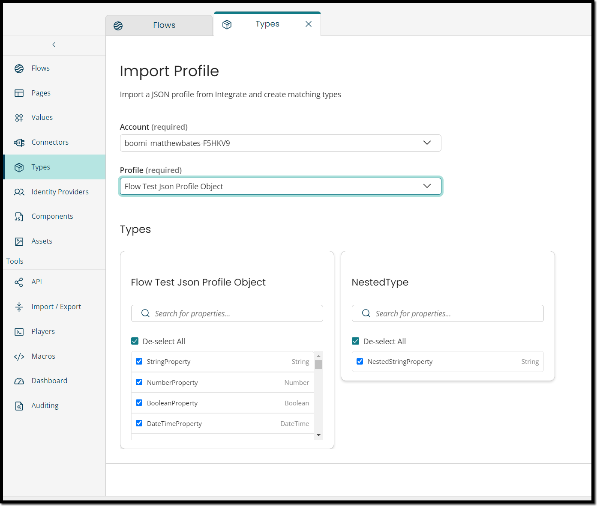

# Import Profile 

## Overview

You can automatically establish a Type in Flow that corresponds to your Integration Profile for the input or output.

## Setup

1. Select **Types** from the left-hand menu.
2. On the **Types** screen, click **Import Profile** (next to the **New Type** button).

## Configuration

1. On the **Import Profile** screen, select the Account from the drop-down. This is the integration account from which you wish to import a JSON profile. It will use the first integration account defined in your tenant as the default.

2. Select the Profile, that is the JSON profile you want to import as a Type into your tenant.

   :::note

   The checkbox next to each property allows you to pick the properties from the JSON profile you wish to carry across to the Type.

   :::

3. Click the **Import Types** button to create the types.

## Additional Notes

- Supports array repeating and array absolute.
- Does not support the arrays that contain strings, numbers, booleans, and datetimes. The arrays should have children that are objects.
- Nested Profiles like *Object* > *Property* > *Object* are supported and will create multiple types.
  - This is also true for *Array* > *Object*  
  - There is no limit on the nesting
