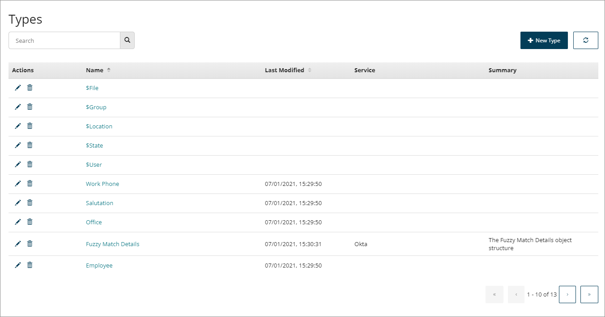
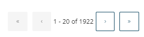

# Types page

<head>
  <meta name="guidename" content="Flow"/>
  <meta name="context" content="GUID-78d82003-2a58-4eb7-96c8-05d2f211d34b"/>
</head>

The **Types** page allows you to manage existing types and add custom types for use within your flows.

## Opening the page

-   Select **Types** from the left-hand menu.

## Page overview

The **Types** page displays all the types currently set up within the tenant.

-   Types are shown in the **Types** table. The table is sorted by the **Last Modified** date column by default, showing the most recently modified types first.

-   System types are always displayed at the top of the table. See [System Types](r-flo-Types_System_d5418044-1ac0-4d01-9485-5ebd06ab7f8e.md).

-   Click on a type **Name** to open the type for editing.

-   Click on the **Name** or **Last Modified** column headings to change the table sorting order.

-   Click the **Edit** icon  in the **Actions** column to edit a type. See [Editing a Type](t-flo-Types_Editing_63c3214c-0269-4681-adb2-f3ec7a2d39ac.md) or[Editing Types](t-flo-Types_Editing_Service_Type_ada54795-7afa-4de7-ab42-6ecf82b8ed84.md).

-   Click the **Delete** icon  in the **Actions** column to delete a type.

-   Only 20 types are shown at a time. If there are more than this, you can use the **Navigation** icons to navigate betweeen pages in the table.

    

## Searching/filtering types

The **Search** field allows you to search for and filter which types are shown in the table.

This is useful if you have a large number of types, or wish to quickly search for a specific type.

1.  Enter the text into the **Search** field that you wish to filter the table by. Partial search terms can be used, for example, entering "Doc" will filter the table so that all/only types containing "Doc" in their name are shown.
2.  Click the **Search** icon to perform the search.

## Creating a new custom Type

As well as managing existing types on this page and types created as part of a installation, you can also create a new custom type:

1.  Click **New Type**. See [Creating a Type](t-flo-Types_Creating_a8b56d7f-4f20-4a98-b730-6f21b2bd5bfc.md).