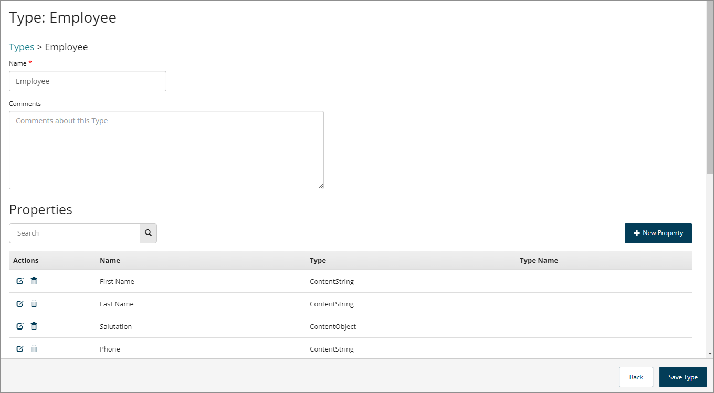

# Type Properties

<head>
  <meta name="guidename" content="Flow"/>
  <meta name="context" content="GUID-19f429ec-b9d3-42bf-bf0a-055bd61b4024"/>
</head>

Type properties are used to build and define the structure of the data that the type is associated with.

Properties for a type are displayed on the **Type** page, accessed by editing a type. See [Editing a Type](t-flo-Types_Editing_63c3214c-0269-4681-adb2-f3ec7a2d39ac.md).

-   A type must contain at least one property, however there is no upper limit on the number of properties that can be associated with a type.

-   Each property has a name and a content type, for example, string, number, password and so on.

-   The **Properties** table shows the properties for the type.

-   The **Dependents** table shows any dependencies for the type, such as any values using the type.

## Searching/filtering properties

The **Search** field allows you to search for and filter which properties are shown in the table.

This is useful if you have a large number of properties, or wish to quickly search for a specific property.

1.  Enter the text into the **Search** field that you wish to filter the table by. Partial search terms can be used, for example, entering 'Name' will filter the table so that all/only types containing 'Name' in their name are shown.
2.  Click the **Search** icon to perform the search.

## Adding a new property

1.  Click **New Property**.
2.  **Name**: Enter a name for the property.
3.  **What kind of Property is this?**: Select the type of property that you wish to create.

    -   If you select either the 'List' or 'Object' option, the **What Type of Value is this?** field is shown. This allows you to link the type to a value. See [Understanding Values, Types, Objects, and Lists](c-flo-Values_Understanding_0a938b9f-c1be-45d9-b53f-aa9d0addad86.md).

    -   If you select either the 'Date/Time' or 'Number' option, the **The format that should be applied to this Property** field is shown. This allows you to apply a specific output format to any properties of this type.

4.  Click **Apply Property** to save and create the new property.
5.  Once you have finished adding properties, click **Save Type** to save your changes.

## Editing a property

:::caution

Editing and saving a property will affect all flows in the tenant that currently use the property, and care should be taken to ensure that your changes do not adversely affect these other flows.

:::

1.  Click the **Edit** icon  in the **Actions** column for the property that you wish to edit.
2.  Edit the property as required.
3.  Click **Apply Property** to save and commit your changes to the property. Once you have saved your changes, the property is updated and these changes are reflected in any flows in the tenant that use the property.

## Deleting a property

:::caution

Deleting a property is permanent and cannot be undone.

:::

1.  Click the **Delete** icon  in the **Actions** column for the property that you wish to delete.
2.  The **Delete Property** dialog is shown, and you are prompted to confirm the deletion. Deleting a property is permanent and cannot be undone.
    -   Click **Cancel** to cancel the deletion and return to the **Type** page.

    -   Click **Delete** to delete the property.

3.  The property is deleted and you are returned to the **Type** page.