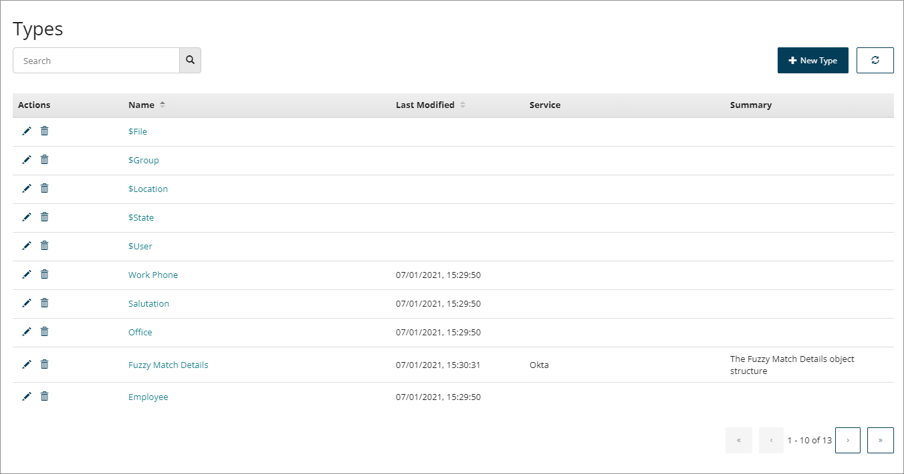

# Types

<head>
  <meta name="guidename" content="Flow"/>
  <meta name="context" content="GUID-d429840a-ffa4-47c5-8131-5411965e422c"/>
</head>

Types define the 'profile' and structure of data in , allowing for efficient data organisation and scalability when working with complex values. A type uses 'Properties' to build and define the structure of the data that it is associated with.

For example, to store details about a car, a 'Car' type could be created, and properties defined for the type such as 'Manufacturer', 'Model', 'Mileage' and so on.

Types can be created automatically when a is installed, allowing to interact with the data structure that already exists in a . For example, if the Salesforce is installed, an 'Account' type is created to represent a record type in Salesforce, with the fields of the account record \('Address', 'Phone', 'Company' etc.\) being mapped to the relevant properties of the type.

Types are managed and created on the **Types** page.

-   The **Types** page displays all the types currently set up within the tenant. See [Types page](c-flo-Types_Page_78d82003-2a58-4eb7-96c8-05d2f211d34b.md).

-   Although types are usually only created as part of a installation, you can create your own custom types. See [Creating a Type](t-flo-Types_Creating_a8b56d7f-4f20-4a98-b730-6f21b2bd5bfc.md). You can also edit types that have been installed with a , see [Editing Types](t-flo-Types_Editing_Service_Type_ada54795-7afa-4de7-ab42-6ecf82b8ed84.md).

-   Types themselves do not store data directly \(values are used to store data in \).

-   Edit a type to view the type properties, and add, edit or delete properties as required. See [Editing a Type](t-flo-Types_Editing_63c3214c-0269-4681-adb2-f3ec7a2d39ac.md) and [Type Properties](c-flo-Types_Properties_19f429ec-b9d3-42bf-bf0a-055bd61b4024.md).

-   Types can be used as shared elements and imported into multiple flows within a tenant. See [Importing a Type into a Flow](t-flo-Types_Importing_728d08eb-be6c-4b61-83c2-793208d3f15d.md).

-   Default system types are available within . See [System Types](r-flo-Types_System_d5418044-1ac0-4d01-9485-5ebd06ab7f8e.md).

-   To learn more about using types, see [Understanding Values, Types, Objects, and Lists](c-flo-Values_Understanding_0a938b9f-c1be-45d9-b53f-aa9d0addad86.md).