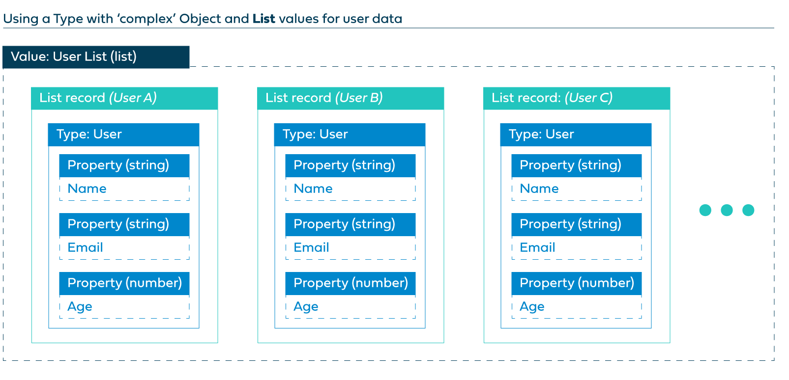

# Understanding Values, Types, Objects, and Lists

<head>
  <meta name="guidename" content="Flow"/>
  <meta name="context" content="GUID-0a938b9f-c1be-45d9-b53f-aa9d0addad86"/>
</head>

In order to work with data efficiently in , it is important to understand the different ways of working with and structuring data using values, types, objects, and lists.

## Overview

-   A **value** is used as a container \(like a variable\) to store data for use in a flow. For example, a user name could be stored in a username string value. See [Values](/docs/Atomsphere/Flow/topics/c-flo-Values_f83f964c-1348-475d-80b1-480daef433f7.md).

-   There are a number of primitive 'kinds' of value available in Boomi Flow - **Boolean**, **Content**, **Date/time**, **Encrypted**, **Number**, **Password**, and **String**. See [Value content kinds](c-flo-Values_Content_Types_782220dc-722d-4d55-8576-e0274117e190.md).

-   Once you begin to work with more complex data, you may need to use one or both of the two complex kinds of value - **Objects** and **Lists**, in combination with **Types**.

-   Types allow you to scale your data efficiently, by defining a structure for data, and referencing the **Properties** of the type. See [Types](/docs/Atomsphere/Flow/topics/c-flo-Types_d429840a-ffa4-47c5-8131-5411965e422c.md).

## A worked example - introducing primitive values

In this example, we want to create a simple web application that allows details for a user to be input \(the name of the user, their email and their age\) and then displayed on a page.

-   The first page could be set up with 3 Input page components that allows a user to enter their user name into a 'User Name' value, email into a 'User Email' value and age into a 'User Age' value.

-   The second page is then set up to display these three values.

## A worked example - introducing complex object values and types

Following this, we now want to be able to add and work with details for multiple users.

If simple primitive values were used for this, it would quickly become unmanageable as three values would need to be created for each user such as 'User2 Name', 'User2 Email', 'User2 Age', 'User3 Name', 'User3 Email', 'User3 Age' and so on. If a hundred users are added, this would require three hundred separate values, and if a new field needed to be added such as 'User Salary' then a new separate value would need to be added for each user.

In this situation, it is far more efficient to use the 'Object' kind of value, in combination with a 'type' that defines the data structure.

-   A 'User' type is created, and properties added for the User Name, Email and Age.

-   An 'object' value is created for each user and linked to the type, allowing the type properties to be used for the user data, rather than separate values.

This approach now allows greater scalability of the data - if a new user is added, a single new object value can be added with their details stored against the properties defined by the type. If a new piece of information needs to be stored for each user \(such as 'User Salary'\), this can be simply achieved by adding a new property to the type, which will propagate through for all the users.

## A worked example - introducing complex list values, objects and types

As well as using complex 'object' kinds of value, also allows you to define a value as a 'List'. List values allow you to store information for multiple *objects* in a single value. Again, a type is required that the list can use as the data structure for the user objects.

-   The 'User' type is again used to define the data structure for each user.

-   A 'list' value is created and linked to the type to store the list of user objects \('User List'\) .

Now, it is possible to display and work with a list of the users by inserting a table into a page in the flow that links to and displays the user objects linked to the type.

The 'Create, Read, Update and Delete items in a List' flow in the Flow Library provides an example of how to use list values to work with and display user data.