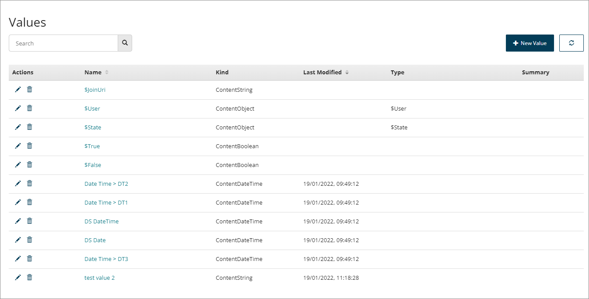

# Values page

<head>
  <meta name="guidename" content="Flow"/>
  <meta name="context" content="GUID-fe9f42c1-ce51-4fa5-a0b8-7a205a2fadde"/>
</head>

The **Values** page allows you to manage existing values and create new values for use within your flows.

## Opening the page

-   Select **Values** from the left-hand menu.

## Page overview

The **Values** page displays all the values currently set up within the tenant.

-   Values are shown in the **Values** table. The table is sorted by the **Last Modified** date column by default, showing the most recently modified values first.

-   System values are always displayed at the top of the table. See [System values](/docs/Atomsphere/Flow/topics/c-flo-Values_System_Values_afbf6756-7aa2-41ea-971d-1e74e716c7f9.md).

-   Click on a value **Name** to open the value for editing.

-   Click on the **Name** or **Last Modified** column headings to change the table sorting order.

-   Click the **Edit Value** icon  in the **Actions** column to edit a value. See [Editing a value](/docs/Atomsphere/Flow/topics/t-flo-Values-Edit_fdf5c84e-efa5-4ea6-9095-324c205598f2.md).

-   Click the **Delete Value** icon  in the **Actions** column to delete a value.

-   The table only displays 20 values at a time. If there are more than this, you can use the **Navigation** icons to navigate between pages in the table.

    

## Searching/filtering values

The **Search** field allows you to search for and filter which values are displayed in the table.

This is useful if you have a large number of values, or wish to quickly search for a specific value.

1.  Enter the text into the **Search** field that you wish to filter the table by. Partial search terms can be used, for example, entering "Doc" will filter the list so that all/only values containing "Doc" in their name are shown.
2.  Select the **Search** icon to perform the search.

## Creating a new Value

As well as managing existing values on this page, you can also create a new value:

1.  Click **New Value**. See [Creating a new value](/docs/Atomsphere/Flow/topics/t-flo-Values_Create_8f17a05f-fff5-44b4-af66-a810ebf4b8d2.md).