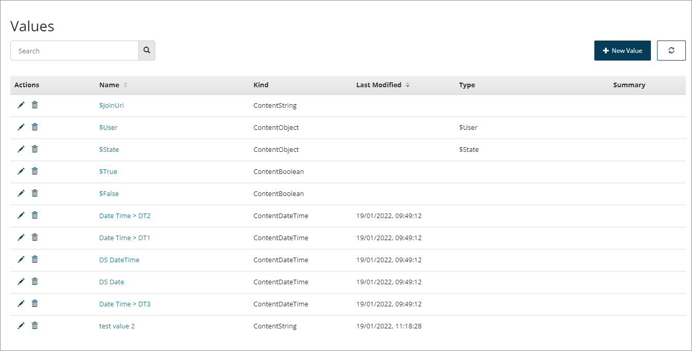

# Values

<head>
  <meta name="guidename" content="Flow"/>
  <meta name="context" content="GUID-f83f964c-1348-475d-80b1-480daef433f7"/>
</head>

Values are containers used to store data that can then be used in your flows. This data can consist of numbers, text, dates, instances of a type, or another value.

Values are created and managed on the **Values** page.

-   The **Values** page displays all the values currently set up within the tenant. See [Values page](/docs/Atomsphere/Flow/topics/c-flo-Values_Values_Page_fe9f42c1-ce51-4fa5-a0b8-7a205a2fadde.md).

-   Create values to store and work with data in your flows. See [Creating a new value](/docs/Atomsphere/Flow/topics/t-flo-Values_Create_8f17a05f-fff5-44b4-af66-a810ebf4b8d2.md).

-   As well as values that you create, there are a set of system values that provide information about a flow, the user who starts the flow, users in the flow, geolocation data of the user, and so on. See [System values](/docs/Atomsphere/Flow/topics/c-flo-Values_System_Values_afbf6756-7aa2-41ea-971d-1e74e716c7f9.md).

-   Values are one of the different content kind types, such as Boolean, Date/time for example. See [Value content kinds](/docs/Atomsphere/Flow/topics/c-flo-Values_Content_Types_782220dc-722d-4d55-8576-e0274117e190.md).

-   It is important to follow a naming convention for values to make it easy to find specific values in the future, understand what a value contains and to avoid naming collisions. See [Value naming conventions](/docs/Atomsphere/Flow/topics/c-flo-Value_Naming_Conventions_217e78cd-f068-43e3-85d2-5da28a110dcb.md).

-   Date and Date/Time values can be formatted in a number of ways. See [Formatting date and time values](/docs/Atomsphere/Flow/topics/c-flo-Date_Time_in_Flow_967f3878-c123-4466-9f9f-dffb94c4f3b1.md).

-   Values can be used as shared elements and imported into multiple flows within a tenant. See [Importing a Type into a Flow](/docs/Atomsphere/Flow/topics/t-flo-Types_Importing_728d08eb-be6c-4b61-83c2-793208d3f15d.md).

-   To learn more about using values, see [Understanding Values, Types, Objects, and Lists](/docs/Atomsphere/Flow/topics/c-flo-Values_Understanding_0a938b9f-c1be-45d9-b53f-aa9d0addad86.md).