# A visual overview of Flow

<head>
  <meta name="guidename" content="Flow"/>
  <meta name="context" content="GUID-061ad01a-aff5-4a7b-8b3e-f22af22e84bc"/>
</head>

This topic provides a visual overview of some of the main features you will need to use when getting started with .

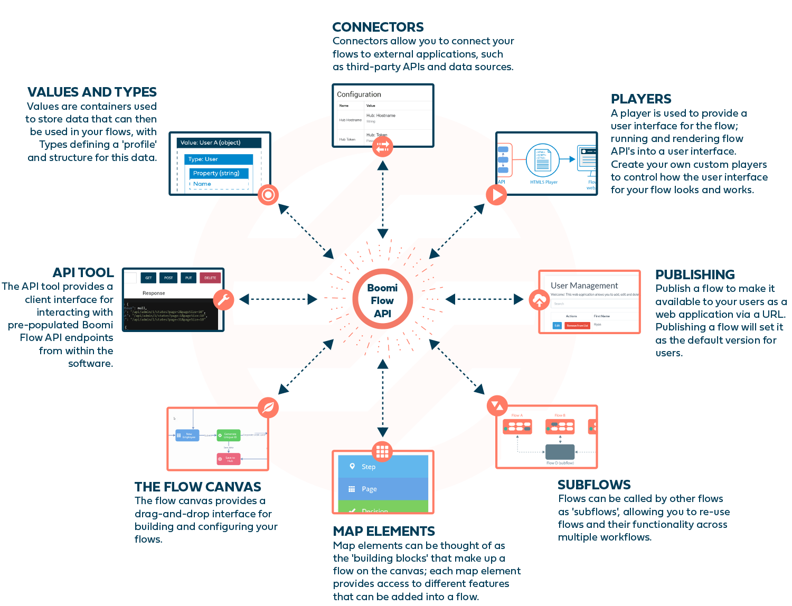

|[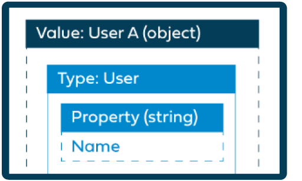](c-flo-Values_Understanding_0a938b9f-c1be-45d9-b53f-aa9d0addad86.md)

|[**Values and Types**](/c-flo-Values_Understanding_0a938b9f-c1be-45d9-b53f-aa9d0addad86.md)

 Values are containers used to store data that can then be used in your flows, with Types defining a 'profile' and structure for this data, allowing for efficient data organisation and scalability when working with complex values.

 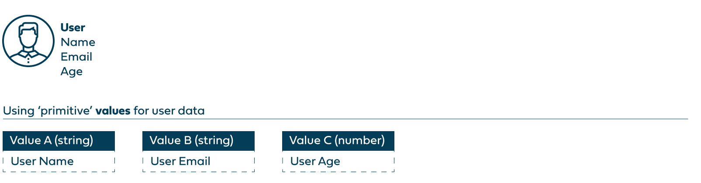

 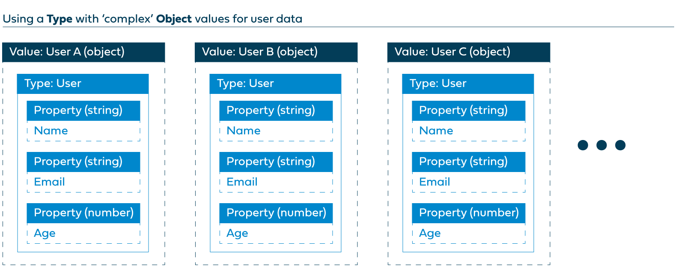

 -   To learn more about values, see [c-flo-Values\_f83f964c-1348-475d-80b1-480daef433f7.md](c-flo-Values_f83f964c-1348-475d-80b1-480daef433f7.md).

-   To learn more about types, see [c-flo-Types\_d429840a-ffa4-47c5-8131-5411965e422c.md](c-flo-Types_d429840a-ffa4-47c5-8131-5411965e422c.md).

-   To learn more about the different ways of working with and structuring data using values, types, objects and lists, see [c-flo-Values\_Understanding\_0a938b9f-c1be-45d9-b53f-aa9d0addad86.md](c-flo-Values_Understanding_0a938b9f-c1be-45d9-b53f-aa9d0addad86.md).

|
|[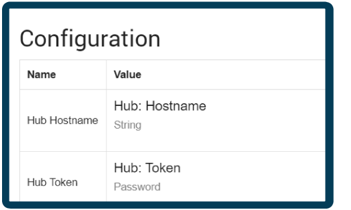](c-flo-Service_Integrations_cac4d712-9607-4f24-8e70-aae48ceb27b9.md)

|[****](c-flo-Service_Integrations_cac4d712-9607-4f24-8e70-aae48ceb27b9.md)

 allow you to connect your flows to external applications, such as third-party APIs and data sources. They can also be used to extend the functionality of a flow, such as adding authorization restrictions and scheduling tasks.

 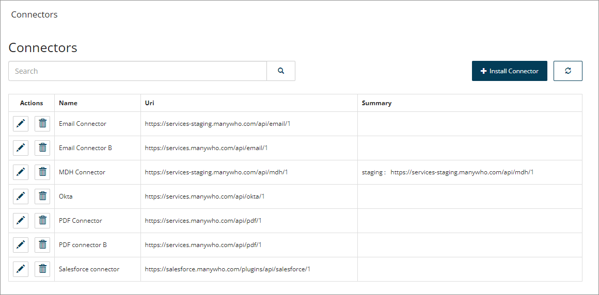

 -   To learn more about , see [c-flo-Service\_Integrations\_cac4d712-9607-4f24-8e70-aae48ceb27b9.md](c-flo-Service_Integrations_cac4d712-9607-4f24-8e70-aae48ceb27b9.md).

|
|[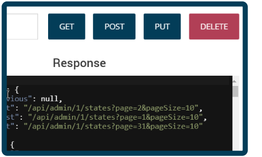](c-flo-APItool_95ad682d-ce04-494a-9235-e113a89406bc.md)

|[**API Tool**](c-flo-APItool_95ad682d-ce04-494a-9235-e113a89406bc.md)

 The API tool provides a client interface for interacting with pre-populated Boomi Flow API endpoints from within the software.

 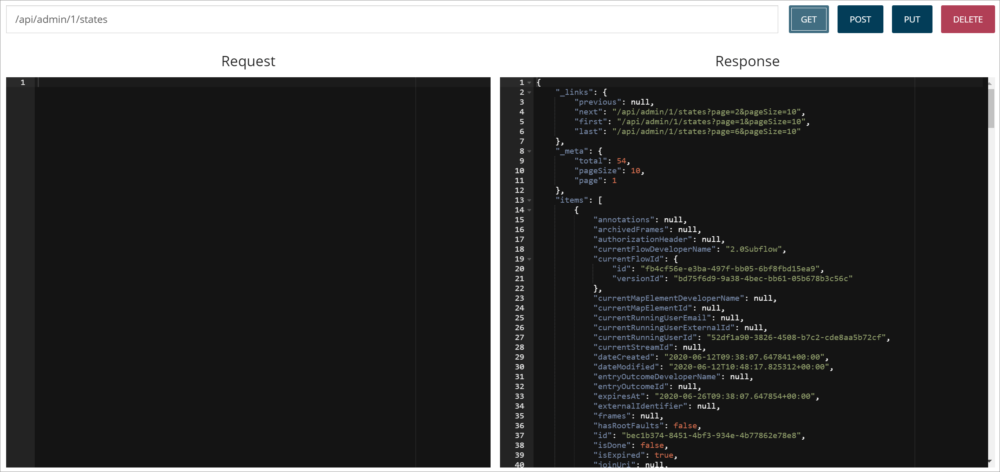

 -   To learn more about the API tool, see [c-flo-APItool\_95ad682d-ce04-494a-9235-e113a89406bc.md](c-flo-APItool_95ad682d-ce04-494a-9235-e113a89406bc.md).

-   To get started with using the API tool, see [c-flo-APItool\_using\_8a620c2a-753f-4eb9-9457-d67931336d2f.md](c-flo-APItool_using_8a620c2a-753f-4eb9-9457-d67931336d2f.md).

|
|[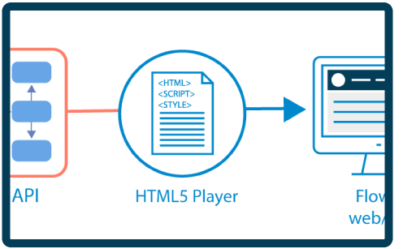](c-flow-Players_931f82a8-0725-4dc3-b965-f606330dc5a6.md)

|[**Players**](c-flow-Players_931f82a8-0725-4dc3-b965-f606330dc5a6.md)

 A player is used to provide a user interface for the flow; running and rendering flow API's into a user interface. Create your own custom players to control how the user interface for your flow looks and works.

 

 -   To learn more about players, see [c-flow-Players\_931f82a8-0725-4dc3-b965-f606330dc5a6.md](c-flow-Players_931f82a8-0725-4dc3-b965-f606330dc5a6.md).

-   To learn more about customizing players, see [c-flo-Players\_HTML5\_9dffba2f-c22b-4a90-8950-9dc6af119ab0.md](c-flo-Players_HTML5_9dffba2f-c22b-4a90-8950-9dc6af119ab0.md).

|
|[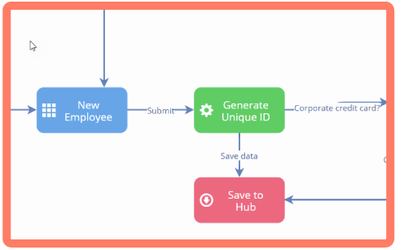](c-flo-Flow_Canvas_f063ba9b-b7f4-4484-8242-d51d4fb40fa6.md)

|[**The Flow Canvas**](c-flo-Flow_Canvas_f063ba9b-b7f4-4484-8242-d51d4fb40fa6.md)

 The flow canvas provides a drag-and-drop interface for building and configuring your flows.

 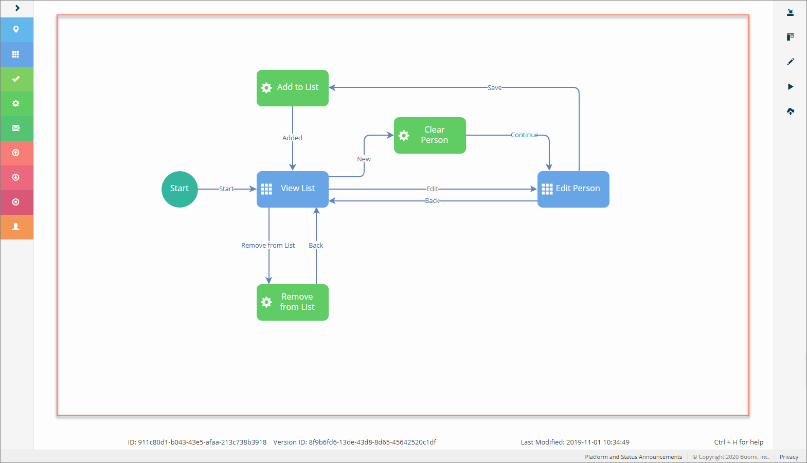

 -   To learn more about the flow canvas, see [c-flo-Flow\_Canvas\_f063ba9b-b7f4-4484-8242-d51d4fb40fa6.md](c-flo-Flow_Canvas_f063ba9b-b7f4-4484-8242-d51d4fb40fa6.md).

-   To get started using the flow canvas, see [c-flo-Flow\_Canvas\_Using\_9563eda3-a577-46d0-a444-7cada7c9413d.md](c-flo-Flow_Canvas_Using_9563eda3-a577-46d0-a444-7cada7c9413d.md).

|
|[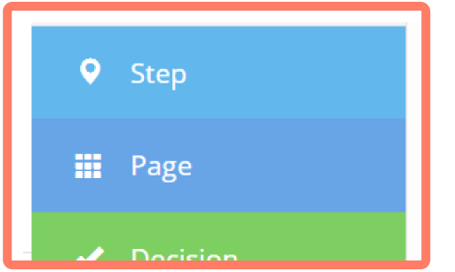](c-flo-Map_Elements_94361918-d868-4422-9bd4-94da7c46cd0f.md)

|[**Map elements**](c-flo-Map_Elements_94361918-d868-4422-9bd4-94da7c46cd0f.md)

 Map elements can be thought of as the 'building blocks' that make up a flow on the canvas; each map element provides access to different features that can be added into a flow.

 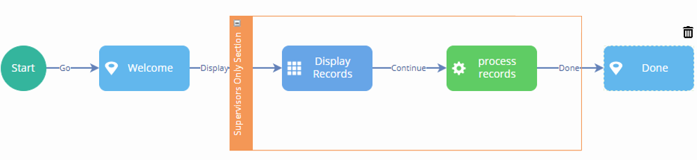

 -   To learn more about map elements, see [c-flo-Map\_Elements\_94361918-d868-4422-9bd4-94da7c46cd0f.md](c-flo-Map_Elements_94361918-d868-4422-9bd4-94da7c46cd0f.md).

-   To get started adding map elements, see [c-flo-Canvas\_Adding\_Elements\_97cfb541-b16d-4c77-9ea1-57f506580785.md](c-flo-Canvas_Adding_Elements_97cfb541-b16d-4c77-9ea1-57f506580785.md).

|
|[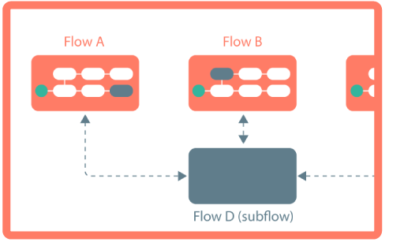](c-flo-Subflows_ca879fac-5941-44d3-87df-69b97ac5c034.md)

|[**Subflows**](c-flo-Subflows_ca879fac-5941-44d3-87df-69b97ac5c034.md)

 Flows can be called by other flows as 'subflows', allowing you to re-use flows and their functionality across multiple workflows.

 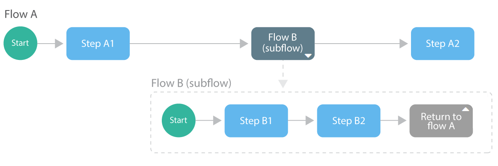

 -   To learn more about subflows, see [c-flo-Subflows\_ca879fac-5941-44d3-87df-69b97ac5c034.md](c-flo-Subflows_ca879fac-5941-44d3-87df-69b97ac5c034.md).

-   To get started using subflows, see [t-flo-Subflows\_Creating\_a\_subflow\_02491fd8-480f-49dd-9806-352781af429a.md](t-flo-Subflows_Creating_a_subflow_02491fd8-480f-49dd-9806-352781af429a.md).

|
|[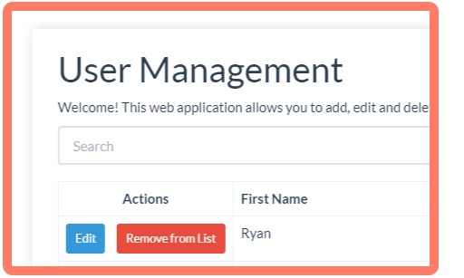](c-flo-Publishing_Flows_ace67655-6267-49a1-a1dd-2eb29ac6c585.md)

|[**Publishing flows**](c-flo-Publishing_Flows_ace67655-6267-49a1-a1dd-2eb29ac6c585.md)

 Publish a flow to make it available to your users as a web application via a URL. Publishing a flow will set it as the default version of the flow for users.

 

 -   To publish a flow, see [c-flo-Publishing\_Flows\_ace67655-6267-49a1-a1dd-2eb29ac6c585.md](c-flo-Publishing_Flows_ace67655-6267-49a1-a1dd-2eb29ac6c585.md).

|