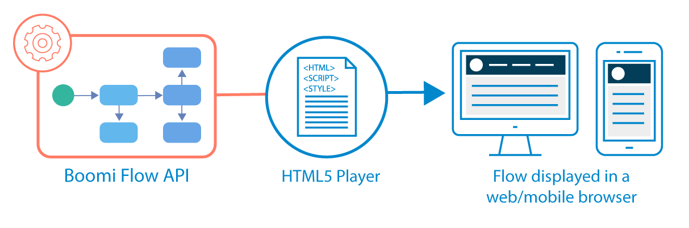
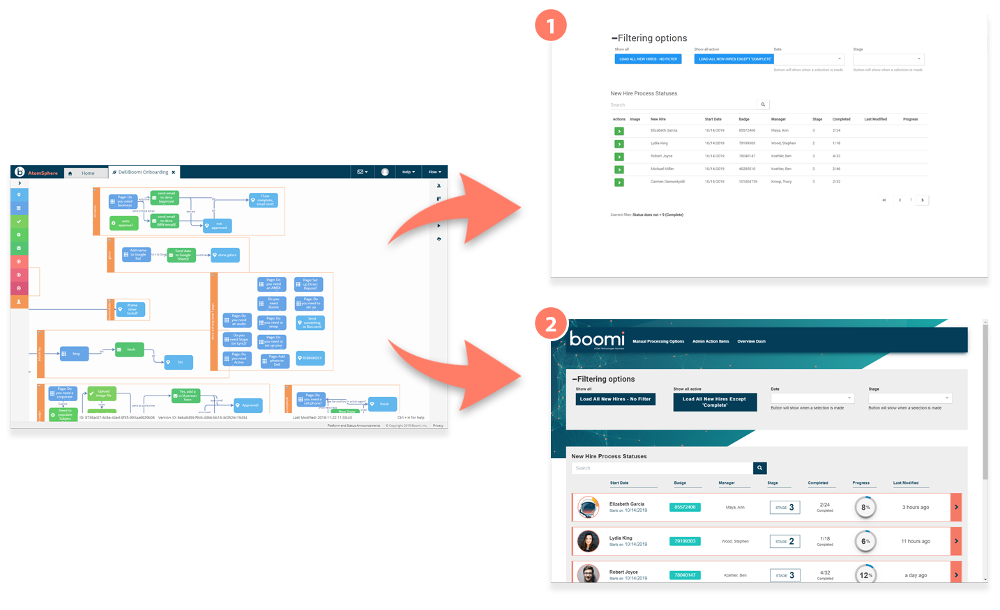

# Players

<head>
  <meta name="guidename" content="Flow"/>
  <meta name="context" content="GUID-931f82a8-0725-4dc3-b965-f606330dc5a6"/>
</head>

You can use a player to generate and present a user interface for your flows.

## Overview

Once you have built a flow, you can use a player to provide a user interface for the flow to your end users.

uses an API-first architecture, and players are used to run and render these API's into a user interface. The platform API's define the user interface elements for a player, and the player in turn generates the interface from this.

-   The most widely used type of player is an HTML5 player that allows web applications to be delivered to users via a browser. An HTML5 player is an HTML file that uses HTML, Javascript and CSS to run flows and render them to React components.

-   Each tenant has the default HTML5 players installed that you can use without changing, or customize to suit your needs, for example using your own images, Javascript and CSS.

-   You can manage your players on the **Players** page. See [Players page](c-flo-Players_Page_ba77dfc3-cf1c-42b3-90dd-957b04d1e4e1.md).

## The default player

You can choose to run your flows using the default player. See [The default player](flo-defaultplayer_05efb5f4-0c3c-4c1c-98c3-d470af81fcad.md).

:::tip

We recommend you to use the default player over the legacy player for an effective and seamless experience. The new player is fast-paced and a lighter version of the legacy player.

:::

## The default legacy player

You can also continue to run your flows using the default legacy player. See [The default legacy player](c-flo-Players_Default_1ec7b998-bb39-4296-9857-949eb1dd5680.md).

-   You can use themes with the default legacy player to quickly customize the appearance of a web application without having to rebuild the application or apply custom CSS. See [Player themes](c-flo-Players_Themes_c08a4544-961f-478d-b949-a833634034b0.md).

## Custom players

The default players provide a starting point from which to begin creating your own custom player. You can customize a player to control how your flow user interface looks and works. See [Creating a custom player](t-flo-Players_Create_New_8c9d70c8-3d56-42ac-b988-927e60e5c4db.md) and [Customizing players](c-flo-Players_HTML5_9dffba2f-c22b-4a90-8950-9dc6af119ab0.md).

For example, the following image shows how the same flow will appear when run using the default legacy player  and a customized player :

## Extending players

You can build players to provide any kind of user interface and integration that might be required.

Examples of players that could be used with your flows are:

-   A Twilio player that connects to a Twilio connector and renders a flow to Twiml markup.

-   A Salesforce player that utilises Apex and HTML.

-   A desktop player could even be built to render a flow to XAML/Winforms/Qt/GTK.