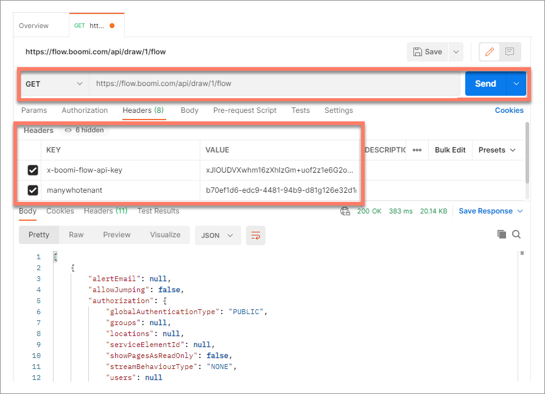

# Using API keys

<head>
  <meta name="guidename" content="Flow"/>
  <meta name="context" content="GUID-3eb1cca6-8456-4ecd-accc-03769d8b98e4"/>
</head>

This worked example shows how API keys can be generated and used to authenticate and make requests to the API.

## Before you begin

Before using this worked example, ensure that you are familiar with the following concepts and procedures:

- Generating an API key in Flow. See [Generating an API key](flo-API_Keys_Creating_fab6941c-d8a2-433a-a2f2-6782eb873a02.md).

- Making requests to a Rest API, for example using Postman. See [Postman](https://www.postman.com/).

- Using the Rest API. See the documentation for details on endpoints and methods.

## Generating an API key

In this worked example, a user wants to make requests to the API, using an API key that they have generated.

The key will allow the user to make requests against their tenant. The tenant is named "Example", and has a tenant ID of "*b70ef1d6-edc9-4481-94b9-d81g126e32d1*".

1. In Flow, a new API key is generated in the **Generate a new API key** section on the **User Settings** page.
  
   - **Key Name**: The API key is named "*API Key*".
   - **Tenant**: The "*Example*" tenant is selected.

2. The **Show** link in the **Key** column is clicked to display the API key.

3. The API key value is copied from the **Key** column. This key value is required when adding the `x-boomi-flow-api-key` authentication header.

## Making a request to the Flow API

In this worked example, the user sends a request to the API to obtain information about which flows exist in their tenant, using the `https://flow.boomi.com/api/draw/1/flow endpoint`.

The user makes the request using the Postman API tool.

1. In Postman, a new request tab is opened.
2. The `https://flow.boomi.com/api/draw/1/flow API` endpoint is entered into the **request URL** field.
3. The `GET` method is selected from the method drop-down menu.
4. If the request was sent at this point it would fail, as no authentication details are included with the request.

   To authenticate the request using the API key, headers are added to the **Headers** tab.

   - An `x-boomi-flow-api-key` header key is added. The API key value that was copied earlier is pasted into the **Value** field for the header.

   - A `manywhotenant` header key is added, to specify which tenant the request should be made against. The "*Example*" tenant ID of "*b70ef1d6-edc9-4481-94b9-d81g126e32d1*" is pasted into the **Value** field for the header.

5. The user clicks **Send** to perform the request, resulting in a successfully authenticated request, using the generated API key.

   The response data contains the metadata for all the flows that exist in the tenant.
