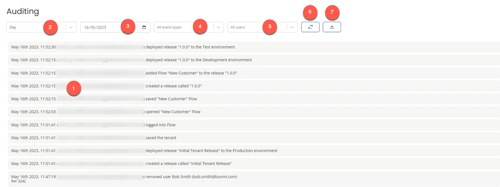

# Auditing

<head>
  <meta name="guidename" content="Flow"/>
  <meta name="context" content="GUID-f31eb0a6-b159-4a34-90cb-1ddc1369b976"/>
</head>

The **Auditing** page provides an audit view of the events logged within your tenant, and allows you to drill down into the event metadata.

## Opening the page

-   Select **Auditing** from the left-hand menu.

## Page overview

The **Auditing** page displays the events logged within your tenant.

-   Events are displayed as separate rows in the **Events** table. 

    The table is sorted so that the most recent events are displayed first. Information for each event is displayed in the table log as rows. In addition to individually recording the identity, user entries, and action of the user, the event log provides the date and time that the events occurred. For instance, creating, updating, or modifying any record.

-   The **Duration** field allows you to change the **Events** table results by selecting a duration, like:

    -   Day
    -   Last Month
    -   Last 3 Months
    -   Last 6 Months
    -   All
    Selecting Day will update the table of events to show only events that had occurred on a certain day. 

-   The **Date** field allows you to change the **Events** table results by selecting a different date. Selecting a different date will update the table of events to show only events that occurred on the selected date. 

    :::note
    
    The **Date** field appears only when the Day option is selected from the **Duration** field drop-down.
    
    :::

-   The **Event Types** field defaults to showing all event types that occurred. You can filter which event types should be displayed in the **Events** table by clicking on individual event type entries in this drop-down menu to add/remove them from the filter. 

-   The **Users** field defaults to showing all event types that occurred regardless of the user that the event was logged against. You can filter which event types should be displayed in the **Events** table by clicking on individual user entries in this drop-down menu to add/remove events for this user from the filter. 

-   Click on the **Refresh results** icon to update the table with the latest events information. 

-   Click on the **Download** icon to download the event log in a CSV file.