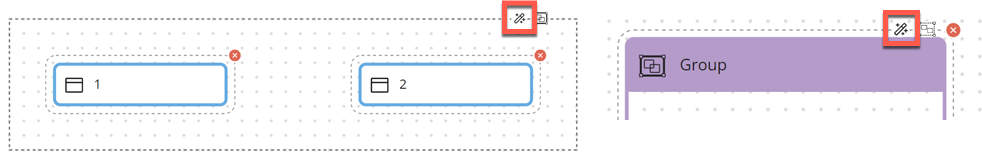

# Auto Arrange 

<head>
  <meta name="guidename" content="Flow"/>
  <meta name="context" content="GUID-b260faf8-a0e8-41ce-b7f8-fbd8e3f58e63"/>
</head>

You can use the Auto Arrange tool to automatically rearrange elements on the flow canvas.

## Overview 

The Auto Arrange tool optimizes the canvas layout by automatically rearranging and aligning elements into a more logical structure.

-   You can rearrange the entire canvas, a selection of elements, or just the elements contained in a group.

-   You are shown a preview of the new layout before the changes are committed. Choose whether to save the new canvas layout, or reject the changes and keep the original layout.

**Note:** To achieve the best results on large or complicated flows, you can use the tool on smaller sections of the canvas in sequence, instead of rearranging the entire canvas at once.

## Auto arranging the canvas 

1.  Edit a flow to open the flow canvas.
2.  Choose what to automatically arrange:
    -   To rearrange the **entire canvas**, do not select any canvas elements.

    -   To rearrange only a particular **set of elements**, select the elements on the canvas.

    -   To rearrange the elements contained within a **group**, select the group on the canvas.

3.  Click the **Auto Arrange** icon on the [canvas toolbar](flo-Canvas_Toolbar_4396313b-48e2-43e3-a697-a455dd1043e1.md).

    If you have selected a group or a set of elements, you can also click on the **Auto Arrange** icon shown on the selection.

    

4.  A read-only preview of the new canvas layout is shown.
    -   Click **Save** to save and apply the new canvas layout.

    -   Click **Revert** to reject the new canvas layout, and keep the original canvas layout.

5.  After choosing either option, you are returned to the canvas.