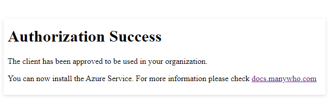

# Approving the application

<head>
  <meta name="guidename" content="Flow"/>
  <meta name="context" content="GUID-3541e186-6459-4b7d-90b1-0a866d40e47d"/>
</head>

:::warning

We no longer support the legacy connectors and recommend that you upgrade to the newer supported version of these connectors.

:::

Before you can integrate with AD, a Administrator must approve the client application, and grant it the required AD access and permissions.

## Approving the application

To approve the required access and permissions for the application:

1.  Navigate to the following URL in a browser:
    -   [Approve access to the application](https://login.microsoftonline.com/common/oauth2/authorize?client_id=095d7f42-b4cb-4bae-a5f6-847d7649345f&response_type=code&redirect_uri=https://services.manywho.com/api/azure/1/callback/admin/authorization&nonce=12345&resource=00000002-0000-0000-c000-000000000000&prompt=admin_consent)

2.  When prompted, sign-in to using an Administrator account for your AD implementation.
3.  The **Permissions requested** form is displayed.

    

    Click **Accept** to accept the terms and conditions.

4.  An **Authorization Success** message is displayed to inform you that the required access and permissions have been granted.

    

5.  The can now be installed in your tenant. See [Installing the application](flo-Azure_AD_Service_Installation_19e99baf-ca51-461f-81c9-9bef2de0e46a.md).

## Access and permissions required by the application

In order to communicate with your AD implementation, the application requires the following access and permissions:

|Access/permission|Description|
|:----------------|:----------|
|Access the directory as the signed-in user|Allows to have the same access to information in the directory as the signed-in user. This is a permission requested to access your data in Default Directory.|
|Read all groups|Allows to read basic group properties and memberships on behalf of the signed-in user. This is a permission requested to access your data in Default Directory.|
|Read all users' full profiiles|Allows to read the full set of profile properties of all users in your company or school, on behalf of the signed-in user. Additionally, this allows to read the profiles of the signed-in user's reports and manager. This is a permission requested to access your data in Default Directory.|
|Sign in and read user profile|Allows users to sign in to your applications, and allows to read the profile of signed-in users. It also allow to read basic company information of signed-in users. This is a permission requested to access your data in Default Directory.|

:::note

Once approved, the application can be viewed and managed in your AD **Enterprise Applications** service.

:::