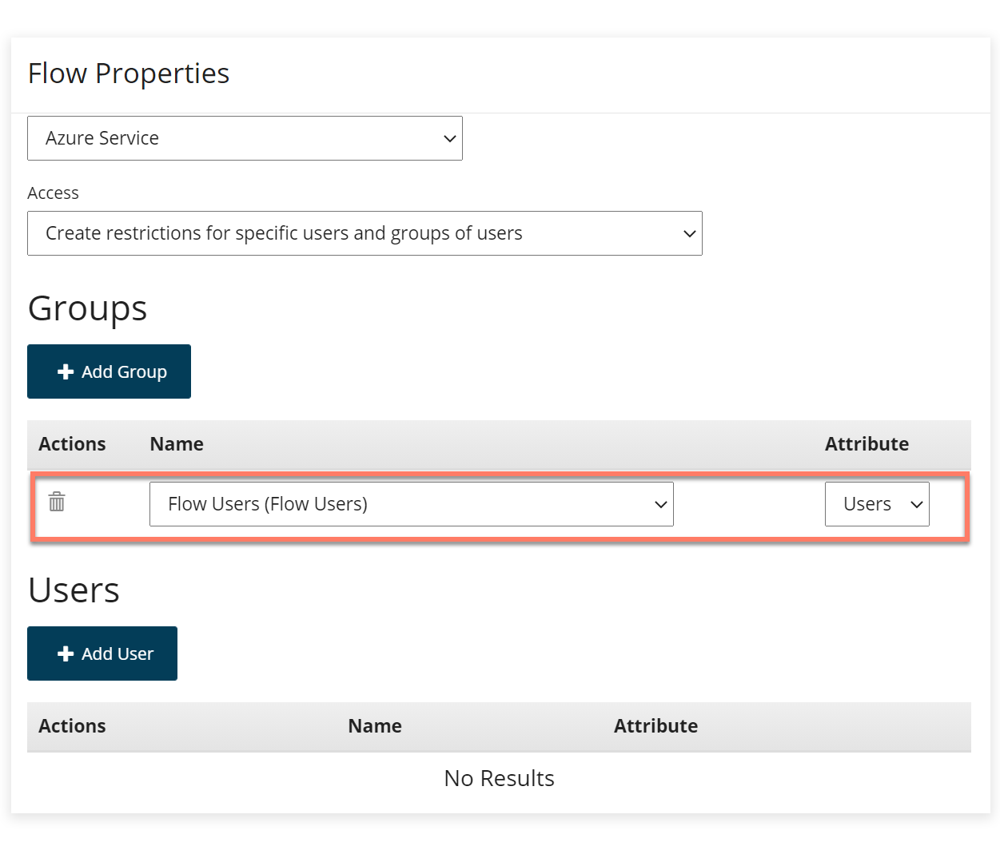

# Using the Azure AD (Legacy) connector to apply group authentication restrictions to a flow

<head>
  <meta name="guidename" content="Flow"/>
  <meta name="context" content="GUID-6a941c3e-8370-46df-ad8c-f62a18d4af7e"/>
</head>

:::warning

We no longer support the legacy connectors and recommend that you upgrade to the newer supported version of these connectors.

:::
This topic shows how to use the to apply group authentication restrictions to a simple flow.

## Before you begin

In the previous topic, the was used to apply simple user authentication restrictions to a flow.

-   [Using the to apply user authentication restrictions to a flow](flo-Azure_AD_Users_90e9122c-5985-48c7-ac83-11e00ac9c21b.md)

This topic covers how simple group authentication restrictions can be applied to a flow using the .

## Applying group restrictions to a flow

In this worked example, access to the previously created flow will now be restricted to only the users that belong to a specific AD group.

In AD, a 'Flow Users' group is created, containing a single 'Flow Connector' member.

In , the previously created flow will now have group restrictions applied:

-   On the **Flow Properties** form for the flow, the existing user restriction is removed by deleting the user from the **Users** section.

-   Clicking **Add Group** allows you to view and select the AD group\(s\) that you wish to restrict access to. Only members belonging to the groups added here will be able to successfully authenticate and view the flow.

    In this example, only the 'Flow Users' group is added.

    

**Note:** If no groups have been set up in AD, the **Groups** section is not displayed on the **Flow Properties** form.

## Publishing and testing the flow authentication

Once the flow has been published, anyone running the flow in a web browser is authenticated against the AD user restrictions that you have defined:

-   If the user is not already signed in to , a prompt is displayed, requiring the user to select an account/sign-in to . For example:

    

-   Once the user has successfully signed in to , or if they were already signed in, the flow will authenticate their user account and proceed as follows:

    -   If the signed in user account is not a member of any group on the list of approved flow **Groups**, they are denied access to the flow.

        

    -   If the signed in user account is a member of any group on the list of approved flow **Groups**, they are successfully authenticated, and will access and begin running the flow.

        In this example scenario, only the Flow Connector' user is allowed access as this user account has satisfied the authentication requirements, i.e. they belong to the group on the list of approved flow **Groups**.

        

## Next: Applying tenant restrictions

The next part of this worked example covers how to apply tenant restrictions to the example flow.

-   [Using the to apply tenant authentication restrictions to a flow](flo-Azure_AD_Tenants_e9d1d535-babf-4434-811d-ff1da9f18112.md)