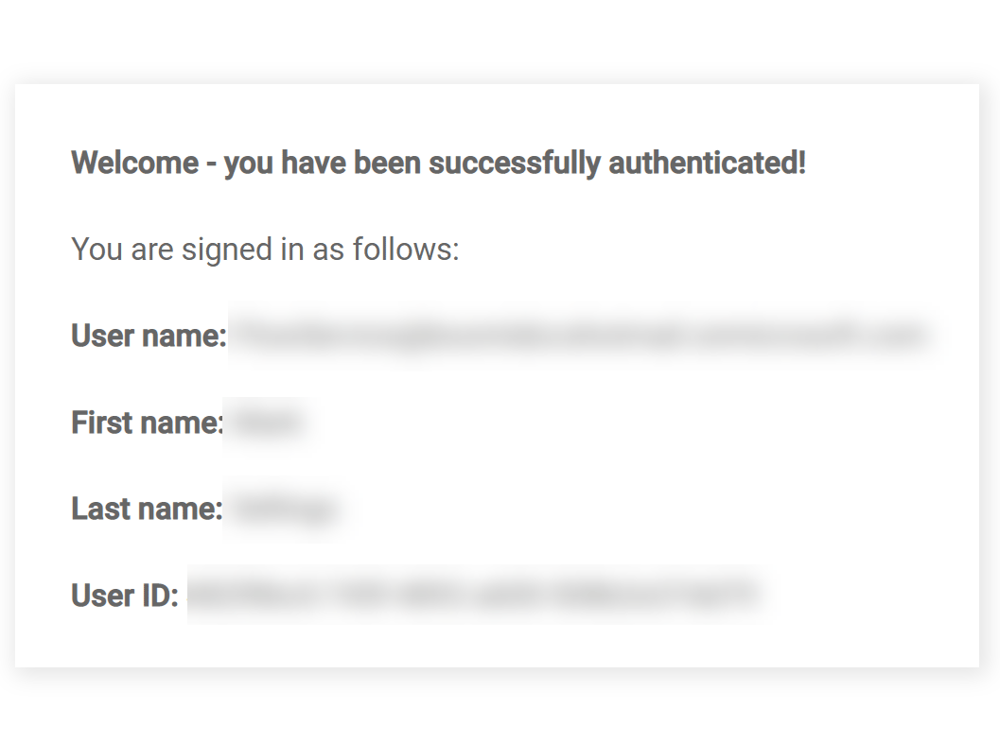

# Using the Azure AD (Legacy) connector to apply tenant authentication restrictions to a flow

<head>
  <meta name="guidename" content="Flow"/>
  <meta name="context" content="GUID-e9d1d535-babf-4434-811d-ff1da9f18112"/>
</head>

:::warning

We no longer support the legacy connectors and recommend that you upgrade to the newer supported version of these connectors.

:::

This topic shows how to use the to apply tenant authentication restrictions to a simple flow.

## Before you begin

In the previous topic, the was used to apply simple group authentication restrictions to a flow.

-   [Using the to apply group authentication restrictions to a flow](flo-Azure_AD_Groups_6a941c3e-8370-46df-ad8c-f62a18d4af7e.md)

This topic covers how tenant authentication restrictions can be applied to a flow using the .

## Specifying the tenant

-   In AD, a new 'Example Organization' tenant is created alongside the standard 'Default Directory' tenant.

-   A single 'Flow Tenant' member is added to the new 'Example Organization' tenant.

-   In , the optional Tenant configuration value is added and set to the **Tenant ID** of the AD tenant. See [configuration values](flo-Azure_AD_Service_Configuration_Values_4362ad7f-b2ad-43eb-b940-fed42f4fe90f.md).

    

## Applying tenant restrictions to a flow

In this worked example, access to the previously created flow will now be restricted to only users belonging to a specific AD tenant, regardless of whether they are on the list of approved flow **Users** or **Groups**.

In , the previously created flow will now have tenant restrictions applied:

-   On the **Flow Properties** form for the flow, the existing group restriction is removed by deleting the group from the **Groups** section.

-   Clicking **Add User** allows you to view and select the AD users that you wish to restrict access to. The selected user\(s\) must belong to the tenant that you have specified in the Tenant configuration value.

    In this example, only the 'Flow Tenant' user is added. This user is a member of the 'Example Organization' tenant.

## Publishing and testing the flow authentication

Once the flow has been published, anyone running the flow in a web browser is authenticated against the AD tenant/user restrictions that you have defined:

-   If the user is not already signed in to , a prompt is displayed, requiring the user to select an account/sign-in to . For example:

    

-   Once the user has successfully signed in to , or if they were already signed in, the flow will authenticate their user account and proceed as follows:

    -   If the signed in user account does not belong to the tenant specified in the `Tenant` configuration setting, regardless of whether they are on the list of approved flow **Users**, they are denied access to the flow.

        

    -   If the signed in user account does belong to the tenant specified in the `Tenant` configuration setting, but is not on the list of approved flow **Users**, they are denied access to the flow.

        

    -   If the signed in user account does belong to the tenant specified in the `Tenant` configuration setting, and is also on the list of approved flow **Users**, they are successfully authenticated, and will access and begin running the flow.

        In this example scenario, the 'Flow Tenant' user is allowed access as this user account has satisfied the authentication requirements, i.e. they belong to the required tenant and are also on the list of approved flow **Users**.

        