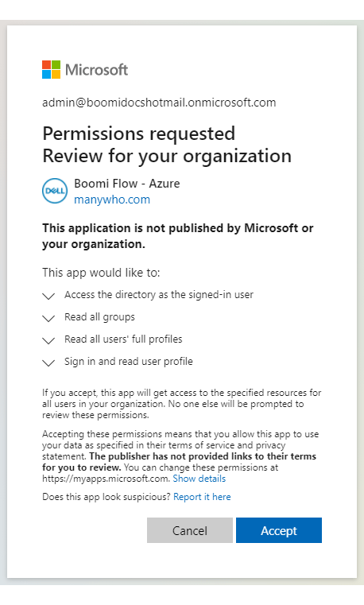
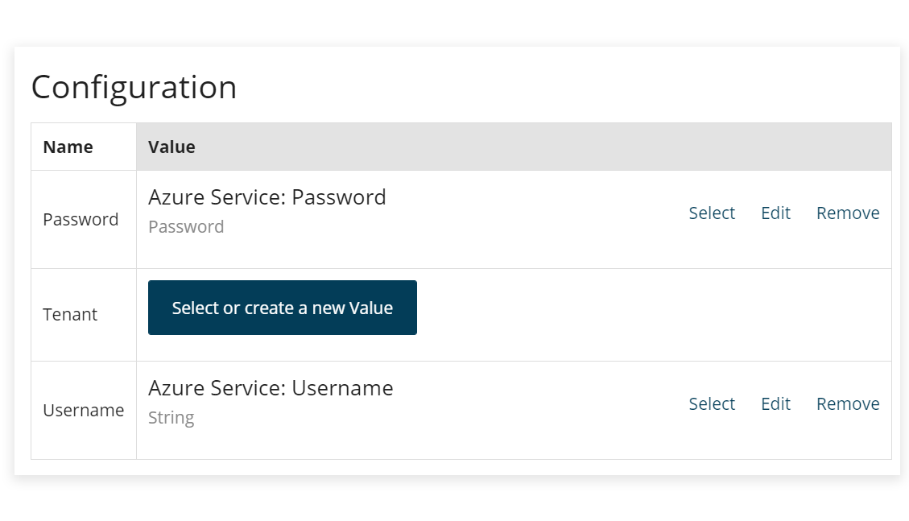
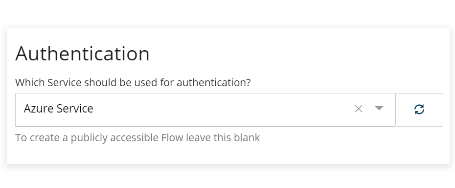
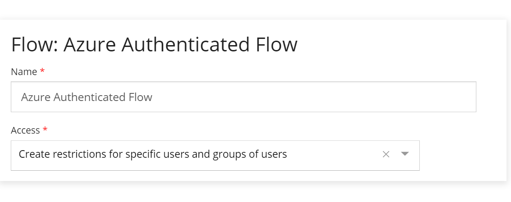
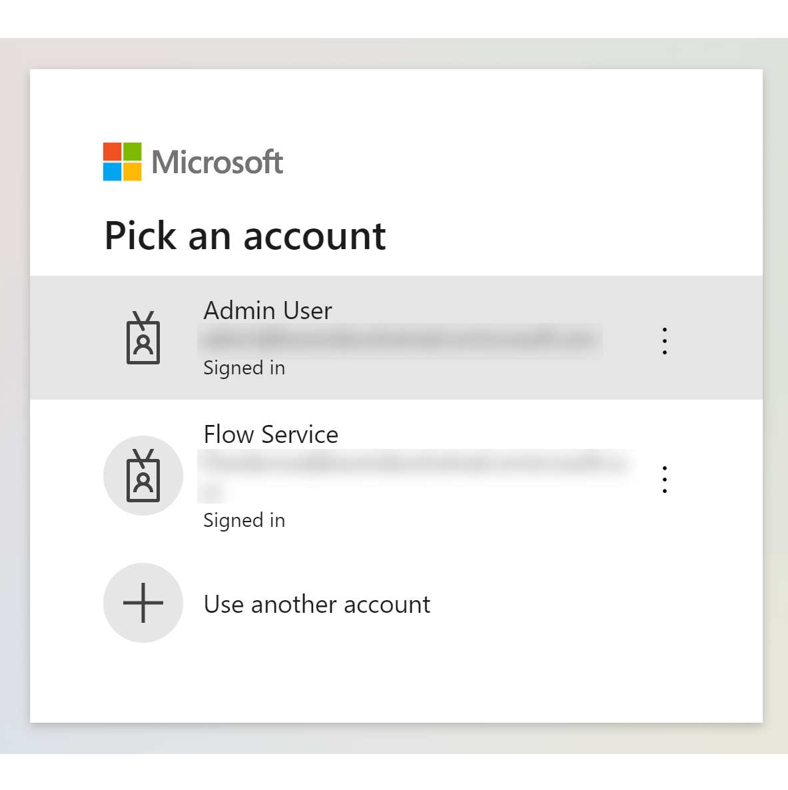
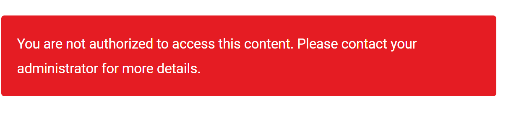
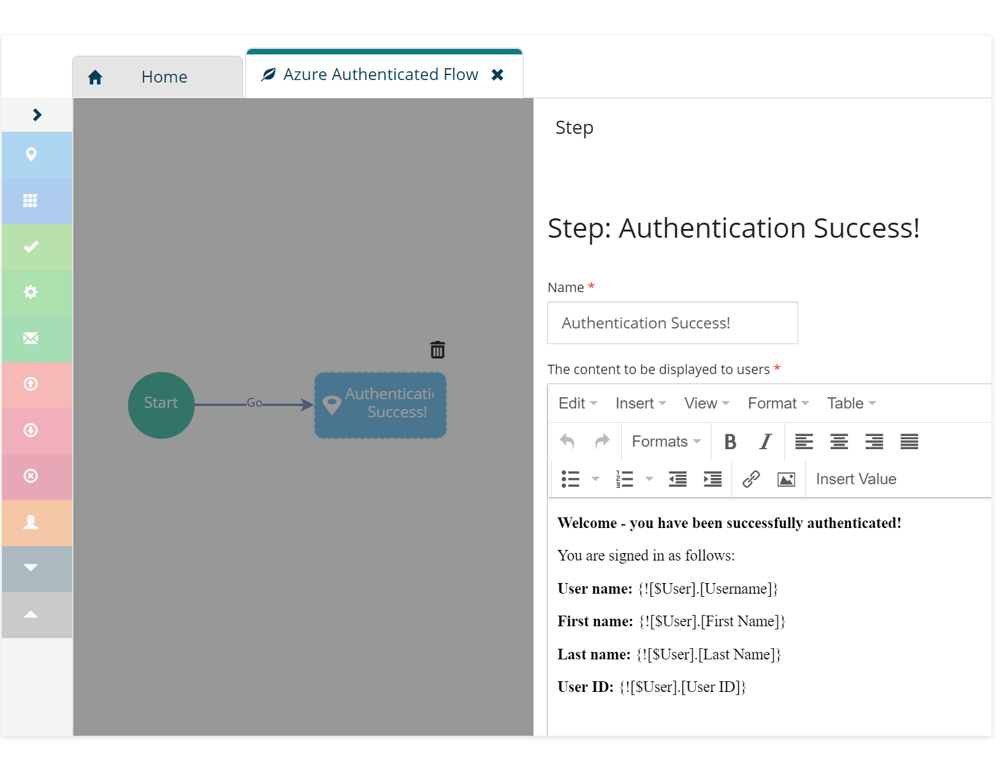

# Using the Azure AD (Legacy) connector to apply user authentication restrictions to a flow

<head>
  <meta name="guidename" content="Flow"/>
  <meta name="context" content="GUID-90e9122c-5985-48c7-ac83-11e00ac9c21b"/>
</head>

:::warning

We no longer support the legacy connectors and recommend that you upgrade to the newer supported version of these connectors.

:::

This topic shows how to use the Azure AD (Legacy) connector to apply Microsoft Azure user authentication restrictions to a simple flow.

## Before you begin

This topic covers how simple user authentication restrictions can be applied to a flow using the .

## Approving the Boomi Flow - Azure connector application


Before the is installed, a Administrator first has to approve the client application.

-   [Approving the Azure AD (Legacy) connector application](flo-Azure_AD_Granting_Permissions_3541e186-6459-4b7d-90b1-0a866d40e47d.md)




## Installing the Azure AD (Legacy) connector in Flow

The is installed into a flow tenant, using the following example configuration values to define the user account that is used for the connection.

-   [Installing the Azure AD (Legacy) connector](flo-Azure_AD_Service_Installation_19e99baf-ca51-461f-81c9-9bef2de0e46a.md)

-   [Azure AD (Legacy) connector configuration values](flo-Azure_AD_Service_Configuration_Values_4362ad7f-b2ad-43eb-b940-fed42f4fe90f.md)




| Name     | Value Name       | Value Kind | Access                 | Default Value                                                                             |
|----------|------------------|------------|------------------------|------------------------------------------------------------------------------------------|
| Password | Azure AD: Password | Password   | Private - No external access | The Password for the Microsoft Azure user account defined in the Username configuration value below. |
| Tenant   | -                | -          | -                      | -                                                                                        |
| Username | Azure AD: Username | String     | Private - No external access | The Microsoft Azure User Principal Name field value for the user account that you wish to use for the Azure AD (Legacy) connector connection. <br/>For example, 'FlowConnectorAdmin@Org.onmicrosoft.com' <br/>This information can be found in the Microsoft Azure User Profile screen. |


The **Tenant** configuration value is not configured, as no tenant restrictions are being applied in this first part of the worked example scenario. Tenant restrictions are covered later in the final part of this worked example.

-   [Using the Azure AD (Legacy) connector to apply tenant authentication restrictions to a flow](flo-Azure_AD_Tenants_e9d1d535-babf-4434-811d-ff1da9f18112.md)


## Creating a new flow and applying user restrictions

In this worked example, we want to set up a flow that can only be accessed by the AD users we specify.

A new flow is created, and AD user authentication restrictions applied.

These user restrictions are configured during the **New Flow** creation process:

-   The is selected on the **Authentication** page.

    

-   On the **New Flow** page, the 'Create restrictions for specific users and groups of users' flow **Access** option is selected. This allows access to the flow to be restricted to only the AD users and groups that you specify.

    

-   The **Advanced** section of the **New Flow** page allows you to select which users to restrict access to. Clicking **Add User** allows you to view and select the AD users that you wish to restrict access to. Only the users added here are able to successfully authenticate and view the flow.

    In this example, only the 'Flow Connector' user is added.

    


:::note

These settings can also be accessed on the **Flow Properties** form once the flow has been created. See [ Flow Properties](c-flo-Flow_Properties_b74d944d-9fec-43da-9ae3-fe0a5a370d00.md).

:::

## Publishing and testing the flow authentication

Once the flow has been published, anyone running the flow in a web browser is authenticated against the AD user restrictions that you have defined:

-   If the user is not already signed in to , a prompt is displayed, requiring the user to select an account/sign-in to . For example:

    

-   Once the user has successfully signed in to , or if they were already signed in, the flow will authenticate their user account and proceed as follows:

    -   If the signed in user account is not on the list of approved flow **Users**, they are denied access to the flow.

        

    -   If the signed in user account is on the list of approved flow **Users**, they are successfully authenticated, and will access and begin running the flow.

        


In this example flow, a single step map element is displayed to the user once they have successfully authenticated into the flow with their user credentials.



This step map element retrieves and displays the user information using [System user values](r-flo-Values_System_User_Values_d9728e25-86de-4d77-8246-a04031fe6b63.md):

```
User name: {![$User].[Username]}
First name: {![$User].[First Name]}
Last name: {![$User].[Last Name]}
User ID: {![$User].[User ID]}
```

## Next: Applying group restrictions

The next part of this worked example covers how to apply group restrictions to the example flow.

-   [Using the Azure AD (Legacy) connector to apply group authentication restrictions to a flow](flo-Azure_AD_Groups_6a941c3e-8370-46df-ad8c-f62a18d4af7e.md)