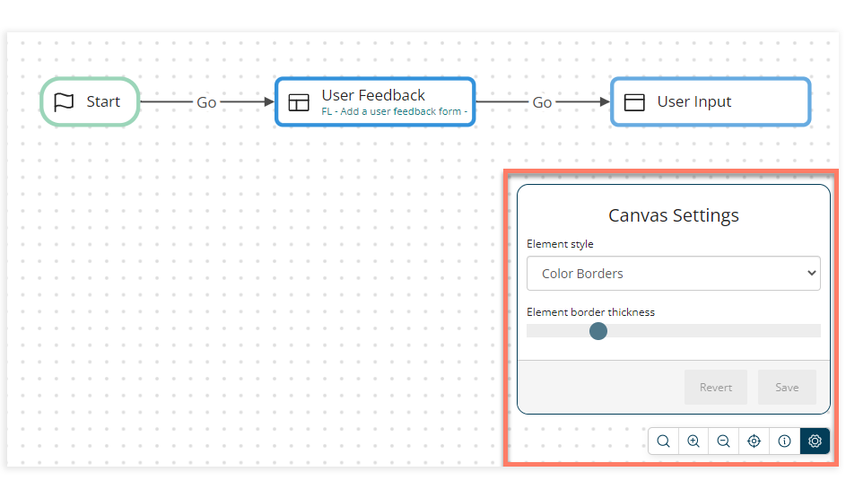

# Canvas Settings 

<head>
  <meta name="guidename" content="Flow"/>
  <meta name="context" content="GUID-7ec861cb-8d6d-440f-bfcf-29f321b622f1"/>
</head>

You can customize the general display settings of the flow canvas.

-   Canvas Settings are applied at a User level. Any changes you make are applied to the flow canvas across all your tenants and flows.

-   **Element Style**: Change the general element canvas settings:

    -   **Color Borders**: Canvas elements are shown with an outline and no fill \(default\).

    -   **Color Fill**: Canvas elements are shown with a color fill applied.

    -   **Color Fill When Zoomed Out**: Canvas elements are shown with an outline and no fill at a higher zoom, with canvas elements then being shown with a color fill applied once you zoom out beyond a certain point. This setting helps to provide greater visual clarity of elements when the canvas is zoomed out.

-   **Element border thickness**: Increase/decrease the border width of canvas elements.

## Opening the Canvas Settings 

1.  To show/hide the flow canvas settings, either:
    -   Press **Period** \(.\).

    -   Click the **Settings** icon on the canvas toolbar.

2.  The flow canvas settings are overlaid on the canvas, allowing you to customize the flow canvas display.
3.  To hide the flow canvas settings, either:
    -   Press **Period** \(.\) again.

    -   Click the **Settings** icon on the canvas toolbar again.

## Changing the Canvas Settings 

1.  Select the general canvas display style that you wish to apply from the **Element Style** drop-down menu.

2.  Drag the **Element border thickness** bar handle left/right to decrease/increase the border width of canvas elements.
3.  Click **Save** to save and apply your changes to the canvas display. Click **Revert** to revert to the previously saved settings.