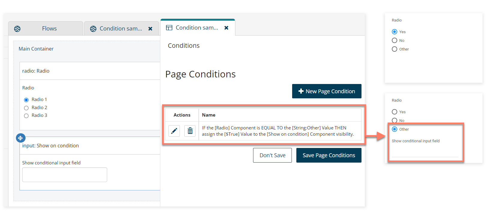

# Page conditions

<head>
  <meta name="guidename" content="Flow"/>
  <meta name="context" content="GUID-a464b2d7-8eee-4b12-bf1c-0335ecf2df17"/>
</head>

You can use page conditions to apply conditional formatting to components on a page layout.

Page conditions allow you to conditionally vary the display and behaviour of components on a page in your flow application, providing a more dynamic experience for users.

For example, a page condition can be used to change the visibility of a component on a page, based on the state of another component on the page, or a value selected by a user.

You can add page conditions to a page layout using either of the two page condition interfaces:

-   [Basic page conditions](flo-Conditions_basic_cfbe2a47-b326-4de9-9675-2092f11d47a2.md): Create a simple page condition, such as changing the state of a component in a page layout, based on the value of another component.

-   [Complex page conditions](flo-Conditions_complex_71527fb2-50fe-4f6f-bfbc-8eb40597f2b5.md): Create and configure more advanced conditional formatting and behaviour, by defining the page rules and operations that build a page condition.

## Getting started with page conditions

To get started with creating page conditions:

-   [Creating a basic page condition](flo-Conditions_creating_basic_0f55bd1c-c85f-4fa6-87ae-80bdaa61463c.md)

-   [Creating a complex page condition](flo-Conditions_creating_complex_6dd00a39-da3a-454d-ae20-535045971f89.md)

    -   [Page Rules](flo-Conditions_rules_c2625ff4-12fa-40da-b277-b48e9530eb86.md)

    -   [Page Operations](flo-Conditions_operations_6bca370d-9dd9-401e-822c-956bfe78c977.md)

See [Changing field visibility with a basic page condition](flo-Conditions_using_basic_b2ca49a7-b859-409b-a00a-019517b698ff.md) for a worked example of a page condition.

## Notes on using page conditions

-   **Page condition order**: Page conditions are applied in the order in which they are added on the **Conditions** panel. To change the order in which page conditions are applied, you must delete the conditions, and then re-add them in the required order.

-   **Page condition planning**: Plan your page conditions from the perspective of the operation first, rather than from the rule. For example, "I want to make this component do this, when this other component/value is this", instead of "if this component/value is this, then make this other component do that".

-   **Page condition conflicts**: Page conditions always apply the opposite operator to the opposite of a rule. This can result in conflicts between conditions on a page unless conditions are planned carefully. For example:

    -   A page condition checks if a value is equal to "5", and sets a component visibility to "true" if the condition is met.

    -   If the value is not equal to "5", the condition will instead apply the opposite of the rule, setting the component visibility to "false".

-   **Page condition evaluation**:

    Page conditions are evaluated when:

    -   The page is loaded,

    -   Any page condition that contains a rule with a Left Page Component selected, is updated by user interaction, such as switching a toggle on or off, or moving from one input field to another.

    Page conditions where a page rule does not have a Left Page Component selected \(such as when only reading from a value\) are only evaluated when the page is loaded.

-   **Building multi-level logic with page conditions**: Page conditions only allow single-level AND/OR logic. To apply multi-level conditional logic with page conditions, use multiple page conditions to build up the logical steps.

    For example, to show a component when \(X=2 AND \(Y=4 OR Y=5\)\), you could first create a page condition that sets a Boolean property to "true" IF \(Y=4 OR Y=5\), and then set the visibility of the component to "true" IF \(X=2 AND the Boolean property EQUALS "true"\).