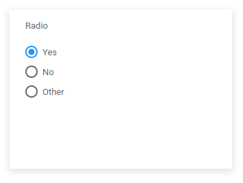
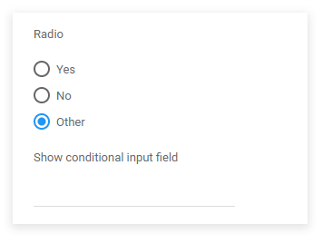

# Changing field visibility with a basic page condition

<head>
  <meta name="guidename" content="Flow"/>
  <meta name="context" content="GUID-b2ca49a7-b859-409b-a00a-019517b698ff"/>
</head>

This worked example shows how a basic page condition can be used to conditionally control the visibility of a field on a page.

## Before you begin

Before using this worked example, ensure that you are familiar with the following concepts and procedures:

-   Working with page layouts. See [Pages](c-flo-Pages_Overview_15c245e1-5232-4173-8a85-dae7ea7f060b.md).

-   Input components such as input fields and radio buttons, enabling user input in a flow. See [Input Component](/docs/Atomsphere/Flow/topics/flo-pages-components-input_e6b419b2-403d-409a-bcf3-77ed9f522fdb.md).

## Setting up the flow

In this example flow, a basic page condition is used to show an input component on a page when a user selects a specific option in a radio component. The input component is not visible until the option is selected.

-   The flow has a single page map element, linked to the Start map element.

-   The page layout assigned to this page has 2 components:

    -   A radio component named "Radio" that uses a list value to present a user with 3 options - "Yes", "No" and "Other". The user selection is saved to an object value named "SelectedRadioObject", with the "Label" property added to the **Data Presentation** column.

    -   An input component named "Show on condition" that provides a field for a user to enter additional details if the "Other" option is selected.

## Setting up the page condition

A basic page condition is added to the page layout and configured as follows:

-   **When the value of** \[Radio component\]

-   \[is equal to\] \[Other string value\]

-   **then make** \[Show on condition component\] \[Visible\]

## Running the flow

When the flow is run, a simple radio component is displayed on the page.

As a page condition always applies the opposite rule to a component until the condition is met, the input component is automatically hidden \[Visible=$False\] to begin with.

If a user selects either the Yes or No radio component option, the page condition is not met, so the input component remains hidden \[Visible=$False\].

However, when a user selects the Other radio component option, the page condition is met, and the input component visibility changes to show the page component \[Visible=$True\].

