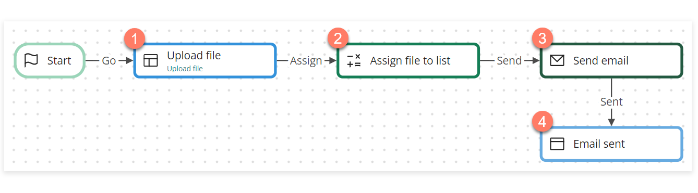
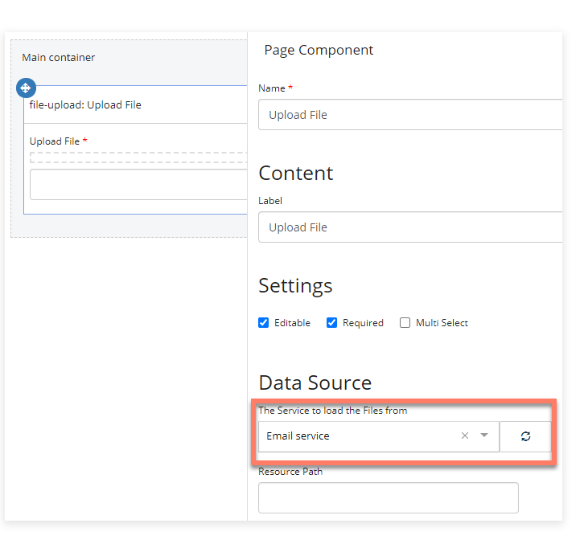
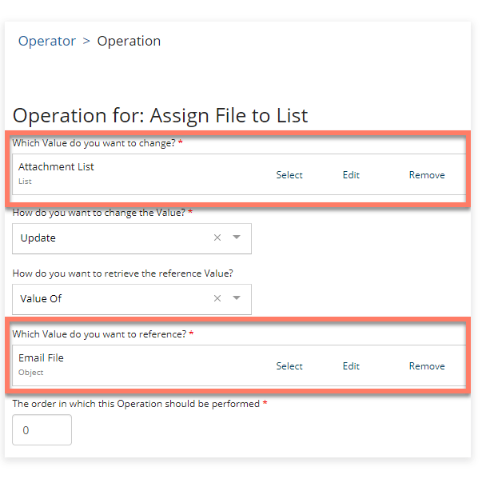
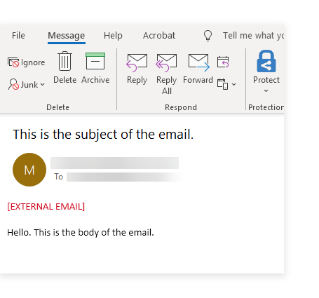

# Sending email attachments using the Email connector

<head>
  <meta name="guidename" content="Flow"/>
  <meta name="context" content="GUID-cfd0438a-8a35-40d8-9c0b-c91a06c4c36b"/>
</head>

The Email connector can be used with a file upload component to upload files and then include them as attachments in an email.

## Before you begin

Before using this worked example, ensure that you are familiar with the following concepts and procedures:

-   Installing the Email connector. See [Email connector](/docs/Atomsphere/Flow/topics/flo-Email_connector_f96ce3fa-c713-41fe-932e-85844f496b87.md).

-   Creating new flows. See [Creating a new flow](/docs/Atomsphere/Flow/topics/c-flo-Flows_Creating_a_new_flow_6745110f-738e-4a54-bf5e-c565e4c412a9.md).

-   Setting up flows using map elements on the flow canvas, and running/publishing flows. See [ Building and publishing flows](/docs/Atomsphere/Flow/topics/c-flo-Building_and_Publishing_Flows_3dba9a15-316f-4134-9093-d4811ea7d14f.md).

-   Working with file upload components. See [ File Upload component](/docs/Atomsphere/Flow/topics/flo-pages-components-fileupload_edb868aa-5a66-4cbf-9019-42e1df0ed027.md).

## About this worked example

This worked example is provided for illustration purposes only, to demonstrate the example steps and settings involved in using a file upload component in combination with the Email connector to upload and then include file attachments in a flow email.

## Installing the Email connector

The Email connector is first installed and configured to allow emails to be sent from within the flow. In this example, the is configured to send emails from a Gmail account, which requires additional configuration.

-   [Email connector](/docs/Atomsphere/Flow/topics/flo-Email_connector_f96ce3fa-c713-41fe-932e-85844f496b87.md)

-   [Configuring Gmail with the Email connector](/docs/Atomsphere/Flow/topics/flo-Email_connector_Gmail_a4c10a39-e873-427f-9218-28894b3eb29d.md)

## Setting up the flow

Once the Email connector is installed, a new flow is created and named "Email connector - send email attachments".

To use the Email connector in the new flow, it is imported into the flow as a shared element. Shared elements are 'global' tenant elements that can be shared and re-used across multiple flows within a tenant. See [ Shared Elements](/docs/Atomsphere/Flow/topics/c-flo-Shared_Elements_85425302-deb7-4f96-aedd-be797a3224e5.md).

In this example, the simple flow consists of 4 map elements:

-   A [page](/docs/Atomsphere/Flow/topics/c-flo-ME_Page_539c415f-59d7-47d5-90ef-cb3a108b3010.md) map element contains a file upload component that uploads a file to the Email connector. 

-   An [operator](/docs/Atomsphere/Flow/topics/c-flo-ME_Operator_7d40c8c0-1da1-4acc-a659-18e534029ae6.md) map element is used to assign the uploaded file object into a list value. 

-   A [message](/docs/Atomsphere/Flow/topics/c-flo-ME_Message_342e9efb-0f11-4083-a2dc-195d52d1f939.md) map element is used to connect to the and send the email using a [Send email](/docs/Atomsphere/Flow/topics/flo-Email_connector_send_email_990e6944-706b-4864-be2e-ad9205b453c0.md) message action. 

-   A [step](/docs/Atomsphere/Flow/topics/c-flo-ME_Step_f2f3f25f-f6c8-4f34-9c44-6210cdef30a2.md) element provides a simple confirmation page once the message action has been performed and the email sent. 

**Page**: A file upload component is added to the page layout/page map element, with the Email connector selected as the Data Source.

**Operator**: A single operator is added to the operator map element, to convert the uploaded file object into a list value.

**Note:** This operation is required as the Send email message action requires the attachment data to be in the form of a list value.

**Message**: A Send Email message action is added to the message map element, and values created and configured as follows:

-   **Attachments**: The "Attachment List" value is selected to include the uploaded file as an attachment.

-   **Body**: A simple "Hello. This is the body of the email." message is entered.

-   **HTML Body**: A simple "Hello. This is the body of the email." message is entered.

-   **From**: A contact object value containing the Gmail email address set up for the Email is selected.

-   **Subject**: A simple "This is the subject of the email." message is entered.

-   **To**: A contact object value containing the recipient email address\(es\) is selected.

**Step**: A simple "The email was sent." message is entered into the step map element.

## Running the flow and sending the email

When the flow is run:

-   A user uploads a file using the file upload page component. The operator then maps this into a list value.

-   When the user proceeds through the flow, the message action is performed, and the email is sent to the recipient\(s\).

-   The flow proceeds to the step map element, displaying the "The email was sent." message to the user.

-   The recipient\(s\) receive an email using the values that were set up in the message action, along with the file attachment.

    

## Storage of email file attachments

Files uploaded to the Email connector are only stored temporarily.

If you require email attachment files to be stored more permanently, you can configure a file upload component to use the Amazon S3 connector instead.

For example, to store the email attachments in this worked example into an Amazon S3 bucket, the following changes would be required:

-   The Amazon S3 would need to be installed/configured in the tenant, and imported into the flow.

-   The **Data Source** of the file upload component would be changed to point to the Amazon S3 .