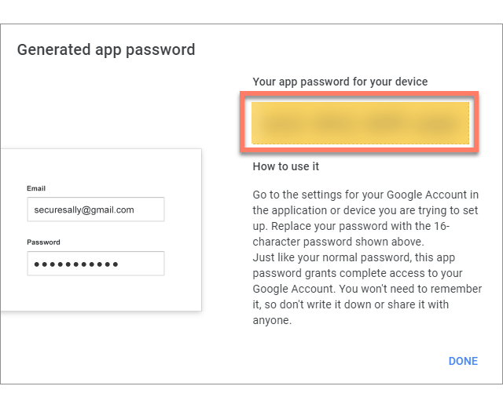

# Configuring Gmail with the Email (Deprecated) connector

<head>
  <meta name="guidename" content="Flow"/>
  <meta name="context" content="GUID-a3fe1ab9-0cf7-4699-91cd-71d9d54b61bf"/>
</head>

:::warning

This connector is now in Deprecated status. It is no longer available for new users and is not actively maintained. We will provide a minimum six-month notice before its retirement. We recommend upgrading to the newer supported version of this connector.

:::

You can configure the to use a Google Gmail email account.

## Overview

Using to send emails from a Gmail account requires additional configuration of the Google/Gmail account set up with the . These additional steps should be performed for the Gmail account and email address that is specified in the **Username** configuration value. See [Email (Deprecated) connector configuration values](flo-Email_Service_Configuration_109ed362-cb5b-4580-9cc8-d44504ff6cf7.md).

You will need to:

1.  Enable Internet Message Access Protocol \(IMAP\) for your Gmail account.
2.  Create a Google App password for the .
3.  Configure the for Gmail.

## Enable IMAP for your Gmail account

Enable IMAP on your Gmail account. For example:

1.  Sign in to your Gmail account.
2.  Click the **Settings** icon in the top right and click **See all settings**.
3.  Click the **Forwarding and POP/IMAP** tab.
4.  Select **Enable IMAP** In the **IMAP access** section.
5.  Click **Save changes**.

:::note

The [Check Gmail through other email platforms](https://support.google.com/mail/answer/7126229?hl=en&visit_id=637598837736674294-2991282240&rd=2) Google documentation provides full details and instructions on setting up IMAP in your Gmail account.

:::

## Create a Google app password for the Email (Deprecated) connector

As the Email (Deprecated) connector does not support using 2-Step Verification, a Google App password must be created for the , to allow you to integrate your Gmail Account with . For example:

1.  Sign in to your Google account.
2.  Click the Google Account icon and select **Manage your Google Account**.
3.  Click **Security** in the left-hand menu.
4.  Click **App passwords** in the **Signing in to Google** section.
5.  Sign in to your Google account.
6.  Select *'Other \(Custom Name\)'* from the **Select App** drop-down menu and enter a name for the app password \(such as *'Flow Email Connector'* for example\).
7.  Click **Generate**.
8.  Copy the app password; this is needed for configuring the Email connector.

    

## Configure the Email (Deprecated) connector for Gmail

The can now be configured to use the Gmail account.

1.  Install the into your tenant, using the following values.
    -   **Host**: *smtp.gmail.com*

    -   **Port**: *587*

    -   **Transport**: *tls*

    -   **Password**: *The Google app password that was generated for the Email connector*.

    -   **Username**: *The Gmail account email address to use for sending emails with the connector*.

2.  Save the and import it into any flows that you wish to send emails from.