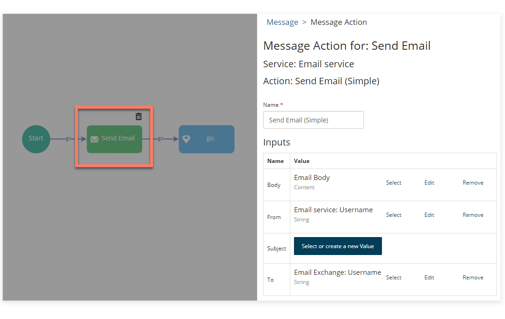

# Email (Deprecated) connector message actions and send types

<head>
  <meta name="guidename" content="Flow"/>
  <meta name="context" content="GUID-401a4206-f7f9-4c66-aef0-d9090b9ac2ed"/>
</head>

:::warning

This connector is now in Deprecated status. It is no longer available for new users and is not actively maintained. We will provide a minimum six-month notice before its retirement. We recommend upgrading to the newer supported version of this connector.

:::

You can use [Message Map Elements](c-flo-ME_Message_342e9efb-0f11-4083-a2dc-195d52d1f939.md) to interact with the and generate emails from your flows.

Once you have added a message map element into your flow, you can configure it with one of several types of message action, depending on your email requirements.

The following types of message action can be added to message map elements for sending emails from a flow:

-   [Send email \(simple\)](flo-Email_Service_Send_Email_Simple_7d52b27a-e8e5-4b82-9a4a-9748746f4f28.md): Provides basic functionality for sending an email from a flow, such as defining who to send to email to/from, and the HTML formatted body of the email.

-   [Send email](flo-Email_Service_Send_Email_7fe5ed12-bfea-4090-bab5-0b1657331a6c.md): Provides additional functionality to the Send email \(simple\) message action when sending an email from a flow, including the ability to interact with attachments and carbon copy/blind carbon copy additional recipients into an email.

-   [Send email with Decision Request](flo-Email_Service_Send_Email_Decision_cd0b677f-4b54-4bbb-adbc-8a329861634a.md): Send an email containing clickable links that allows recipient\(s\) to progress further in a flow. For example, if an approval email is generated in a flow, the recipient can choose to either approve or deny the request by clicking on the appropriate link in the email.