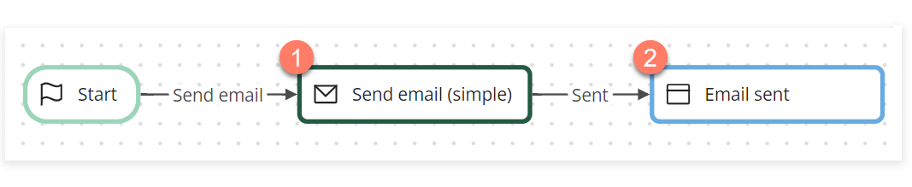

# Sending a simple email

<head>
  <meta name="guidename" content="Flow"/>
  <meta name="context" content="GUID-b8686a9c-0899-4b72-9343-399511e3273b"/>
</head>

This worked example shows how the Email connector can be used to send a simple email from a flow.

## Before you begin

Before using this worked example, ensure that you are familiar with the following concepts and procedures:

-   Installing the Email connector. See [Email connector](/docs/Atomsphere/Flow/topics/flo-Email_connector_f96ce3fa-c713-41fe-932e-85844f496b87.md).

-   Creating new flows. See [Creating a new flow](/docs/Atomsphere/Flow/topics/c-flo-Flows_Creating_a_new_flow_6745110f-738e-4a54-bf5e-c565e4c412a9.md).

-   Setting up flows using map elements on the flow canvas, and running/publishing flows. See [ Building and publishing flows](/docs/Atomsphere/Flow/topics/c-flo-Building_and_Publishing_Flows_3dba9a15-316f-4134-9093-d4811ea7d14f.md).

## About this worked example

This worked example is provided for illustration purposes only, to demonstrate the example steps and settings involved in using the Email connector to send a simple email from a flow.

## Installing the Email connector

The Email connector is first installed and configured to allow emails to be sent from within the flow. In this example, the is configured to send emails from a Gmail account, which requires additional configuration.

-   [Email connector](/docs/Atomsphere/Flow/topics/flo-Email_connector_f96ce3fa-c713-41fe-932e-85844f496b87.md)

-   [Configuring Gmail with the Email connector](/docs/Atomsphere/Flow/topics/flo-Email_connector_Gmail_a4c10a39-e873-427f-9218-28894b3eb29d.md)

## Setting up the flow

Once the Email connector is installed and imported, a new flow is created and named "Email connector - send email \(simple\)".

To use the Email connector in the new flow, it is imported into the flow as a shared element. Shared elements are 'global' tenant elements that can be shared and re-used across multiple flows within a tenant. See [Shared Elements.](/docs/Atomsphere/Flow/topics/c-flo-Shared_Elements_85425302-deb7-4f96-aedd-be797a3224e5.md).

In this example, the simple flow consists of 2 map elements:

-   A [message](/docs/Atomsphere/Flow/topics/c-flo-ME_Message_342e9efb-0f11-4083-a2dc-195d52d1f939.md) map element connects to the connector and sends the email using a [Send email \(simple\)](/docs/Atomsphere/Flow/topics/flo-Email_connector_send_email_simple_16564ade-7bb3-4286-a7ba-25b967aa0ce0.md) message action. 

-   A [step](/docs/Atomsphere/Flow/topics/c-flo-ME_Step_f2f3f25f-f6c8-4f34-9c44-6210cdef30a2.md) element provides a confirmation page once the message action has been performed and the email has been sent. 

**Message**: A single Send Email \(Simple\) message action is added to the message map element, and the values created and configured as follows:

-   **Body**: A simple "Hello. This is the body of the email." message is entered.

-   **From**: The Gmail email address set up for the Email connector is entered.

-   **Subject**: A simple "This is the subject of the email." message is entered.

-   **To**: The recipient email address\(es\) are entered, separated by a semi-colon.

**Step**: A simple "The email was sent." message is entered into the step map element.

## Running the flow and sending the email

When the flow is run:

-   The message action is performed, and the email is sent to the recipient\(s\).

-   The flow then proceeds to the step map element, displaying the "The email was sent." message to the user.

-   The recipient\(s\) receive an email using the body and subject values that were set up in the message action.

    