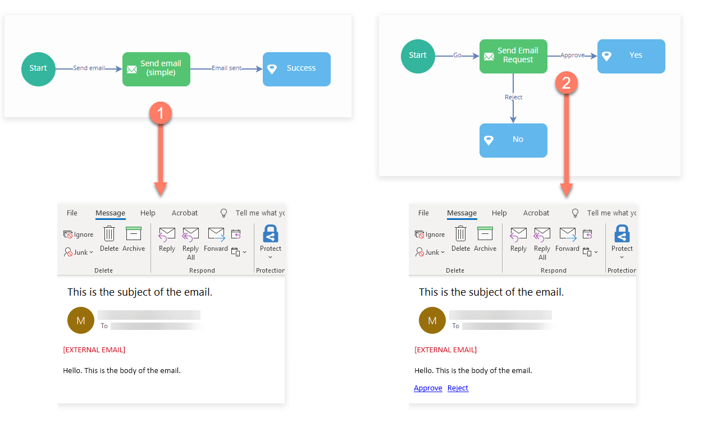

# Email (Deprecated) connector

<head>
  <meta name="guidename" content="Flow"/>
  <meta name="context" content="GUID-d9394378-fc42-4a24-91b1-52215277b1d5"/>
</head>

:::warning

This connector is now in Deprecated status. It is no longer available for new users and is not actively maintained. We will provide a minimum six-month notice before its retirement. We recommend upgrading to the newer supported version of this connector.

:::

The Email connector allows you to connect to an email provider and send emails directly from a flow.

## Overview

The connector is most commonly used to integrate email functionality so that simple asynchronous emails can be configured and triggered to send at defined points within a flow. 

The connector can also be used as part of a flow approval process, by sending synchronous emails that require a decision from an email recipient before the flow can continue progressing along the chosen outcome path. 

To use the it, you must first be installed into a tenant and configured. It can then be imported into a flow as a shared element.

The configuration values for the will depend on your email provider. For example, to send emails from a Gmail account you will need to configure the with a different SMTP server name than if you are sending emails from a Microsoft Exchange/Office 365 account.

-   [Installing the Email Service](flo-Email_Service_Installation_ee9d2159-e4e3-4508-b86c-8d70fcfc5a07.md)

-   [Configuration values](flo-Email_Service_Configuration_109ed362-cb5b-4580-9cc8-d44504ff6cf7.md)

-   [Configuring Gmail with the Email connector](flo-Email_Service_Gmail_a3fe1ab9-0cf7-4699-91cd-71d9d54b61bf.md)

-   [Configuring Microsoft Exchange with the Email connector](flo-Email_Service_Exchange_b0548ca1-51c0-408c-9a27-580bd0547acb.md)

## Message actions and send types

Once installed and imported into a flow, the connector can be integrated using a message map element and message action.

There are several different types of message action available for the connector:

-   [message actions and send types](flo-Email_Service_Send_Types_401a4206-f7f9-4c66-aef0-d9090b9ac2ed.md)

    -   [Send email \(simple\)](flo-Email_Service_Send_Email_Simple_7d52b27a-e8e5-4b82-9a4a-9748746f4f28.md)

    -   [Send email](flo-Email_Service_Send_Email_7fe5ed12-bfea-4090-bab5-0b1657331a6c.md)

    -   [Send email with Decision Request](flo-Email_Service_Send_Email_Decision_cd0b677f-4b54-4bbb-adbc-8a329861634a.md)

## Worked examples

To get started using the connector, the following worked examples are provided:

-   [Sending a simple email](flo-Email_Service_Using_b8686a9c-0899-4b72-9343-399511e3273b.md)

-   [Sending an email with a decision request](flo-Email_Service_email_decision_d52111d1-9a81-4f38-9625-6af47dc44096.md)

-   [Sending email attachments using the Email connector](flo-Email_Service_Attachments_cfd0438a-8a35-40d8-9c0b-c91a06c4c36b.md)

## URL

The endpoint url is: [https://services.manywho.com/api/email/1](https://services.manywho.com/api/email/1)

## Features

The forms part of the following features:

-   **Files:** This feature allows you to expose files stored in an external repository from within your flows. This also allows users to upload and manage files through flows.

-   **Messages:** This feature provides the ability to interact with the using [Message Map Elements](c-flo-ME_Message_342e9efb-0f11-4083-a2dc-195d52d1f939.md).

## Known limitations

-   Although the connector can be integrated with a [File Upload Component](../topics/flo-pages-components-fileupload_edb868aa-5a66-4cbf-9019-42e1df0ed027.md) to allow a user to upload and send a file as an email attachment, the file attachment is a temporary resource in the . The is not designed for permanent file storage.

    To store files that are attached to emails sent with this , use a dedicated file storage such as the Amazon S3 . See [Sending email attachments using the Email connector](flo-Email_Service_Attachments_cfd0438a-8a35-40d8-9c0b-c91a06c4c36b.md).