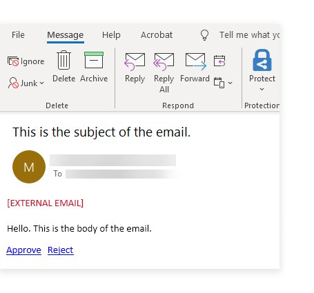

# Sending an email with a decision request

<head>
  <meta name="guidename" content="Flow"/>
  <meta name="context" content="GUID-d52111d1-9a81-4f38-9625-6af47dc44096"/>
</head>

This worked example shows how the Email connector can be used to send an email containing clickable links that define the path that a recipient takes when progressing in a flow.

## Before you begin

Before using this worked example, ensure that you are familiar with the following concepts and procedures:

-   Installing the Email connector. See [Email connector](/docs/Atomsphere/Flow/topics/flo-Email_connector_f96ce3fa-c713-41fe-932e-85844f496b87.md).

-   Creating new flows. See [Creating a new flow](/docs/Atomsphere/Flow/topics/c-flo-Flows_Creating_a_new_flow_6745110f-738e-4a54-bf5e-c565e4c412a9.md).

-   Setting up flows using map elements on the flow canvas, and running/publishing flows. See [ Building and publishing flows](/docs/Atomsphere/Flow/topics/c-flo-Building_and_Publishing_Flows_3dba9a15-316f-4134-9093-d4811ea7d14f.md).

## About this worked example

This worked example is provided for illustration purposes only, to demonstrate the example steps and settings involved in using the Email connector to send an email from a flow that contains clickable links to allow a recipient to progress further in a flow.

This example uses the format of a simple approval request flow, where a user can select 'yes' or 'no' in an email, before being routed along the selected outcome path in the flow.

## Installing the Email connector

The Email connector is first installed and configured to allow emails to be sent from within the flow. In this example, the is configured to send emails from a Gmail account, which requires additional configuration.

-   [Email connector](/docs/Atomsphere/Flow/topics/flo-Email_connector_f96ce3fa-c713-41fe-932e-85844f496b87.md)

-   [Configuring Gmail with the Email connector](/docs/Atomsphere/Flow/topics/flo-Email_connector_Gmail_a4c10a39-e873-427f-9218-28894b3eb29d.md)

## Setting up the flow

Once the Email connector is installed, a new flow is created and named "Email connector - send email with decision request".

To use the Email connector in the new flow, it is imported into the flow as a shared element. Shared elements are 'global' tenant elements that can be shared and re-used across multiple flows within a tenant. See [ Shared Elements](/docs/Atomsphere/Flow/topics/c-flo-Shared_Elements_85425302-deb7-4f96-aedd-be797a3224e5.md).

In this example, the simple flow consists of 3 map elements:

-   A [message](/docs/Atomsphere/Flow/topics/c-flo-ME_Message_342e9efb-0f11-4083-a2dc-195d52d1f939.md) map element is used to connect to the and send the email using a [Send email with Decision Request](/docs/Atomsphere/Flow/topics/flo-Email_connector_decision_a1407578-4750-4d6a-b2a3-39fa41a456c6.md) message action. 

-   2 [step](/docs/Atomsphere/Flow/topics/c-flo-ME_Step_f2f3f25f-f6c8-4f34-9c44-6210cdef30a2.md) elements provide different routes that a user can follow in the flow, depending on which link they click in the email.

    Each outcome from the message element is automatically converted into a clickable link in the body of the email, allowing the recipient to either 'Approve' or 'Reject' the request.

    -   If the email recipient clicks on the 'Yes' email link, they are routed along the 'Approve' outcome to the 'Yes' step. 

    -   If the email recipient clicks on the 'No' email link, they are routed along the 'Reject' outcome to the 'No' step. 

**Message**: A single Send Email with Decision Request message action is added to the message map element, and the values created and configured as follows:

-   **Body**: A simple "Hello. This is the body of the email." message is entered.

-   **HTML Body**: A simple "Hello. This is the body of the email." message is entered.

-   **From**: A contact object value containing the Gmail email address set up for the Email is selected.

-   **Subject**: A simple "This is the subject of the email." message is entered.

-   **To**: A contact object value containing the recipient email address\(es\) is selected.

**Step \(Approve\)**: A simple "This is approved." message is entered into the step map element.

**Step \(Reject\)**: A simple "This is rejected." message is entered into the step map element.

## Running the flow and sending the email

When the flow is run:

-   The message action is performed, and the email is sent to the recipient\(s\).

-   The recipient\(s\) receive an email using the body and subject values that were set up in the message action. At the bottom of the email the outcomes are displayed as clickable links.

    

-   When a recipient clicks a link in the email, the flow opens in a web browser and is routed along the chosen link outcome to display the appropriate step. For example, if a recipient clicks 'Approve', they are directed to the 'Approve' step map element.