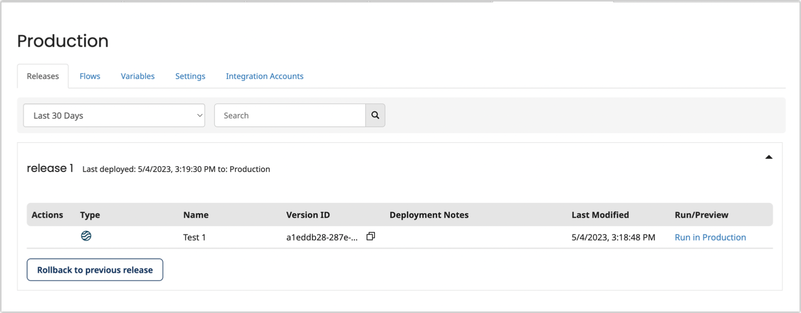

# Managing environments

<head>
  <meta name="guidename" content="Flow"/>
  <meta name="context" content="GUID-6e577ba9-468e-4dbc-ace5-43b787e418ca"/>
</head>

Manage your environment releases, variables and settings.

## Overview

As well as performing basic release management tasks on the **Environments** page, you can access and manage each environment separately.

1.  On the **Environments** page, click the **Manage \[Environment\]** link on an environment tile to open the environment in a separate tab.

-   Click the **Releases** tab to view and manage each release currently deployed to the environment, including [Promoting a release](flo-Environments-promoting-releases_85e7790e-d62e-4778-a54f-b8ed1c7bc7bb.md), or [Rolling back a release](flo-Environments-rollback_bb012b3c-b7c7-4ff6-b703-c90442cc81be.md).

-   Click the **Variables** tab to view and manage environment variables.

-   Click the **Settings** tab to view and manage environment settings.

## Evironment Releases

Releases are how you build and deploy flows to an environment. Releases allow you to easily build and deploy a collection of flows to your environments, and move them through the development life cycle.

-   [Releases](flo-Environments-releases_cada8541-d290-4f3b-a2a7-3cda33e9ca2a.md)

    -   [Creating a release](flo-Environments-adding-to-release_a13156ec-3eee-4303-9c27-a480e88a3ba8.md)

    -   [Adding flows to a release](flo-Environments-using_9a8bd4c5-2b42-47fb-bf70-16c4e2ae3721.md)

    -   [Promoting a release](flo-Environments-promoting-releases_85e7790e-d62e-4778-a54f-b8ed1c7bc7bb.md)

    -   [Rolling back a release](flo-Environments-rollback_bb012b3c-b7c7-4ff6-b703-c90442cc81be.md)

## Environment Flows

The Flow tab displays all of the flows that are currently running in the specified environment. It consolidates all releases by displaying all flows that have ever been deployed on it. You may run or preview the flow in your chosen environment.

## Environment Variables

Define environment-specific variables to manage common values that can be changed for each environment.

-   [Environment variables](flo-Environments-variables_9bce8c2a-9182-46a9-8efa-2d9debb0c16b.md)

## Environment Settings

Change the general environment settings, such as the name, and default player.

-   [Environment settings](flo-Environments-settings_fd017cc0-754e-47ee-858a-170ddf2a80b0.md)

## Environment Integration Accounts

 You can map the environment in your integration account to your flow environment. A process map element understands which integration account environment to use for process execution when it runs in a flow.
