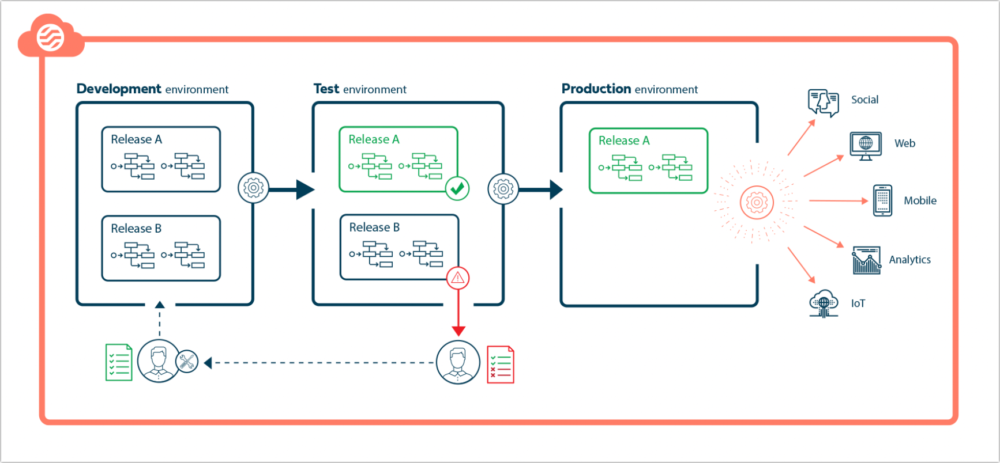

# Environments

<head>
  <meta name="guidename" content="Flow"/>
  <meta name="context" content="GUID-f79be140-1c1c-46a5-a45f-21fba514cf5e"/>
</head>

Release, deploy, and run your flows in development, testing, and production environments.

## Overview

You can use environments to manage and progress your flow releases through the stages of a standard development life cycle, giving you precise control over how and when you deliver flows to your users.

The development life cycle has 3 environments:

-   **Development**: A workspace where you can develop flows and build them into a release.

    -   When you add a flow to a release, it is automatically deployed to the development environment.

    -   You can run a flow, make edits, and then see your changes in real time after you select **Update**and refresh the flow.

    -   You can continue building and adding flows to a release until it is ready to move to testing, the next stage in the development cycle.

-   **Test**: Promote a release to the test environment to make it available for testing.

    -   Your testing team can then run and test the flows included in the release in this test environment.

    -   If rework is needed, you can roll back the release, or remove flows from it.

    -   When the release is ready to go live, you can move it to the production environment.

-   **Production**: Promote a release to the production environment to make it available live to your flow users.

## Enabling environments

To start using environments, a tenant Administrator must first enable it in your tenant.

-   [Enabling environments](flo-Environments-enabling_8dc02467-4964-4900-8a00-5ff1e4768b93.md)

## Adding environments

A development life cycle typically includes the three environments listed above. By choosing **Edit Environment**, you may insert an additional environment between them.

## Managing environments

As well as performing release management tasks on the **Environments** page, a tenant Administrator can access and manage each environment separately.

-   [Managing environments](flo-Environments-managing_6e577ba9-468e-4dbc-ace5-43b787e418ca.md)

## Getting started with releases

Releases are how you build and deploy flows to an environment. Releases allow you to easily deploy a collection of flows to an environment, and move them through the development life cycle. Both Standard and Administrator users can add flows to a release.

-   [Releases](flo-Environments-releases_cada8541-d290-4f3b-a2a7-3cda33e9ca2a.md)

    -   [Creating a release](flo-Environments-adding-to-release_a13156ec-3eee-4303-9c27-a480e88a3ba8.md)

    -   [Adding flows to a release](flo-Environments-using_9a8bd4c5-2b42-47fb-bf70-16c4e2ae3721.md)

    -   [Promoting a release](flo-Environments-promoting-releases_85e7790e-d62e-4778-a54f-b8ed1c7bc7bb.md)

    -   [Rolling back a release](flo-Environments-rollback_bb012b3c-b7c7-4ff6-b703-c90442cc81be.md)